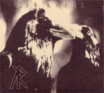

artist: **In Ruin** release: _Seeds of the Past_ format: CD-R year of release: 2004 label: [Bunkier Productions](http://www.bunkierproductions.com/) duration: 30:06

detailed info: [discogs.com](http://www.discogs.com/In-Ruin-Seeds-Of-The-Past/master/212062)

This was released long ago, and I thought that I would shed some light on it now when **In Ruin** has a new album coming up, finally after years of delay. In this digipack you can actually read that the "debut album is due to be released in late 2004." And I’m writing this in 2008... The debut album is coming, and _Seeds of the Past_ should actually be considered a demo with some additional material.

Not many have heard **In Ruin** and quite few have heard ABOUT **In Ruin**. A pretty common mistake you hear is that this is a total **:Of The Wand and the Moon:** rip off. Sure, there are strong similarities, but every band has their influences and especially young bands don’t hide those with their own sound. What this has in common with **:Of The Wand and the Moon:** is the often whispered vocals, the fascination for runes, forests and misanthropy. Besides that, I think **In Ruin** stands out in the genre, with some of the most minimalist neofolk tunes ever. The first five songs do not consist of anything but an acoustic guitar and vocals. Pitch black and really fine, with crystal clear chords and well-achieved vocals. These are the songs that should be the "demo" songs and the second one is the strongest one, that jumps from strummed to plucked very nicely.

What follows next is a **Current 93** cover: "Oh Coal Black Smith". It differs in many ways from the previous tracks, and shows another side of **In Ruin**. It has keyboards, drums and distorted vocals in addition to the guitar. It works. The two closing tracks are songs recorded at the same time as the first five, but never made it into the original edition of the demo. I can’t see why they where shifted out. Both are two very strong neofolk tracks and the electric psych guitar solo in the last one brings it to a level of it’s own. I’m glad that Terry Collia decided to put these here for our pleasure.

I have listened to _Seeds of the Past_ for years and compared it to all the new artists that popped up and **In Ruin** still stands as one of the most promising young American neofolk acts. I am so eager to hear the new album, which should be released anytime now. If you get the chance to buy yourself a copy of _Seeds of the Past_, don’t hesitate if you are, by any means, interested in neofolk. A classic!

Reviewed by **CME**

Tracklist:

1\. Seeds Of The Past (3:41) 2. Darkness (4:42) 3. The Emptiness Inside (1:40) 4. The Wildflower's Song (3:31) 5. I Wonder (4:28) 6. Oh Coal Black Smith (3:53) 7. Twilight's Escape (4:25) 8. Solace (3:49)
