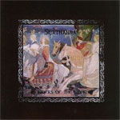

artist: **Scáthanna** release: _Riders of the Sidhe_ format: CD-R year of release: 2008 label: Self-released duration: 15:32

**Scáthanna** is a young Irish neofolk project by a man called Marcus MacCormaic. _Riders of the Sidhe_ is the first demo, and we get four nice instrumental neofolk tunes with, obviously, a Celtic touch. Stylistically, it is quite close to the tradition that has sprung up around projects like **Ulver** and **Empyrium** (to name the two standard cases), but it sounds slightly more original than most projects in this area.

The demo starts with "Samildánach", a short uptempo track with an uplifting guitar melody and bodhrán percussion. Soon a tin whistle joins in to support the melody, but it doesn't sound quite right yet. I regularly hear whistles and flutes that sound a bit off from the rest of the instruments in various live settings and such, and this demo is no different, sadly. I guess it can be difficult to pull off? In any case, it's not very disturbing, but certainly a point that could be improved. The other tracks basically have a similar composition. The title track starts off a bit more calmly, but also features more lively parts. The third track is the longest, and has an interplay between a couple of different melodies and rhythms. The final track, "The March of Lámhfhada" ends the demo with an epic melody, recalling heroic tales from Celtic heritage.

On the whole, while performance and sound are indeed at a real demo level, there's certainly quite some potential in this project. I enjoy a bit of the Celtic touch in a musical area often dominated by Germanic-themed projects, as doesn't only add a new conceptual element, but also a different sound. I also get the feeling that **Scáthanna** might benefit from adding a vocal touch - why not? In any case, this is an atmospheric demo that is worth checking out if you enjoy following the latest developments in neofolk.

Reviewed by **O.S.**

Tracklist:

1\. Samildánach (1:47) 2. Riders of the Sidhe (3:53) 3. The Flowers of Carn Corrslebe (7:11) 4. The March of Lámhfhada (2:41)
