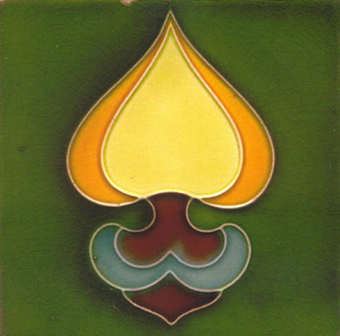

artist: **The A. Lords** release: _The A. Lords_ format: 3" CD-R year of release: 2006 label: [Barl Fire](http://www.barlfire.co.uk/) duration: 19:42

detailed info: [discogs.com](http://www.discogs.com/A-Lords-The-Birds-Play-Themselves/release/1058387)

**The A. Lords** is a project out of the **Dorset Paeans** Collective (in this case **Michael Tanner** and **Nicholas Palmer**). I first heard about them by way of their excellent song "Summerhouse", which featured on the [_John Barleycorn Reborn_](http://www.eveningoflight.nl/2007/11/01/review-john-barleycorn-reborn-2007/) compilation. That track also appears on this 3", released by **Barl Fire**, and I think also the first release by this project.

The five tracks on this EP are all in the style of the aforementioned track: calm, pastoral acoustic music, making use of a variety of instruments, ranging from the obvious (guitar) to the unexpected (toy piano). We also hear organ, balalaika, dulcimer, and most importantly: "the birds play themselves." The use of field recordings and live on-the-spot recordings give the tracks a very spontaneous and honest feel - you can even hear a telephone ringing in the background on the last track. It's as if these songs are recorded outside on a spring morning, or at night, looking at the stars.

The EP is well succeeded, and the music itself, though simple, is deceptively compelling. I keep coming back to it. Both acoustic tracks like "Summerhouse" and more ambient ones like "Mikemedieval" hit exactly the right spot. A perfect little release to drift off by. Though this release is probably sold out by now, lovers of freefolk and warm acoustic ambient should definitely keep an eye on these guys.

Reviewed by **O.S.**

Tracklist:

1\. The Dawn Chorus (1:43) 2. Summerhouse (5:16) 3. Toy Piano, Balalaika (2:07) 4. Mikemedieval (7:15) 5. Guitar, Dulcimer (3:21)
