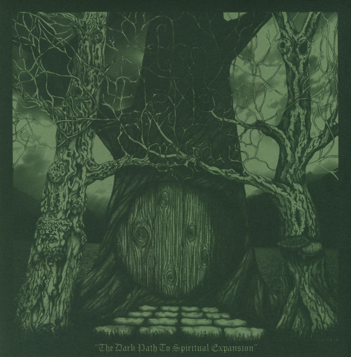

artist: **The Elemental Chrysalis** release: _The Dark Path to Spiritual Expansion_ format: 2xCD year of release: 2007 label: [Glass Throat](http://www.glassthroatrecordings.com/) duration: 1:57:55

detailed info: [discogs.com](http://www.discogs.com/Elemental-Chrysalis-The-Dark-Path-To-Spiritual-Expansion/release/1611779)

The duo of **James Woodhead** and **Chet Scott** is back with their second album, and a long journey it is, this time! _The Dark Path to Spiritual Expansion_ is, like the title suggests, a long and dark musical peregrination, spread across two discs, each containing four tracks and an hour of music. On the journey, the main musical strain seems to be dark folk, but with this project, influences from ambient, blues, and even doom metal don't seem to be very far away.

The first Collection starts off with the very long "In Through a Desert Door...", which is based almost purely around slowly evolving guitar, bouzouki, and organ melodies. In a track like this, one can draw a parallel to some funeral doom metal, like perhaps an acoustic version of **Mournful Congregation**. Actually, this track is quite comparable to the opener of the debut album: long, but good. "Procession of Burning Flowers" is a nice 'short' piece, based mainly around bluesy guitar, later embellished with nice percussion and vocal samples. "Hehaka" starts slow, with a dark and subtle ambientish intro, but including a heavy skin drum in the background. After a couple of minutes, the main guitar melody kicks in - kind of bluesy, with a typical folky touch as well. The vocals on this track are also quite nice. The title track is also one of the better tracks on the album. Even though it's completely based on one repeated bouzouki melody, it doesn't get boring; rather, it's simply utterly hypnotising as you're drawn into the dark journey described in the lyrics.

The second collection begins in a way similar to the first one, though "Our Limbs..." is somewhat shorter than the opening track of the whole album. The main track, and heftiest piece of the album is the excellent "Grey Like a Moon...". Clocking in at nearly 27 minutes, it's quite something to take in, but that won't daunt the experienced listener, I guess. From a subtle ambient woodwind intro (reminds me quite positively of **Far Black Furlong**), the track launches into an epic ritual of skin drum percussion, organ drones and pleading faint vocals. It swells and swells, adding some excellent dark strings into the mix as well. After the track climaxes, the last quarter of it or so is a beautiful calm part with bass, strings and electric guitar. The third track is one of the shorter ones, based on the lyrics about the Banshee, but also featuring guest Banshee vocals by Chet's wife (and packaging designer!) Rachel. The final track is also deserving of particular mention though: a beautiful piece of drifting ambient with excellent interplay between piano, drones and sea samples.

While I feel the album might drag a tiny bit in some places, it's impressive how these two men manage to make an album last two hours and be interesting and fulfilling at the same time. The vast variety of instruments and sounds give the music a great aural detail, and although those with short attention spans will most likely not be digging this, any experimental music lover worth his or her salt will want to check this one out. There's still room for improvement, but there's no doubt in my mind that **The Elemental Chrysalis** are heading for more greatness.

Reviewed by **O.S.**

Tracklist:

_Collection One:_ 1. In Through a Desert Door of a Wooded Heart (23:41) 2. Procession of Burning Flowers (7:32) 3. Hehaka (10:14) 4. The Dark Path to Spiritual Expansion (14:48)

_Collection Two:_ 5. Our Limbs Your Shelter... Our Roots Your Den (13:00) 6. Grey Like a Moon Underneath Waves of Storms... Her Shroud Falls Faint as a Clouded Embrace (26:55) 7. A Banshee's Blackened Wail (9:33) 8. Jeweled Blue Waters of a Slumbering Ocean (12:12)
