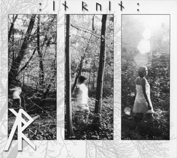
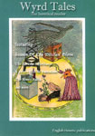

artist: **English Heretic** release: _Wyrd Tales_ format: CD + Book year of release: 2006 label: [Self-released](http://www.english-heretic.org.uk/) duration: 70:28

detailed info: [discogs.com](http://www.discogs.com/English-Heretic-Wyrd-Tales/release/1143918)

_Wyrd Tales_ is the biggest release of the **English Heretic** collective thus far, containing not only a full CD, but also a 90-page book with characteristic occult stories and background. As usual, the collective is inspired by the 'occult landscape' of England, and they venture out to locations that play an important role in occult history or imaginative fiction, and conduct their own musical and spiritual rituals there. And again, this has resulted in a quirky release that is interesting both musically and conceptually.

First, the musical part. "Season of the Witches' Glove" is an example of what happens when the band dives into folk territory. A relaxing track with bright acoustic guitar chords and synths, as well as the über-English strange vocals. "Pan Satyros" is more in the experimental corner, utilising piano loops, programmed percussion, and the spooky story sample also utilised in "Rime of the Ancient Lamia" from the _2006 Annual_ ("we listened side ways up - by the star dogged moon..."). "The Digitalis Experience (Side 1)" is one half of an (imaginary?) LP, full of delightfully freaky stuff. It starts of with faint voices, samples and effects, but nearly halfway, it launches into a cool disco-ish beat with vocals, again reminding me of some earlier **Death in June** material, _Nada_\-era. The final minutes of the track are different again, introducing a banjo melody with spoken word, synth, and effects. All in all quite brilliant. "Theme from the Abraxas Inheritance" returns to the theme of alectromancy, also used in the _2006 Annual_. That might be one of the musical weak spots of the album: there is some overlap in material (especially used samples) between these tracks and those on the previous album. You realise that all the more on the final track, which again uses the sample from track two and _2006 Annual_. Luckily, there are two excellent tracks in between. "The Menabilly Pathworking" utilises samples from **Elgar's** "Cello Concerto (op. 85)" and **Vera Lynn**, and creates a haunting melancholic atmosphere. "Oh Whistle and I'll Come to You", based on the story by **M.R. James**, is one of the more ritual tracks of the band, featuring many contributions by **Xenis Emputae Travelling Band**'s Phil Legard. Some spoken word, shingle running samples, flutes: a great track with a mystic atmosphere, and an excellent interpretation of the story.

The literary part of the release is at least as interesting as the musical part, and the book contains one story (in various forms) for each track on the album. This ranges from a travelogue with ghost story tinges for the first track, to fictional coroner reports and movie scripts. I'm not going to spoil the joy of reading it all by listing everything. Let me just say that the selection of themes and form is varied, and contains many flavours and moods. The bottom line, though, is that it is all occult, mysterious, horrid... - you get the idea.

It's safe to say that this is a very enjoyable release, and the best thing by the collective yet. If you enjoy a synthesis of experimental music and occult literature, you can not let this one slip! It's available for a very reasonable price from both **English Heretic** themselves (see link above) and [Larkfall Productions](http://www.larkfall.co.uk/).

Reviewed by **O.S.**

Tracklist:

1\. Season of the Witches' Glove (6:03) 2. Pan Satyros (6:32) 3. The Digitalis Experience (Side 1) (17:08) 4. Theme From The Abraxas Inheritance (6:33) 5. The Menabilly Pathworking (13:06) 6. Oh Whistle and I'll Come to You (18:00) 7. The Vampires Are Coming / Minion of the Outer Ones (3:06)
