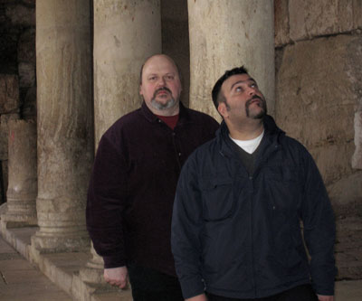

**Interview with Tony Wakeford and Reeve Malka**

February 2008 - guest interview by Peter Webb. \[Comments in Brackets by O.S.\]

\[caption id="attachment\_1863" align="aligncenter" width="400" caption="Photograph by Renée Rosen."\]\[/caption\]

Tursa ([http://www.myspace.com/tursa](http://www.myspace.com/tursa) and [http://www.tursa.com](http://www.tursa.com)) as a record label and production house has gone through a number of significant changes and developments in the last two years. **Tony Wakeford**'s band of merry troubadours **Sol Invictus** ([http://www.myspace.com/solinvictushq](http://www.myspace.com/solinvictushq)) have been at the centre of the majority of releases by the Tursa label but it is now branching out much further than it ever has before. Sol, reflective of Tony’s personal musical vision and an expression of a remarkable personal journey that has dealt with some of the political contradictions, interests, preoccupations and ideas of a period of British culture stretching from the 1970s to today, have fostered an extremely independent music and cultural scene that developed from punk and post-punk through Industrial to the folk noir or neo-folk scene today. There is little literature on this very underground of scenes, **David Keenan**’s _England’s Hidden Reverse_ and **Diesel** and **Gerten**’s _Looking for Europe_ being notable exceptions, but a cursory glance at the WWW shows a massive number of websites, myspace pages, forums, record labels and distributors who are involved in this area (see Soleilmoon, Tesco, Dark Vinyl, Athanor, Cynfeird, Strange Fortune, Trisol, Woven Wheat Whispers, Cold Spring, Eis Und Licht, Hau Ruck amongst others). Although the scene is not recognised in much mainstream music press (Zero Tolerance being an important exception) across Europe the artists and fans of the scene have created a vibrant and thoughtful music and cultural underground that has explored and fore-grounded ideas about paganism, ecology, individualism, anarchism and local cultural tradition. There are also elements within this scene that foreground philosophical areas attached to the New Right but these groups are thankfully small and marginal to the majority of the scene.

Tony, as an English artist, has honed his craft with Sol through many different phases. The early recordings of raw edgy guitar, bass and drums have given way to an evolving complexity of strings, oboes, violin, bodhrán, found sound samples, acoustic guitar and bass all set off with Tony’s affecting and brooding vocal style that is particularly emotive. The subject matter on the early releases discussed themes related to Paganism and Magick, now those themes have given way to examinations of Religion, Nationalism, Individualism, Love and the strange and rare beast that is English culture. Tony had solely run Tursa as a label inspired in part by **David Tibet** and his early releases of **Current 93** and **Nurse With Wound** on the Maldoror, United Dairies and eventually Durtro labels ([http://www.durtro.com](http://www.durtro.com/index4.html)). **Death In June** also had run their own New European Recordings label, this though had mainly been **Douglas P**’s baby ([http://www.deathinjune.net](http://www.deathinjune.net)), so Tony, once he had started **Sol Invictus**, decided he needed to take control of his own destiny and developed his own label on the Enterprise Allowance scheme (a 1980s government attempt to get people off of welfare and on the road to capitalist enterprise). Although he didn’t become the Richard Branson of the Post-industrial scene he made a concerted attempt at presenting his work and selling it to a wider public. Over the years the label has released 23 **Sol Invictus** albums and also albums by **Skald**, **Sieben** and **Algiz**. After being through a turbulent relationship with World Serpent (a distributor and finance vehicle for Tursa which ended in a collapse and bankruptcy of the company and left Tony with a large number of debts and non-payment of royalties) he decided to develop Tursa partly as a label in its own right and partly to license recordings to other labels. As the 2000s progressed and the Internet started to instigate massive changes in the wider world of music it also had a huge effect on underground scenes like the Neofolk/post-industrial scene. The net encouraged a decline in sales of recorded music through peer to peer file sharing but also brought people and music scenes together in closer ties through networking sites like MySpace, forums, websites and web communities. With all this in mind Tony has revamped and re-energised Tursa in a number of ways.

Firstly he met the Israeli and Jewish artist **M** or **Reeve Malka**. Reeve and Tony first linked up through 'the evil' that is MySpace. Reeve had been doing some work with **Jarboe** (on a yet to be released project) and Tony having worked with **Jarboe** in the past took a look at Reeve’s work. The two of them corresponded and hit it off. They started to look to ways in which they could collaborate. Reeve is a musician (**M**, **Init**, **Hatch**, **The Miller Test** - see [http://www.idv33.com](http://www.idv33.com).) but also a talented producer and they decided that a fruitful relationship could be developed firstly with Reeve as a producer of Tony’s work and secondly as a joint label owner for Tursa as his business acumen was much more refined than the humble Wakeford’s, something he all too readily admits. Their first released work has been Tony’s solo album _Into the Woods_, a layered, textured and beautifully crafted album that highlights Tony’s structured song-writing on tracks like "Down the Road Slowly" and "The Devil went a travelling" and also his ability to produce dense atmospheric slabs of brooding ambience that evoke, in this albums case, an England of old, steeped in enchantment, magic, fear and mysticism on "Into the Woods" but also so readily brought back to earth lyrically in tracks like "The Hangman’s Son" and "The London Hanged". The album has shown how the new relationship between Tony and Reeve is beginning to blossom into something quite special. They have also been working on the **Orchestra Noir** project and a check of the MySpace page of the band also shows the way in which Tony and Reeve’s collaboration is beginning to shape the project into a stimulating mix of classicism, ambient textures and vocal combinations of Tony, **Autumn Grieve** and **Jessica Constable**.

As a new business partnership and production house Tony and Reeve have gone about constructing a small empire of acts and bands that initially have come mainly from Tony’s own creative vision. He continues the project Orchestra Noir ([http://www.myspace.com/orchestranoir](http://www.myspace.com/orchestranoir)) with a host of musicians some of which are \`names’ on the classical scene: **Guy Harries** (flute, oboe - [http://www.myspace.com/guyharries](http://www.myspace.com/guyharries)), **Mark Baigent** ([http://www.myspace.com/markbaigentoboe](http://www.myspace.com/markbaigentoboe)), **Richard Moult**, **Alexandria Lawrence**, etc. He also has developed a number of new projects – **The Triple Tree** with **Andrew King** ([http://www.myspace.com/thetripletree](http://www.myspace.com/thetripletree)), **Grey Force Wakeford** with **Nick Grey** and **Kris Force** ([http://www.myspace.com/greyforcewakeford](http://www.myspace.com/greyforcewakeford)), **Wardrobe** with **Andrew Liles** ([http://www.myspace.com/andrewowenliles](http://www.myspace.com/andrewowenliles)) and his own solo project. Tony and Reeve have also gone about adding a new set of interesting artists to the Tursa stable: **The Zunroyz**: a Ukrainian folk band and the melancholic and atmospheric pop of London based **Hong Kong in the 60s**.

The rest of this decade looks like being an exciting one for the ever-expanding group of musicians associated with Tursa. With these new developments in mind and also wanting to get Tony’s take on his life and the various paths that he has taken up till now, I sat down for a cup of tea and a slice of Zucchini cake at Tony’s London residence with himself and Reeve Malka. We started by exploring Tony’s first interest in politics and discussed his membership of the International Socialist organization (who later morphed into the Socialist Workers Party):

_PW - Tell me about your relationship with the International Socialists and your time as a member with them:_

TW – Basically they (The IS) came to the door one day to sell my sister a copy of their paper, her being a member of the _hoi polloi_ and all and she got involved. I was about 13 at the time she was 6 years older than me, she was a skinhead girl and I was a little mini skinhead. For me it started as an easy way to get into pubs, as most of the meetings were in pubs, then of course eventually you get involved, she started going out with one of the blokes in the party. So I got involved and became quite active and for a socialist or far left group I think they were one of the best around at the time or the best of a bad lot. They were quite easy going and had a sense of humour and it wasn’t dogmatic but it eventually morphed into the horror that is the SWP \[Socialist Workers Party, [Wikipedia](http://en.wikipedia.org/wiki/Socialist_Workers_Party_%28Britain%29)\].

_PW - So in terms of the politics did you get disillusioned with them?_

TW – Well I was a real mixture of things, my dad was a shop steward and an ex-military policeman and he was a supporter of Enoch Powell so I was a real mixture from my upbringing. I was very socialist, I was in a council estate that was right next to St Georges Hill which was one of the most expensive pieces of real estate in the country at that time. The houses there were full of rock stars, my dad had become a taxi driver and used to drive the stars and rich Arabs about, so there was a weird mixture of different competing prejudices within me. I considered myself to be pretty socialist and left wing but also I was pretty racist as a lot of people were. So there was a real mixture of different views. I also got involved in a lot of the anti-fascist campaigns of the time which is quite ironic as I get a lot of criticism now but I have probably punched more fascists than a lot of the people who criticise me have. There was for me no real disillusionment with the International Socialists but when the SWP came along and dominated the Rock Against Racism campaign and threw people like us into any warzone they could then I got fed up with it. The problems of the far left i.e. being very middle class dominated and the level of self hatred that is expressed where nothing English can ever be any good. All cultures are a mixture of good and bad. It is a shame that today there still seems to be a self hatred that I think **Orwell** (George) talked about that is destructive and negative and alienating to a lot of people.

_PW – Was that one of the reasons that you got disillusioned then?_

TW – Yes it was just how we were treated as members. It is the same with all of these extremist groups they live in their own bubble. You can say exactly the same about parts of the far right; they’ve no connection to reality. Both extremes seem to meet up as \`culty’ conspiracy loons. Certainly the far left and the working class could be living on different planets.

_PW – So in terms of the music, which was very political at that point, **Crisis** were very political in a leftist sense, but then you move out of the far left, **Crisis** splits up and later **Death In June** forms. Then there is a use of symbolism that is associated with the far right and a whole image that seems to come from a far right aesthetic. Was part of the appeal of that politics and aesthetic finding; as **Douglas P** is quoted as saying, the 'left wing' of National Socialism or even of finding the socialist element of those politics and being attracted by that?_

TW – Yes, I think that one of the dangers of being heavily involved in anti-fascism is the danger of attraction. You define yourself in opposition to something so much that you become obsessive. You find out more about it and it gets weird. I had always been a socialist but I didn’t see what was wrong with liking your country and being patriotic and I thought that the views of the British working people were being ignored. So, of course, in the name of a socialism that is patriotic and is interested in what is happening here and not a thousand miles away I looked around. So as I got disillusioned with the left then that became an interest. So when you find out about the Strasser Brothers \[[Wikipedia](http://en.wikipedia.org/wiki/Strasser_brothers#Strasser_brothers%22)\] and their ideas, it seemed to click with me, on a certain level and unfortunately, for me, it coincided with the NF \[National Front, [Wikipedia](http://en.wikipedia.org/wiki/British_National_Front)\] having that strain within them. I remember picking up a magazine and being quite surprised because it was quite left wing. So when the members of left organisations are telling you that the NF are the boot boys of capitalism and a bosses front and then you read their material and it seems to be the total opposite of that so rather naively you think okay maybe there is something here. Maybe this is an alternative. I have to add that I was the only one to be stupid enough to fall for it. Neither Doug or Pat \[Patrick Leagas\] shared my death wish. But the reason that I do deeply regret it is the fact that, regardless of that the underlying strain of that politics is, or at least was then, anti-Semitism. That was also the bizarre thing that apart from having the left wing affectation of being very anti-Israel, I had had Jewish girlfriends before then, the **Crisis** song "Holocaust" was about the Nazi’s and the extermination program and I was very anti-Nazi and that is one of the real shameful things of it is that you get involved in the bubble that is far right politics and things you don’t believe in get ignored. When I joined I said that I was very socialist and patriotic and I don’t want to know about this holocaust denial and anti–Jewish stuff, I think that is bonkers. Then you get into it, you get in this bubble, you’re drinking and meeting with people and you just let things slide and in the end, I’m ashamed to say, you go out on the piss or to a party and you realise it’s for some dead genocidal maniacs birthday or something. At one point you would have been shocked at that, but because you are in this political bubble you just go along with it. Now, looking back on it, you realize you were aligning yourself to something that had they won power somewhere, would mean that many of your friends, and your wife would not have even been born.

_PW – The NF were very good at recruiting amongst football casuals, young guys that were into music, culture and fighting and who were patriotic, socialist in some senses but had the feeling that the left was full of middle class intellectuals. But these people often got fed up with the leaderships of these organisations, wondered about their motivations and often when the more extreme elements of the racism came to the fore it contradicted their relationships with young black kids in their cities, workplaces or schools. How did you see the leadership of these organisations?_

TW – I think that with all parties and extremist politics the further you go up the greasy pole the more corrupt and un-idealistic it becomes. You get all these Muppets on the ground, whether it is the NF or the SWP, who get their hands dirty and do all the groundwork but the further you go up the organisation the more cynical and corrupt it becomes. It’s all a bit of a cult.

_PW – So when did you decide that you had had enough of that and when did you decide to move away from those politics?_

TW – This period, for me, coincided with low level criminality, drugs (the taking and pushing of), drinking far too much, a general downward spiral. I woke up one day and realised that if the police had knocked on the door and come in and searched then I would have \`gone away’ for a long period of time. I felt that despite all the changes in the NF and all the different ideas that the underlying ethos was still that the Jews are to blame. Even though there were some of us in the NF who would say that \`if it rains they’ll blame the Jews’. Also, even though I was racist the idea of attacking someone because of their ethnic identity felt horrific, I was always polite to people in general whatever their background, because I’m very old school English like that. If people are polite to me then I am polite back. In fact I hate people’s bad manners far more than anything else, so it just wasn’t me. So although the people in the NF weren’t all the Devil incarnate there were some utter scumbags who should have been put down, so I thought what the hell am I doing, this just isn’t me. So I tried to just untangle myself from it all and it wasn’t immediate , it was a gradual process of getting out of it.

_PW – So like leaving any organisation that you have spent time in you still have friendships with some of these people. Would it be fair to say that you maintained relationships with some people who had been in the organisation after you left?_

TW – Most of the friendships that I had with people were with people that also became disillusioned with the politics. So very soon after leaving I didn’t have friendships with anyone who was still in the NF. Friendships in those organisations, just like the SWP, are often about being in the organisation and after you leave the friendship is dead, you become an outcast. It’s like a crap version of the Mafia. But yeh I don’t know anyone now who is a member of, or active in any of those organisations on the Far Right. But the people who left, we used to get together occasionally over a pint and have a moan and complain and it would always end up with us saying "what the fuck were we doing?". Of course you still have residual views that carry on for a period of time but the further away you get from it the less you have those ideas. I mean now I’m the least that way inclined than ever, I don’t have any interest in it whatsoever. I find it quite alien. For me the past really is another country.

_PW – So in terms of your trajectory since leaving the NF and DIJ what are the themes of Sol that are key concerns of yours. There seems to be a concentration on Englishness, Paganism, the Occult, the Runes, Religion are these new influences for you, or are they themes that are carried on from your earlier path?_

TW – Yes, I think to be self critical, that I always needed a crutch of a big idea or a utopian dream. I think that the interest in Magic, the runes and Paganism was trying to fill a gap in a way and of course the Occult is just like all these political organisations in that it’s \`cranksville’, people in bed sit thinking that they are great, either they are the new Lenin, Mosley or Aleister Crowley but the fact is they are wankers. In the end you come to the conclusion to mis-quote the Marx Brothers "that any organisation that wants you as a member is probably one that you don’t want to join". I still find it very hard to look back on a lot of this stuff; I have just pushed it down not because I want to keep it a secret but because I’m embarrassed about it. I just want to forget about it but of course life is not like that. The English love belonging to things whether it is the Women’s Institute or Trainspotters and I guess that I have been a more extreme and sociopathic version of that.

_PW – In terms of Sol’s development as that progressed and you got disillusioned with the magical and pagan elements of it what were the themes that remained strong for you in that work?_

TW – I think that running all the way through it for good or ill is that I am an English artist and a lot of the music I like reflects a sense of place or culture because otherwise you are just playing lift music for corporate crap. Maybe I'm just being hopelessly reactionary but I think that music should be an expression of the artist. Part of what an artist is, not the only thing, but one thing is where you come from and the culture that you were brought up with and that should be reflected in the art you produce. So I am a very English artist and whether that is good or bad, I don’t know, but that is what I am. So all the hang ups and obsession of living on a little island, all the class, sexual and religious hang ups that England or Britain resonates with all come out in the music. Also, more generally, I write on a more personal perspective now. I’ve tub-thumped for long enough. So in the end how individuals think and feel and act is far more interesting than sprouting some ideology. Politics and art are very uncomfortable bed fellows. Especially when with music, they’re ending up singing alibis for murderers.

_PW – So, when you take a good look at your lyrics over the last ten years then I would say that a lot of what you are expressing is the contradiction, the madness, the chaos of English life._

TW – Absolutely!

_PW – Rather than saying isn’t this great, let’s fly the flag, it seems to be saying look at what is going on in this culture and look at the strangeness of it. Would you say that is a fair comment on your work?_

TW – I am a bit embarrassed by flag waving, I like the kitsch value of it but I do know that it should be kitsch. So the whole contradictions of the English whether... I think that there is a quote that says "brave soldiers, cowardly civilians" if you stick a uniform and a medal on them they’ll die for you but in everyday life if you say jump they’ll say how high. There is also the whole class thing that I think a lot of Europeans don’t understand you know you can open your mouth in a pub and half the people in there will hate you – maybe it is not as much now but it is still there. The whole sexual hang up thing, I came from a very repressive working class family, my parents didn’t even undress in front of each other. I know that sounds ridiculous but it happens and those things have an effect on you. My dad was... another reason that I can speak about these things now, and my wife pointed this out to me, is that with a lot of the politics stuff etc. while my parents were still alive I didn’t want that to come out. My dad was one of those that liberated Neuengamme concentration camp, he had a walking stick... while I was in the NF I pushed all this aside, but I suddenly remembered that it was a walking stick that had been carved by one of the inmates as a thank-you to the soldiers who liberated them. It was very nice piece with the name of the concentration camp on it. Now that my parents are dead I feel more comfortable talking about these issues.

_PW – How do you see yourself now? Sometimes you may be described as a Libertarian; do you think that is fair?_

TW – In some ways I am a libertarian but there are certain issues that I have strong views on; People who are cruel to animals. Rapists and paedophiles, bullies in general I guess. I’m still a fascist :-) when it comes to stuff like that. But apart from that if people aren’t hurting other people then they should be able to do what they like. That is another thing with the far right is that they had an irrational hatred of homosexuals; people have different views on things but nobody should be killed or discriminated against for who they sleep with.

RM – I think that it is easier for me because I have followed Tony’s music from the early years; a friend of mine introduced me to **Sol Invictus** and **Death In June**. I was attracted to Tony’s music because I think he maybe unconsciously developed this winning musical formula of one’s ideas, ideals and opinions through lyrics rendered by folk style music with an experimental nature (needless to mention that folk symbolizes the togetherness) topped with aggression, anger, beauty, mystery, the occult, and many other moods and emotions.

_PW – So on the musical front there was definitely a strong feeling from you for what Sol was doing?_

RM – Certainly, I loved what **Sol Invictus** is about, the lyrics and the way to hint and hide behind the words has a definite effect, his good old English sense of humour, the witty language, the insinuations, all of it is Tony’s artistic persona!

_PW – What about your background as an Orthodox Israeli Jew? When you hear about Tony’s past how did you feel about that?_

RM – I see things in a healthy way, you never judge a person for his opinions only for his actions. If the good man had murdered someone or something like that then I definitely wouldn’t have anything to do with him. Everybody goes through changes and we always grow. I have to admit and it may seem strange but I knew nothing about Tony’s personal life till I met him, personally I have no intentions to know any details about a musician besides his music. I knew vaguely that there was something about DIJ and colleagues but never bothered to know more or stick my nose in someone else’s business, I’m not the type of person, I don’t like it and I don’t like when someone does it to me. It was after our first meeting when Tony emailed me a true and sincere email about his past, I then figured and said ah, so he was the trouble maker. I simply admired his openness and the good that he is after and took no time to reply yes, we’re going to work together! I have worked with big names in the industry and I will mention no names but there are some who did more harm and were anti-Semitic, people you least expect, but they often put on an efficient disguise.

_PW – So now that the two of you are working together in Tursa, have you become a creative part of it as well as a financial part of it?_

RM – Yes I am a creative and financial partner.

_PW – Sol has this Neo-folk tag attached to it which sometimes makes sense and sometimes not at all and you come from a background where you have been into a wide variety of music and music scenes, do you see these tags as being useful in terms of an audience or categorisation?_

RM – Basically I don’t like tags nor categories, I don’t like or want to have the need to explain my art or my intentions, it is strictly up to the individual to absorb and to experience it. It is up to the stores to categorize for efficiency and effectiveness of sales. The Neo-folk tag seems to work as long as the artist has no intention to limit his creativity and vision to one style of working. Artists should not use the Neo-folk flag as a style that can get stagnant and not be explored developed or progressed. I think it is quite unfortunate that the Neo-folk has a reputation that identifies with certain movements and ideals, as far as I am concerned most of the artists I listened to recently in this genre are simple copycats and some of them have got it very wrong or they simply don’t understand!

_PW – The other development at the moment seems to be **Orchestra Noir**. There have been two previous projects that were quite classical in approach, what is the approach being taken with the new ON project?_

TW – It’s got, not so much of the martial elements, I’m really tired of all these martial sounding acts, casio panzer divisions, plastic kettle drums etc. Richard and I when we first got together on this wanted to do something more emotional, much more personal but with classical elements and other ideas coming into it.

_PW – Has that become much more of a band or unit as a whole?_

TW – Well it used to be French based and now it is UK based. A lot of the people are now in London or the South East so it can come together much more easily now. Hopefully we will actually be able to play live. That won’t be easy especially with the nature of things as they are now (the expense of live performance) and with the fact that there are up to ten people involved. But the core of the project is me, Richard (Moult), Reeve and Mark (Baigent), the horrendously talented oboe player that we all hate. There is a lot of potential there, before I was knocking it out and someone else was arranging it where as now it is far more. Well not a democratic band because the ideas originate with me but Reeve gets involved. So for example the track "The Last Train", Richard sent me a piano piece, there was a passage I liked so I looped it, wrote some bass and some lyrics and then everyone else got involved. Reeve created a really good percussion part that changed the direction of the piece, so it is a very interesting project.

RM – The track "Unto Eden" is an example of the new direction that we might take ON in, not for this coming album, but certainly for the next.

_PW – So I’m not sure how many projects that you are now involved in, is it 7, why do think that you are involved in so many projects?_

TW – I think that partly it is... I’m not sure really. I really enjoy that side of things and I hate the business side of things and Reeve as well as being an artist can do the business side. I think that some projects, like for example **The Triple Tree** - the **M.R. James** project, originally that was an **Orchestra Noir** project but it seemed to be too rigid for that so **Andrew King** and I developed that work. So these projects arise because we have such a big pool of fantastic musicians and within the Tursa family there seems to be no big egos. I’ve been in the music industry for a long time and I don’t know who is worst for ego versus talent; drama students or musicians. But within Tursa we have a great bunch of musicians who have no need for huge egos; they know they’re good and I know they’re good. We all respect each other and so far there has been no problem. I’m never sure whether those with the big egos are those who are lacking in talent?

With **The Triple Tree**, this started out as a one off project for Woven Wheat Whispers, a great on-line site that Mark Coyle started. He is a real unsung hero of the folk scene and I am very proud to have the Tursa catalogue as part of it.

_PW – When people look at Tursa from the outside and don’t know about the development of it and Tony’s development they may look at someone like **Richard Moult** and ask questions about him e.g. where has he come from, he had links to an organisation that were on the extreme edges of Satanism and National Socialism, does he still have those ideas? He is not here himself so he can’t talk about it but how would you describe that relationship?_

TW – The bizarre thing about it is that I didn’t know about Richards past at all until fairly recently and as soon as it came out I thought "oh no this is a conspiracy theorist's wet dream". I found out about him through **Current 93** and his artwork and I thought that his work would be good for an album. When I was thinking about the solo album I contacted him and said that I really love your artwork and would you consider doing an album cover for me. He said that he would love to and we got talking and he said that he really loved the Orchestra Noir stuff and if you ever need someone to tinkle the keyboards then I’d love to do that. So we started collaborating and like a lot of these things nowadays you don’t meet, you send stuff to each other and work on it. But on one occasion he was coming up to London to do some stuff with us and I thought it was a good opportunity to have a conversation with him. Because of my past I like to tell people about it, I did it with Reeve because he is Jewish, Lesley and Caroline because they are gay.

RM - Yes he sent me an e-mail and we had a chat and I thought: great, this person is very genuine.

TW – There is always a cloud hanging over you, especially if they have a good reason to be offended by my past. But with Richard he was just a painter from Wales, so he came up and we were working and I thought I’ll make him a cup of tea and tell him. So I said \`Richard I’ve got something to tell you’ and he said \`well I’ve got something to tell you too’. I said \`do you know about my past’ and he said \`oh yes I know all about your past, don’t worry about it’. He then said \`do you know the group the Order of the Nine Angles’ and I thought \`oh my god, of course I know, David bloody Myatt!’. For me all of that is way beyond the pale, whatever he has been involved in whether it has been far right politics, magic or Islamic stuff, the underlying core of it has been a virulent anti-Semitism. For me that is just too much and I would never have any sympathy with any of that shit, I never will have and Richard knows that. If I thought that Richard was still involved in any of that then it would be \`goodbye’. But for me I had to tell people who I wanted to work with about my past, like Reeve, Caroline, Lesley and they have been very gracious and understanding, so what am I meant to do when someone comes to me and says something that is of a similar situation. I couldn’t tell him to fuck off. I did think when he first said it that I might go for a piss and come back and find the cat with its throat cut splayed inside a pentagram, but he said to me that this was ten years ago and he totally rejects it now. So I thought okay, fair enough, if this is genuinely in the past then let’s keep working but I know that this will cause a load of shit and people will use it to stir things up. He is however ultra sensitive about it and he does think that he was stupid, but we know that if this wasn’t in the past then we couldn’t work together anymore. For me all the David Copeland stuff and everything about them is beyond the pale. I have been through some really shameful, horrible things in my life so it would be the height of hypocrisy for me to not treat him with respect when he says he has turned his back on those ideas. But of course, if I was looking at it from the outside then I would think look at these connections, but I genuinely didn’t know at the time and now we have resolved all of that. If I was part of some underground occult movement trying to pervert our pop kids then I think I would go about it in a slightly more undercover way.

_PW – Another side to this, away from the politics is the classical and operatic side that Richard has brought to the **Orchestra Noir** project. He has a background in interpretations of **Britten**’s work and pastoral music and it seems to have brought another element into the project._

TW – Yes it really does and he has brought something else to it. There are some disparate strands involved but they work really well together and everyone who is working on it has said that they feel it is a very special project.

RM – Yes classical, experimental, ambient even some pop elements there is not much like it out there at the moment. The way this music is performed we achieve an emotional response, strong and soft at the same time, intelligent and elegant songs and we all seem to love the outcome- it is an extremely strong band!

_PW – Before it has just been your voice, but now you are bringing in some female vocals to it. What was the thinking behind that?_

TW – I’m not the biggest fan of my voice and with this project I thought that there was a definite need for contrast, because the female voice takes it into different areas and gives it a different feel. The contrast between the two is good, the melodies get more interesting. With the project you have **Mark Baigent**, who is one of the best oboe players in Europe and he is classically trained, but he can improvise and that adds to the sound and suits a variety of voices.

RM – He’s great, he can produce anything with his oboe!

TW – Then there is me, I don’t know that many chords, I just play what I play, but within that and with Reeve and Guy (Harries) who are great musicians, we gel really well and there is a great feeling about the group.

_PW – So you have an album that is being completed and that is going to be released next year and that is coming out with which label?_

TW – We don’t know yet. We are leaving our options open because we are not sure who to go with. It is a very important release and I don’t want it to trickle out and do a thousand. So we want it to come out on the right label that will really push it and promote it.

_PW - For the **Orchestra Noir** stuff you, Reeve, have brought a lot of different feels to the music especially in the percussion end of things._

RM – Yes, I look at each song and lay down what is needed, lacking or what will make it work. I am a percussionist by nature and I always push towards rhythm but in the end it is up to us to decide on the production and the image of the project.

_PW – So in terms of **Sol Invictus**? What is the plan there?_

TW – We have an album planned for 2008 which at the moment is called _The Cruellest Month_. The last album was 2005 and this one has gone through many stages. It has been percolating for many months. It started off as basic guitar and voice and since then we have added a lot to that which may get stripped off again the nearer we get to the final mixes. Reeve has got some ideas for cello and trumpet parts so we again are going to spend time on it because it is also an important release. It will be the first studio album with this line up. So we are going to take our time and get it right. But I am very happy with the way it is going I think it will be a very good release.

_PW – Apart from **Orchestra Noir** and **Sol Invictus**, what about **The Triple Tree** and **Grey Force Wakeford**?_

TW – **Grey Force Wakeford** (a collaboration between **Tony Wakeford**, **Kris Force** and **Nick Grey**) is all done and dusted as an album, Athanor are going to be putting that out next year. **The Triple Tree** will be put out by Cold Spring in January. Also Renee and I did a concert in Norway, with a communist promoter no less, and friends of his have a band that are mainly accapella with bits of percussion but amazingly beautiful. So we may do some work with them on Tursa or with **Orchestra Noir** and bring something out.

_PW – So you are using Tursa for some projects and other labels for others like Cold Spring for example. They put out a CD from the concert you did last year, how is the relationship with them working?_

TW – Yes that relationship is good. Justin has been really supportive and has stuck by us after the World Serpent fiasco. I like the fact that he is generally a good bloke and he has been very good with us. He organised a good concert and put out the compilation so he’s been fantastic. I don’t like everything on the label but you could say that about most labels and it is his project. So he has always treated me very fairly and likes **The Triple Tree**. God that sounds so sycophantic. He is a northern git and Cold Spring is just a front for dwarf smuggling into the UK. Something should be done!

_PW – So in a way this is an example of the diversification in the music industry using different labels and looking at how those labels may connect you to audiences etc?_

TW – Exactly, we will have the Tursa logo on the albums but we are using lots of different labels and we see ourselves as almost a production label. But that is the way the industry is going it is all about diversification and the whole industry at the moment is in flux.

_PW – And what about your other projects Reeve?_

RM – I am doing a project called **iNiT** as well as **Hatch** with my dear friend and a colleague of 12 years **Guy Harries** and I’m quite proud of them. **iNiT** is electronic pop rock infused with middle eastern influences and people seem to really love it and dance to it. With **iNiT** we are looking for a major label as it is pop and dance orientated music. I also work and perform under the name of **M** and have a few unreleased albums of which one is double album masterpiece with **Jarboe** of **Swans** and I’ll release them when the time is right!

I also play in and produce **The Miller Test** also on Tursa, as well as **Zunroyz** which is a band I was commissioned to put on together for a few highly successful shows and then had a pressure to record an album and when I gave Tony a copy we decided to bring it to the Tursa repertoire.

_PW – Are there any other projects that you are involved with at present Tony?_

TW- I'm working on a solo album for the Israeli label The Eastern Front. I met Tanya and Igor who run the label when I was staying in Tel Aviv. The album will be called _Not All Of Me Will Die_ and is based on the poems of the Polish poetess **Zuzanna Ginczanka**. I'm exploiting the talents of people from **Zunroyz**, Sol and **Orchestra Noir** on it. I'm very pleased with how it’s going. I find the couple of poems by her translated into English very moving and powerful. She was shot by the Nazis in Krakow just before the end of the war. She was denounced to them by a neighbour. Her work was ignored by the Communists. I guess being Jewish and having friends in the Polish resistance did not put her in Uncle Joe's top ten.

With that I finished my Zucchini cake and cup of tea with soya milk said my goodbyes and headed for the exit. Tursa and the individuals that make it up, as a production label and a group of musicians are producing music of real quality that stretches way beyond the confines of a narrowly defined Neo-folk whilst also maintaining its relationship with that audience. Tony Wakeford has forged an interesting and productive relationship with Reeve Malka and a listen to the various MySpace pages of **Sol Invictus**, **Orchestra Noir**, **The Triple Tree**, **Grey Force Wakeford** and Tursa show the breadth of music that Wakeford is instrumental in producing. The story of Tursa is also one of change. Tony Wakeford’s own personal journey reflects this change and shows how a simplistic view of someone’s political history can never capture the place that they have come to. Wakeford seems at one with himself and very open to a discussion of a period of his life which now is well and truly behind him. The future looks increasingly good for the various projects that Tursa has instigated in the last few years and the label is striving to provide an alternative beacon for independent music and production in the 21st century.

\[Interview with Tony Wakeford and Reeve Malka, London, September 2007. Written and undertaken by Peter Webb, February 2008\]

Links:

- [Tursa (Official Website)](http://www.tursa.com)
- [Tursa (MySpace)](http://www.myspace.com/tursa)
- [Sol Invictus (MySpace)](http://www.myspace.com/solinvictushq)
- [Reeve Malka (Official Website)](http://www.idv33.com)
- [Orchestra Noir (MySpace)](http://www.myspace.com/orchestranoir)
- [The Triple Tree (MySpace)](http://www.myspace.com/thetripletree)
- [Grey Force Wakeford (MySpace)](http://www.myspace.com/greyforcewakeford)
- [Andrew Liles (MySpace)](http://www.myspace.com/andrewowenliles)
- [Guy Harries (MySpace)](http://www.myspace.com/guyharries)
- [Mark Baigent (MySpace)](http://www.myspace.com/markbaigentoboe)
