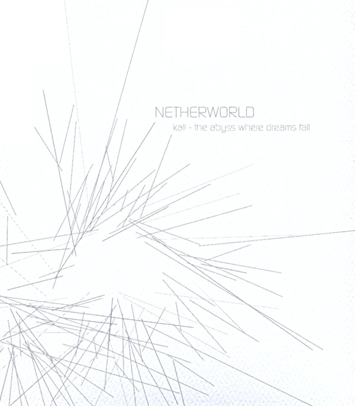

artist: Netherworld release: Kall - The Abyss Where Dreams Fall format: CD year of release: 2007 label: Mondes Elliptiques duration: 52:44

detailed info: [discogs.com](http://www.discogs.com/Netherworld-Kall-The-Abyss-Where-Dreams-Fall/release/1051905)

_Kall - The Abyss Where Dreams Fall_ is one of Alessandro Tedeschi (**Netherworld**)'s latest albums, this one on **Mondes Elliptiques**, a sublabel of the Canadian **Angle Records**. I remember saying about the previous album, the quite relaxing _Mørketid_, that I didn't find much isolationist sounds in it, despite the label description of Alessandro's **Glacial Movements**. It seems that I should have listened to this album, then, as _Kall_ is full of minimalistic, oppressive dark ambient sounds.

The album is divided in four long parts, adding up to a little over fifty minutes. "Part 1" consists mainly of a very heavy and deep, yet soft beat, mixed with higher pitched sounds and samples. This is incredibly dark and ghostly music to my ears: an abyss indeed! Faint vocal patterns are introduced in the second half of this track, which enhances the eerie effect. The second track starts with the looping of a muffled clang, which really pounds into your ears as it fades in. Almost immediately, other sounds, quite beyond my recognition, join in and hammer home that nearly horror-like atmosphere again. The rhythm changes shape halfway, but is clearly discernible throughout the track, and it is joined up with faint scrapings and squeaks. "Part 3" is the big one, lasting well over twenty minutes. It goes a bit more in an improvisational direction, lacking a theme that continues throughout the track. This adds a nice touch of variety, as the track meanders about, without losing the dark atmosphere, though. The final track is shortest, and closes off the album with a final series of deep drones and... well... surges - like a beat, but stretched and obscured to such a degree that it's more like a wave of sound.

Once again, **Netherworld** proves that first impressions can be deceiving. The grey lines on white artwork suggests something abstract or glitchy to me, or more arctic and glacial soundscapes. Instead, _Kall_ proved to be a heavy slab of true dungeon music. The production is crisp and clear, and the contrast between the crushing low-end and other sounds is perfect. It's definitely not an accessible album, though; even less so than other the work of artists who venture into this realm of dark ambient. There is not all that much sound variation, let alone melody, but what little is left makes for some excellent dark soundscapes. In short, this is quality stuff, but only if you dare to venture here.

Reviewed by **O.S.**

Tracklist:

1\. Kall - Part 1 (14:27) 2. Kall - Part 2 (9:12) 3. Kall - Part 3 (21:11) 4. Kall - Part 4 (7:54)
