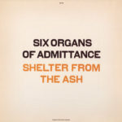

artist: Six Organs Of Admittance release: Shelter From The Ash format: CD year of release: 2007 label: [Drag City](http://www.dragcity.com/) duration: 43:03

detailed info: [discogs.com](http://www.discogs.com/Six-Organs-Of-Admittance-Shelter-From-The-Ash/master/81567)

_Shelter From the Ash_ is latest album by **Six Organs of Admittance**, the main project of Ben Chasny (whom you might also know from his psychrock band **Comets on Fire** or his collaboration with many projects, among which is **Current 93**). I haven't heard very much by this American project, but the albums I've heard so far I like a lot, and _Shelter From the Ash_ is certainly no exception.

The first thing that struck me about this album is the relatively large role for the electric guitar, which gives it a more rockish sound, even reminding me of the legendary **Swans** at times, especially on "Coming To Get You" and "Final Wing". For me, this is one of those albums that you slowly get into, and that grows and grows, revealing new things every time. The album opens with the psychedelic "Alone With the Alone", the perfect introduction to the rest of the album. "Strangled Road" is a fine, introvert ballad, where Ben is supported during the chorus by the subtle vocals of **Elisa Ambrogio**. As befits a true rock ballad, the track ends with a beautiful electric guitar solo. "Jade Like Wine", with its wonderful melody, is certainly one of my favourite tracks. It has - to me - a typically American sound which appeals to me. This is immediately followed by another highlight: "Coming To Get You". After an extensive intro, ominous drums and guitars take over, with equally threatening lyrics. Later the song really erupts with noisy, corrosive guitars and pounding drums. "Goddess Atonement" is an instrumental with a very good melody and development; a fine intermezzo. "Final Wing" is a wonderful long track that starts off calmly, like a guitar mantra, and after a slow development, it breaks loose with searing electric guitars and drums: brilliant! The title track is also great: a track with busy drums and nice accents on piano, and another heavy ending. The album closes off with the soothing "Goodnight". Like the title says, it's a beautifully written lullaby.

The **Six Organs of Admittance** atmosphere for me conjures up associations with the movie _Blueberry_ by **Jan Kounen**. It's a 'western', where the protagonist among other things struggles with his inner demons through use of the psychedelic drink Ayahuasca. The rugged landscapes, the mind-blowing trips, but also the threat and fear in the movie, these are all images I see in front of me when I listen to this music, and I love it!

_Shelter From the Ash_ is a sublime album, that should be in every lover of varied pscyhfolk(rock)'s collection. The tracks never lose focus or structure, and the varied atmosphere, which harbours many contrasts, hasn't bored me yet. Definitely recommended, and an album that'll never be far from my stereo system in the near future.

Reviewed by **DMK**

Tracklist:

1\. Alone With the Alone (4:15) 2. Strangled Road (5:33) 3. Jade Like Wine (4:11) 4. Coming To Get You (7:28) 5. Goddess Atonement (6:01) 6. Final Wing (8:35) 7. Shelter From the Ash (3:24) 8. Goodnight (3:36)
