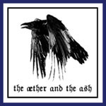

artist: **The æther and the Ash** release: _The æther and the Ash_ format: CD-R year of release: 2007 label: [Council Records](http://www.councilrecords.com/) duration: 25:58

I think 2007 was a very interesting year, musically. It was a really good year for the dark folk genres, when many promising new acts revealed themselves. The American experimental folk and neoclassical act **The æther and the Ash** released this, their first EP in the very last month of the year and it is, in my opinion, a very worthy good bye to a fine year. Read this, and then give them a chance. I am sure you will agree.

The instrumental intro "Gates of Morning" touched me quite deeply I must admit. I froze in movement when the bells faded out and a most tremendous violin composition entered, so beautiful and so sad. There is also a sweet acoustic guitar in the picture, which leads us straight into "The Bright Hours". It brings to my mind some of the slower songs by **Sol Invictus**, with added 'gothic' feeling, almost haunting at some moments. This song also introduces us to a voice, which at times is not far from David Tibet-dramatic but mostly it’s on a more mellow level. When speaking of David Tibet I take the opportunity to present the third track. "Passing to Night" reminds me of the middle 90’s work of **Current 93**. Maybe most because of the lyrics, which are traditional but sounds like something **Current 93** could have used, but there is also a strong Cashmore feeling in the guitars. And the way it jumps from tranquil to theatrical and back is also something that contributes. At the same time, it brings the feeling of desolation and loneliness of **Harvest Rain** to mind. This should be considered the best track if you ask me. I would also like to send credits to the lady that is helping out with some song lines in this track! The fourth song, "XXXVI" is also very nice where piano plays the role as the leading instrument, but the strongest side here are the lyrics. To end this, **The æther and the Ash** put in an instrumental piece called "Natt" (which is actually the Swedish word for 'night'). It is pretty much in the same vein as the intro and it’s divided into two parts, one sad and one even sadder.

Eight is a high score, but very well deserved. It could have been higher if there were more songs because that’s what you want when it’s over. There are also some production flaws here and there but I’m not sure if that’s decreasing the over-all score. Plus also for the constant feeling of sadness and the hand made package and nice cover art. I’m sure that if this EP reaches out to it’s right audience it will give **The æther and the Ash** the reputation they need to become something really, really big.

Reviewed by **CME**

Tracklist:

1\. Gates of Morning (3:38) 2. The Bright Hours (4:39) 3. Passing to Night (5:45) 4. XXXVI (6:53) 5. Natt (5:25)
