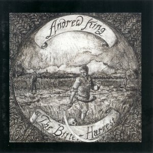

artist: **Andrew King** release: _The Bitter Harvest_ format: CD year of release: 1998 label: Epiphany / World Serpent duration: 75:20

detailed info: [discogs.com](http://www.discogs.com/Andrew-King-The-Bitter-Harvest/release/633285)

_The Bitter Harvest_ was English folk singer **Andrew King**'s debut album, released back in 1998 through World Serpent, which was still active at the time. On this album, Andrew was still trying to find his own form of presentation, and to those who have heard his recent work or seen him perform, the songs on this one will seem rather bare and more traditional. Indeed, on the majority of these ballads, King sings unaccompanied, or with a minimal drone backing. Like I said, this makes for quite traditional renditions of these folksongs. The vocal style is also different, often being a bit softer and less epic than Andrew's style of today.

The result is that the greater part of this album is mainly interesting for traditional folk enthusiasts. Lovers of modern experimentation or Andrew's more recent powerful post-industrial approach to folk will find little material to their liking here.

That's not to say that this album isn't nice all the same. I for one really enjoy the relatively pure settings of these ballads, which really drags you into the tales they tell. Most of them are murder ballads of some sort; examples are "The Folkestone Murder" and "Lily White Hand", which relate the brutal murder of two young girls and a seduced young woman, respectively. At times, there is also a foreshadowing of King's later style. The excellent "The House Carpenter" and "Maria Martin", for example, both chilling tales, also feature more prominent accordion drone loops, and **John Murphy** provides guest percussion on the latter track. "The Taunton Wassail" is also a very nice track, by virtue of its mirth and energy.

So, while this may not be something for every lover of modern experimental and neofolk, if you really enjoy Andrew's works, this one is definitely worth checking out, especially if you have a soft spot for authentic folk song.

Reviewed by **O.S.**

Tracklist:

1\. May Song (2:15) 2. George Collins (4:39) 3. The Folkestone Murder (4:35) 4. The House Carpenter (8:57) 5. Sir Hugh (4:20) 6. Green Bushes (2:57) 7. Earl Richard (3:19) 8. Brigg Fair (2:03) 9. Young Andrew (11:25) 10. The Bither Withy (4:32) 11. Lily White Hand (2:27) 12. The Bonnie Bunch of Roses (2:32) 13. The Honest Labourer (4:47) 14. Maria Martin (6:55) 15. The Taunton Wassail (2:47) 16. Sad Processional (3:40) 17. May Song (3:10)
