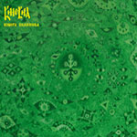

artist: **Kinovia** release: _Knjiga Pelinova_ format: CD year of release: 2007 label: [Cynfeirdd](http://www.cynfeirdd.com/) duration: 41:25

detailed info: [discogs.com](http://www.discogs.com/Kinovia-Knjiga-Pelinova/release/1255118)

**Kinovia** hails from Serbia, and this is their second release on the magnificent Cynfeirdd label. Too bad I never managed to get a hold of their first release, but as far as I understand, most of its tracks are present even on this album. Gazing upon this CD's cover might give the impression of a psychedelic album, but this is on the contrary a very sophisticated release, full of melancholic lyrics (all lyrics are sung in Serbian, but the booklet includes English translations), bible excerpts and quotes from big poets.

Musically **Kinovia** blends neoclassical material with neofolk and also a big dose of the traditional music heritage from Serbia. This makes _Knjiga Pelinova_ an original experience for me – I’m not spoiled with Balkan folk music as to say. Most of the tracks are based on great piano and the strong, deep vocals, both sung and spoken. But **Kinovia** is a big band, a collective of seven very professional members and just as many instruments performed, so of course not all tracks are as calm and peeled-off as the intro or the finishing "Vaskliknite Bogovi". Heavy use of violin or cello is common, and the flute is often participating. Sometimes, it feels as there is too much going on at once and to listen to this album from beginning to end is at times tempting, but picking out specific songs here and there to enjoy is no problem at all.

To get a full and nice first impression of _Knjiga Pelinova_ you can start with the first track – a very laid back and melancholic piano driven song. Then, jump to the fifth track, "Dorothea", to hear the full orchestra and also some up-tempo tunes. The wonderful "Vaskliknite Bogovi" shows that **Kinovia** is also capable of delivering delicate neofolk. Very simple guitar strumming and most impressive vocals.

As I said earlier, the biggest musical influences are from Serbia’s own traditional fauna, but to make comparisons to other bands in the 'dark genres', I guess it isn’t totally unfair to mention **Dead can Dance**, **Argine** and why not **Romowe Rikoito**? These are all great bands and **Kinovia** isn’t far behind, already after their second album only.

Reviewed by **CME**

Tracklist:

1\. Gone (4:07) 2. Omens (3:49) 3. Revelation Of Archangel (3:34) 4. Sabre (3:08) 5. Dorothea (5:27) 6. Neimenia (3:30) 7. Entfremdung: Kafka And The Clocks Of The Apocalypse (4:43) 8. Basilico (4:57) 9. Lelej (4:33) 10. Vaskliknite Bogovi (3:35)
