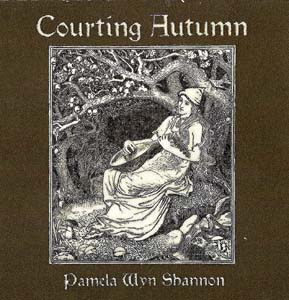

artist: **Pamela Wyn Shannon** release: _Courting Autumn_ format: CD-R, MP3 year of release: 2007 label: [Girlhenge](http://www.girlhenge.com/) (CD-R), [Woven Wheat Whispers](http://www.wovenwheatwhispers.co.uk/Folk_community/pc/home.asp?idaffiliate=13) (MP3) duration: 54:39

**Pamela Wyn Shannon** is an American singer/songwriter of Spanish and Irish descent, and with _Courting Autumn_ she presents her second album, this being the follow-up of _Nature's Bride_ from 2001. As the titles suggest, Pamela has a strong nature symbolism going on, and this is cast into a form together with musical influences from both traditional and psychedelic folk artists. I haven't heard the previous album before, but this one certainly is a very convincing piece of modern folk.

Like I said, I discern different folk influences throughout the whole album. The most obvious is perhaps the typical modern folk-revival sound of the female variety. Pamela has a warm and pleasant voice (and accent), and her melodies combine wonderfully with the music. Traditional folk is very present as well, not only in the obvious way in "Ca' the Yowes" and "Cold Blows the Wind" - which are both excellent, by the way - but also just in the general flow of her own compositions. A slight psychedelic touch is present in "Ca' the Yowes" as well, with some excellent sitar work. The strongest current throughout the album, though, is a melancholy autumn atmosphere, expressed in the lyrics, melody, and the gorgeous string arrangements (by various guest musicians). The title track, "Pipkin", and "Netherworld" are most representative: all moody tracks for the darkening days. Other highlights are "Tis Rambletime in Ambleside" and "Vespertine Autumn", which contrast by adding a higher tempo and a great fingerpicking style into the mix. Both are wonderfully swirling tracks, reminding me of **Nick Drake** somewhat. The album ends with "Fare-Thee-Forelorn", a final melancholy piece of spoken word and strings.

This album is extremely consistent in its high quality from start to finish, and anyone with a soft spot for female singer/songrwriter work and/or melancholy nature folk should definitely check this artist out.

Reviewed by **O.S.**

Tracklist:

1\. O Bittersweet Dear Madeline (4:01) 2. Tis Rambletide in Ambleside (4:29) 3. Courting Autumn (5:14) 4. Woolgathering (3:37) 5. Ca' the Yowes (5:07) 6. September's Way (5:27) 7. Pipkin (5:31) 8. Michaelmastide (3:32) 9. Netherworld (5:27) 10. Verspertine Autumn (4:31) 11. Cold Blows the Wind (3:39) 12. Fare-Thee-Forelorn (4:04)
