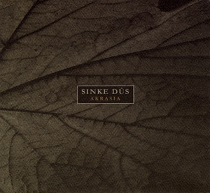

artist: **Sinke Dûs** release: _Akrasia_ format: CD year of release: 2007 label: [Cyclic Law](http://www.cycliclaw.com/) duration: 45:46

detailed info: [discogs.com](http://www.discogs.com/Sinke-D%C3%BBs-Akrasia/release/1175167)

**Sinke Dûs** is one of the new names on the Cyclic Law roster, and it's a one man project by Marcus Lönebrink from Sweden. Not surprisingly, _Akrasia_, his debut album, contains three quarters of an hour's worth of dark ambient with what I consider a distinctly Swedish sound. Sonic references include **Kammarheit** (who also appears on the album) and **Desiderii Marginis**, and I would say this album lies somewhere between the signature sounds of Cyclic Law and Cold Meat, if there is such a thing as a typical label sound.

The term 'akrasia' means to act against one's better judgment, to comit wrong acts even though you know they are wrong. This theme is interpreted musically on this album, which results in seven pensive dark ambient tracks. There is a strong emphasis on synthesizer chords and waves, which make up the greater part of the album, weaving minimalistic, slow-moving melodies. Added to the mix are some typical industrial elements (metal sounds, static, etc.) that are often used in this line of work. This also reminds me of **Raison d'Être** at times. _Akrasia_ is a subtle album, in the sense that there aren't many sounds that push to the foreground. The wavy use of synths give it a relaxed atmosphere, although the sound is also quite dark and moody. The tracks themselves differ a bit in style and melody, but not a whole lot. My favourite is definitely the final track, "Fortitude", which combines the dark atmospheres of the greater part of the album with a glimmer of hope.

Altogether an enjoyable album, and a nice achievement for someone who is just debuting. It's not the most original or groundbreaking thing out there, but it is definitely a nice addition to your collection if you are really into the Scandinavian approach to dark ambient.

Reviewed by **O.S.**

Tracklist:

1\. The Premonition (6:44) 2. Acedia (5:47) 3. Remnants (7:31) 4. That Which Was Lost (7:08) 5. The Abyss (5:17) 6. That Which Lies Beyond (7:11) 7. Fortitude (6:08)
