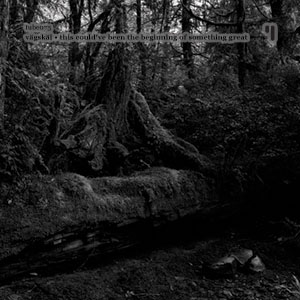

**Vägskäl** release: _This Could've Been the Beginning of Something Great_ format: MP3 year of release: 2007 label: [Test Tube](http://www.monocromatica.com/netlabel) duration: 44:04

detailed info: [discogs.com](http://www.discogs.com/V%C3%A4gsk%C3%A4l-This-Couldve-Been-The-Beginning-Of-Something-Great/release/966704)

_This Could've Been the Beginning of Something Great_ is the latest release by Erik Svensson's **Vägskäl** project, and apparently the last - something corroborated by the title, at least. And a fitting title it is, because I definitely think this is the best release of the project thus far.

The album departs a bit from the 'warm dark ambient' soundscapes of _As Summer Comes Creeping_. While retaining the otherworldly, estranging feel and melody, this one adds a strong dose of electronic beats and rhythms, which adds accesibility and variation to the mix at the same time. Tracks like "These Woods Were My Home" and "The Falling Star" are fine examples of Svensson's ability to create moody ambient pieces, whereas the title tracks and especially "New Worlds Ahead" display an almost poppy mix of dance and ambient. In a context like this, I find both styles very much to my liking. "Like Glass" also deserves special mention with its glitchy experimental sounds. The absolute highlights of the album are the two versions of "Deep Inside", though. The first one is a remix (I think) by **Jari Pitkänen**, which basically takes the vocals from the regular version of the track, strips them down and mangles them into an original whole. The regular version is even better, combining haunting melody waves with a great dance rhythm and aforementioned female background vocals. The album, and sadly, the project, ends with "Someday, Somewhere", a calm dark ambient piece finishing with clouded samples of music from a faraway time.

I definitely hope Erik Svensson will continue to produce music in some form, because this album left me craving for more. This is a [free netrelease from the ever interesting Test Tube label](http://www.monocromatica.com/netlabel/releases/tube073.htm), and as such, there's no reason not to get this right now if you're a lover of experimental electronics.

Reviewed by **O.S.**

Tracklist:

1\. We Shine Brighter Now (5:28) 2. This Could've Been the Beginning of Something Great (3:42) 3. New Worlds Ahead (5:23) 4. 23 Years and Dreamin' (4:14) 5. These Woods Were My Home (3:36) 6. Deep Inside (Through You by **Jari Pitkänen**) (5:41) 7. Like Glass (3:00) 8. The Falling Star (6:04) 9. Deep Inside (3:32) 10. Someday, Somewhere (3:24)
