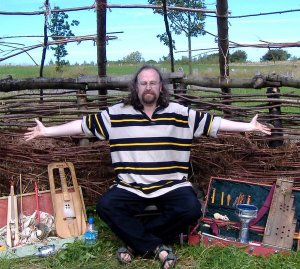
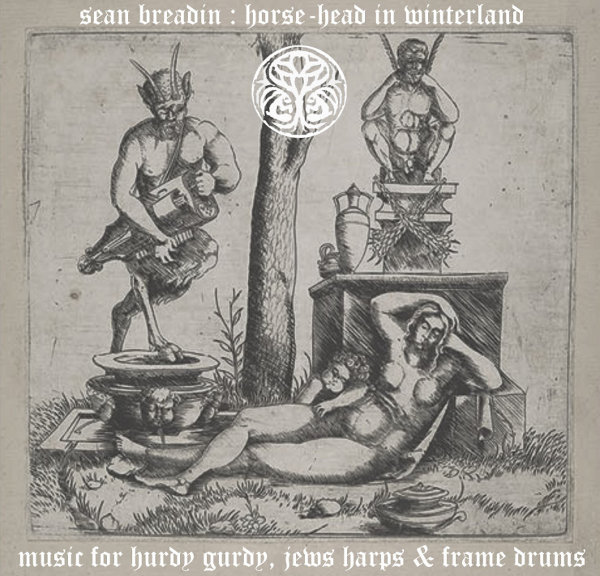
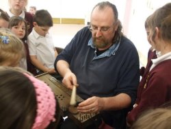
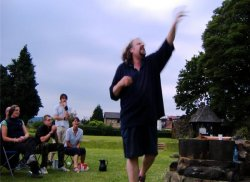
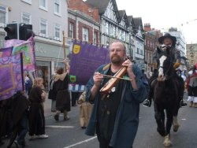

April 2008 - Interview by **O.S.**

****

All photographs property of Sedayne.

_Where lie the roots of your storytelling and your musicianship - and were they intertwined from the beginning?_

The first time music took on any sort of personal importance for me was with the little wooden whistle flute my Grandparents brought home for me from their holiday in Yugoslavia around 1968 or so - so I would have been six or seven at the time. I took it along to the school recorder class and the teacher told me it wasn't a proper musical instrument. Ever since I was drawn to little instruments - artefacts, treen, ethnography and other bits and pieces of exotic junk, cargo & gew-gaws which tied in with the immediate corporeal empiricism of various aspects of folklore and traditional narrative that were very much the landscapes of my native Northumbria and beyond, especially Norway - so the one thing has aways existed in relationship to the other to the extent that I regard them as indistinguishable.

_You have many different musical projects (**Sedayne**, **Eleanor's Visceral Tomb**, **Shibboleth**, **Venereum Arvum**, **DH7**) Can you tell us the idea behind each one of them, and whether they focus on specific musical and cultural themes?_

The music is more important than I am - I see my role as purely mediumistic, so I use the various other names to record and perform under to get away from the personal. **Sedayne** comes from an anagram of **Sean Breadin**, likewise Sabrina Eden, which is the name I use for my YouTube films. **Eleanor's Visceral Tomb** is my idea of the ideal band - I've been in lots of bands in my time, but none of them were ever too happy, so EVT is my happy band; just me with my eight track! **DH7** came from my old postcode in Durham - since we've moved to Lancashire I've changed the name to **The Ha-Ha** (I tried FY8 but it didn't have quite the same ring to it!). **The Ha-Ha** is another ideal band, albeit with the focus on electronica, loops and sampling rather than the natural sound of the various acoustic instruments. **Venereum Arvum** is Rachel and I as a duo, which is a very happy band indeed, and **Shibboleth** is my occasional duo with **Clive Powell** which goes back to 1980, hence the name. There are other names I use too, such as **Sundog**, my Shamanic Alter-Ego - which is to say, the sort of 'Me' I would have undoubtedly been had not sense intervened.

_Why did you release '[Horse-Head in Winterland](http://www.eveningoflight.nl/2007/03/01/review-sean-breadin-horse-head-in-winterland-2006/ "Review: Sean Breadin – Horse-Head in Winterland (2006)")' under your own name?_

\[caption id="attachment\_2188" align="alignleft" width="150" caption="Horse-Head in Winterland"\]\[/caption\]

Horse-Head was about settling old scores - going back to when I made that hurdy-gurdy in 1981; I wanted to revisit something of my old self in that music, to get back to an ideal of a purely improvised acoustic folk / noise aesthetic which I was dealing with back then before getting sidetracked into trying to play early music. The original idea of Horse-Head was to have it as a fake 'newly discovered' archive recording from 1981, which is why I used my own name, but for whatever reason I decided against this, but the name stuck. I did _As I Live and Breathe_ (2003) as **Sean Breadin** too, which is one of my personal favourites though not many people have picked up on it. _As I Live and Breathe_ should really have been a **DH7** project, but I field-recorded all the parts on location in Northumbria and Rachel took lots of pictures of me doing so - so it was very personal from the off, dealing with very particular rural & post-industrial landscapes of my childhood, in particular the demolition of the old coal-fired power station at Blyth which I found particularly upsetting.

_When and why did you start releasing your own music as Plough Myth International?_

Ploughmyth came from a dream I had around 1990 in which I couldn't remember the tune of "Mutton Pie" - you know those dreams where you're about to do something you really ought to know but you haven't got a clue - so in this dream I came up with this tune, which didn't fit the words at all but it was still in my brain when I woke up, so the tune became Plough Myth, after the first line of "Mutton Pie": 'Now my jolly lads if you want to learn to plough, come to Ironheads and he'll show you how...' - thus somehow relating the very mundane notion of "Mutton Pie" to the heavenly notion of The Plough (Ursa Major). Over the years it sort of stuck, along with Harvest Myth, so it seemed somehow right to use the name Ploughmyth as a general heading for the music, but as to exactly when that was I'm not entirely sure - possibly in the mid 1990s.

_How did your cooperation with Mark Coyle and Woven Wheat Whispers come about? Since all new Plough Myth releases also appear on WWW, I take it you are satisfied with the service? What role do you think the internet and digital labels such as WWW play in today's folk movement?_

Mark got in touch after reading of my work on Gerald's site \[[Psyche van het Folk](http://psychedelicfolk.homestead.com/Psychedelicfolk.html), O.S.\], which was a year or so before he set up WWW. Dealing in hard-copy handcrafted CD-Rs isn't something I'm very good at, or even maintaining my website - in fact it's a complete pain in the arse, so WWW is convenient on various levels, though I'm never sure what to charge which is why I've done a lot of free stuff recently. I'm dealing in documents, rather than products - I think the idea of 'the latest album' is a complete anachronism, especially when you're dealing with music as a day-to-day phenomenon. **Sun Ra** had this notion with this Saturn label, with each disk being an edition of a cosmic newspaper! I think the internet opens out this possibility, but I'm never too happy with paying for mp3s, so I try to do stuff for nominal amounts or completely gratis. I think everything of ours on WWW is either free or £3.75 - which is the price sticker on my old vinyl copy of _Back into the Future_ by **The Manband**, quite possibly my favourite album of all time. I think it should be less - the important thing to me is that people hear the music, but business is business. My own website is in the process of demolition - just to free up some space for more free mp3s, likewise the Myspace site. I'll be setting up others soon - both for **The Ha-Ha**, **Sundog** & **Venereum Arvum**.

_You've mentioned that you admire the similarity of story morphology, even across national and linguistic boundaries. What is your view on the evolution of (Indo-European) folktales? How do you imagine they were told in different eras and places, yet still maintained a certain correspondence of form with their 'cousins'?_

All narrative morphology is determined by the hardware of the human brain, everything from basic syntax through to the classical sonata. This is the nature of language itself on a purely psycho-biological level, something humanity has been dealing with for the past 35000 years, or however long it is since we first looked upon the world as 'other' and started giving things names, concepts, and narratives. I once heard that the reason human beings suffer problems with their teeth that other higher primates don't is because the human jaw has evolved to favour language rather than dental health - thus does Nurture triumph over Nature. Personally, as a Neo-Gnostic Jesuist\* Marxist, I find that very exciting - and as a storyteller too, where one is aware of the functional nature of traditional narrative morphology in relationship to both subjective cognition and objective culture, and how the one might interface with the other through language. The fact that narrative morphology knows no linguistic borders is telling in this context, in terms of both function and structure. For example the story variously known as "Jack and the Good Helpers", in which Jack assembles a group of uniquely (and improbably) skilled individuals to assist him along the way, is found in Wales, Ireland, England, Scotland, Norway, Sweden, and Russia, elements of which found their way into the stories of Baron von Münchhausen. In all of these variations we find a flying boat, either as the main point of the story, as in Norway, or as an aside, as in Wales, so one might ponder the process but ultimately there are no answers. It's like looking at a peacock's tail and almost being seduced by the notion of a creator because we can't get our heads around the mechanism of how such things came to be.

\*Jesuism is a secular humanist philosophy founded directly on the teaching & example of Jesus Christ with none of the religious trappings so essential to Christianity.

_Can you briefly sketch for us one of your favourite tales, or whatever comes to mind? What fascinates you about this tale?_

This is a transcription of me telling my favourite ever story, which I call "Hare's Guts", together with my favourite ever traditional folk song, "The Innocent Hare", or "Sportsmen Arouse", which people will be familiar with from both **The Copper Family** and **The Young Tradition** \[see below this reply for transcription\]. The story fascinates me because it operates on just about every level imaginable. One level it's about viscera & excrement in a very mundane yet highly ceremonial setting, and on another, it's darkly Shamanic, and as psychological as _Moby Dick_, dealing with some very primal & fundamental resonances - I shy from using the word 'Archetype' because of the Jungian overtones! Maybe we're not so very in touch with these aspects today, which is why I weave in the song, and the riddle about the wee brown cow, both of which deal with something pretty fundamental to our relationship with the darker aspects of a nature all but lost to us. On another level of course, it's a political critique of feudalism - a ceremonial humiliation of authority, and yet a conformation of it at the same time. It's also a very funny story.

* * *

**Hare's Guts / Innocent Hare / Wee Brown Cow** (Transcription of Sedayne storytelling, Hallowe'en 1998. Sung lines in italics; spoken word in plain text; descriptive details in parenthesis)

_Sportsmen arouse, the morning is clear, the larks are singing all in the air_ - repeat that - _sportsmen arouse, the morning is clear, the larks are singing all in the air_ - not bad - try harder next time. _Go tell your sweet lover the hounds are out_ - repeat that - _go tell your sweet lover the hounds are out - saddle your horses, your saddles prepare, we'll away to some cover to seek for a hare._

Verse two. _We've search the woods and the groves all round, the trial it is over the game it is found._ Repeat that. _We've search the woods and the groves all round, the trial it is over the game it is found. Then up she springs, through brake she flies_ - repeat that - _then up she springs, through brake she flies - follow, follow the musical horn, sing follow, hark forward the Innocent Hare._

That's the chorus. Sing it again to get it right. _Follow, follow the musical horn, sing follow, hark forward the Innocent Hare._ Getting better. _Our huntsman blows his joyful sound, tally-ho my boys all over the downs - our huntsman blows his joyful sound, tally-ho my boys all over the downs - From the woods to the valleys see how she creeps - from the woods to the valleys see how she creeps - follow, follow the musical horn, sing follow, hark forward the Innocent Hare._

Now sing this - _a hopper of ditches, a cropper of corn, a wee brown cow with a pair of leather horns._ It's a riddle, about the hare - from Country Antrim - _a hopper of ditches, a cropper of corn, a wee brown cow with a pair of leather horns._

Because, here's Jack, the poacher, the shaman, venturing forth in his dreaming, his waking, his sleeping, telling the story in the ritual darkness of his very soul - the story that tells of how he comes to catch the Brown Hair of the Valley, because for sure he's been after that hare now for more years than he cares to remember - watching it getting ever fatter, ever wilier, ever more elusive, as he comes ever more under its thrall.

Sing - _a hopper of ditches, a cropper of corn, a wee brown cow with a pair of leather horns._ This echoes the sentiments of an ancient English poem - the stag with the leathery horns, the animal that lives in the corn - the animal that all men scorn - but the animal that no one dare name - aye, the animal that no one dare name. All along the green turf she pants for breath - our huntsman he shouts out for death. Repeat that. _All along the green turf she pants for breath - our huntsman he shouts out for death. Relope, relope, retiring hare - relope, relope, retiring hare. Follow, follow the musical horn, sing follow, hark forward the innocent hare._

And this one night, when the wind and the moon is high, upon the very night of Hallowe'en, when the hare is standing gazing up at the moon transfixed - on this night does Jack's dream come true, and so he catches that hare - and he kills that hare - and he knocks that hare down with a rock and having killed that hare he takes the knife out of his pocket and opens the belly of that hare and takes out its guts - and stands there - bloodied in the moonlight, this great fat puss of a dead hare in one hand, and in the other - hares guts.

_A hopper of ditches, a cropper of corn, a wee brown cow with a pair of leather horns_ - sing - _a hopper of ditches, a cropper of corn, a wee brown cow with a pair of leather horns_ - sing - _a hopper of ditches, a cropper of corn, a wee brown cow with a pair of leather horns - a hopper of ditches, a cropper of corn, a wee brown cow with a pair of leather horns - a hopper of ditches, a cropper of corn a wee brown cow - a wee brown cow - a wee brown cow -_

And who should be watching him but the gamekeeper - the shaman, venturing forth in his dreaming, his waking, his sleeping, telling the story in the ritual darkness of his very soul - the story that tells of how he comes to catch the Jack the Poacher of the Valley, because for sure he's been after Jack now for more years than he cares to remember - watching him getting ever fatter, ever wilier, ever more elusive, as he comes ever more under his thrall - and - things have got so bad the man can't even get a decent shite for the thoughts of Jack - retentiveness being the only pleasure of the man's life of course - holding it in, week in, week out, so that he might indulge in one almighty monthly evacuation by way of a purge to the rancidness of his very soul - but this night - seeing Jack there - with the hare, so the contractions come early - a premature delivery indeed, as the gamekeeper must put his moment of triumph on hold, and dash behind a hedge to - unload, and not without some degree of difficulty, being without the luxury of laxatives and tobacco, and a porcelain goesunder - indeed, the very comforts of his monthly purge, as he squats down on the cold ground and labours long and hard to liberate the near-solid incumbent of his bowel, and oh dear me - what a racket he's making.

Jack meanwhile, he's wondering what all the noise is about - so away over the hedge where here he finds the gamekeeper, labouring and grunting and sweating and cursing and groaning until at last there emerges into the world, into the moonlight, at least treacle-black yards of the thing steaming with a mist that flows thick and mysterious over the earth, a shroud to the thing he bore, as the gamekeeper looks down, waiting for stinking mist to clear, wiping the leavings from his arse with a small flat stone as his heart thrills to see what manner of thing he brought forth into the world. But that mist also hides the hand of the poacher - the poacher's hand indeed, which seizing so wondrous on opportunity, deposits the guts of the Brown Hare of the Valley onto the gamekeepers leviathan of a jobby, so that when the mist clears, and gamekeepers gets a better look at his glory - oh dear me, doesn't the blood drain from his face at what he sees there? Mother, Mary and Joseph! I must have strained a bit too hard there, because I appear to have passed rather more than what I ought - rather more indeed than is either healthy or sensible for a man - and, meanwhile, there's Jack the Poacher, away down the road with the hare to the boozer, where he butchers it a with a clear and gives a portion each to the three unfortunate widows of his brothers who were horribly killed another story.

_A hopper of ditches, a cropper of corn, a wee brown cow with a pair of leather horns - a hopper of ditches, a cropper of corn a wee brown cow - a wee brown cow - a wee brown cow -_

And then, after an hour or so - in comes the gamekeeper himself, walking a wee bit stiff, as you might expect. _Tell us your troubles,_ quoth Jack the Poacher to the gamekeeper - _after all, isn't it the truth that all men are equal in the tavern?_

And so it is, the gamekeeper tells his tale, recounting the legend of that great steaming incumbent laying out in the moonlight that was the prize of such strenuous labours on his part, but how, when mist cleared - oh dear me - there I saw in the moonlight that I must have laboured rather too hard because hadn't I passed rather more than was strictly necessary or indeed health?

Of course at this point the whole tavern's in absolute uproar.

_Don't laugh at me!_ roars the gamekeeper - _do not laugh at me - because -_

(significant pause as Sedayne looks over his audience with a leer worthy of Johnny Rotten in the glory days; various members of the audience biting their nails in dread anticipation of the punch-line).

_\- By the grace of God, and a good stout stick - it's all back up there where it should be!_

(audience erupts with gales of nervous laughter, over which Sedayne sings the concluding verse of The Innocent Hare):

_\- This hare has led us a noble run - success to sportsmen every one. This hare has led us a noble run - success to sportsmen every one. Such a chase she has led us, four hours or more. Such a chase she has led us, four hours or more. Wine and beer we'll drink without fear, we'll drink a success to the innocent hare!_

* * *

_To what degree to you see an interconnection between folktake and folksong?_

Ballad narrative seems to operate in similar way to that of folktale, which is how we get innumerable variations on the same basic song form, right through Child and beyond. My favourite internet folk site, by the way, is the [Max Hunter Folk Song Collection](http://maxhunter.missouristate.edu/), which contains 1600 field recorded folksongs from the Ozark mountains. It's a seriously wonderful place to be, and seriously significant too - just look up Mrs **Pearl Brewer** and listen to [her singing of "All Down by the Greenwoodside (The Cruel Mother)"](http://maxhunter.missouristate.edu/0277/index.html) and see what I mean. I'm not altogether sure if the two are connected in any actual sense - very rarely do we find the narratives of songs turning up as stories, or vice versa. Of course there are exceptions - "King Orfeo (Child #19)" for example is the Greek Myth of Orpheus, albeit in a bi-lingual ballad setting from the Shetland Islands - but this is very rare.

_How do you view the delicate balance between tradition and innovation? On the one hand, you utilise a great deal of traditional material, both in your music and your storytelling. At the same time, anyone who knows your music will concede that is often far from traditional, compared to how traditional folk music is usually played. What do you consider your role within this tradition?_

I have this trinity in which the three aspects of cultural process entwine: 1) The primal & the ancestral - 2) The historical & the traditional - and 3) The creative and the experimental. Without being too deliberate about it, I'm dealing with all three - separately, or together - most of the time. I don't see myself as a musician in any conventional sense of the word - I'm a free improvising instrumental pluralist primarily interested in anomalous sound, as I have been since my grandparents bought me the little whistle flute forty years ago - at least since my teacher said it wasn't a proper musical instrument! I'm not hung up on conventional systems simply because I don't understand them - it's not how my brain works; I never hear anything as being 'out of tune' in terms of tonality - be it bird song or whatever - so what emerges is by way of a more corporeal virtue, and this relates directly to my understanding of the instruments themselves, but rarely, if ever, in any sort of traditional context. For example, when I'm singing purely traditional English folk songs (by English I mean in English - so anything from England, Scotland, Ireland, Australia & America basically) I'll use either a Hungarian zither or a Turkish fiddle to accompany myself. Neither of these are traditional in any musical or cultural sense, but both these instruments empower my entire understanding of the songs on a purely subjective level, which ultimately is the only level that matters. I love traditional music in a traditional context, but I'm not really part of that, only as a singer and storyteller, where I can be a bit of a traddy / purist, but that's just an aspect of what I am, because to accompany the stories I'll invariably be improvising on the crwth or citera, riding the wind of a very vivid sort of spontaneous immediacy. Otherwise I'm dealing with music on a very intuitive, spontaneous and improvised level the whole time - themes emerge, likewise structures, but as to the morphology of those structures I couldn't say precisely what they are in and of themseves, or what they might be analogous to. Analogues do fascinate me - real or imagined - but there's seldom anything conscious about it. I might have a conscious idea, but I've no notion as to what the outcome might be. For example, the whole character of **Sundog** is determined by his collection of Jew's Harps (on the download bit of _John Barleycorn Reborn_ you can hear me improvising in the church of Kilpeck in Herefordshire, famous for its Romanesque carvings, using the Jew's Harp to interact with the resonant / sacred space of the church itself) and for a while I've been dreaming about doing a music using just Jew's Harps and pocket trumpet, with only a vague sense of how this music would actually work, but what actually emerged was something else altogether. I'm still working on this, but there's bits of it on a recent WWW freebie and another on my Myspace site. I suppose it's rather like baking bread - a very intuitive process - but people have been baking bread for countless thousands of years but we continue to do so out of a different sort of necessity which isn't so bound up with being self-consciously traditional or historical, or in any way authentic, it's just about baking bread; likewise the very act of procreation - where would we be without it?

Links:

- [Plough Myth International](http://www.sedayne.co.uk/)
- [Sabrina Eden (YouTube)](http://www.youtube.com/user/sabrinaeden)
- [Sedayne (MySpace)](http://www.myspace.com/sedayne)
- [Sundog (MySpace)](http://www.myspace.com/solusperhelia)
- [The Ha-Ha (MySpace)](http://www.myspace.com/dh7haha)
- [Rachel McCarron (MySpace)](http://www.myspace.com/rachelmccarron)
