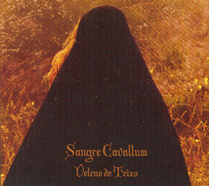

artist: **Sangre Cavallum** release: _Veleno de Teixo_ format: CD year of release: 2007 label: [Ahnstern](http://www.steinklang-records.at/) duration: 62:42

detailed info: [discogs.com](http://www.discogs.com/Sangre-Cavallum-Veleno-De-Teixo/release/1141501)

**Sangre Cavallum** is no new name for me, but I hadn't had the pleasure of hearing their music before I got _Veleno de Teixo_. The band hails from the Portuguese area of Callaecia, a region with its own unique heritage, language, and culture. And this is exactly what **Sangre Cavallum** is all about: expressing this identity in music.

The band themselves do not refer to the music as neofolk, and in a sense, that is correct, although the preoccupation with ethnic identity and heritage definitely has its parallells in the neofolk scene. Regardless, the music on this album contains a seamless blend of traditional folk and mediaeval music, modern folk/martial experimentation, and even a slight rock/metal touch. Other distinctive elements are the powerful and epic vocals of new lead singer Emanuel Meno da Cunha, and the extensive use of folkloric field recordings.

As can be expected, this results in a varied sound, ranging from rousing martial folk tracks ("Braneas Fastoras" and "Bravura" being my favourites) to traditional folk dances ("Chin Glin Din", "Cantiga") and pathos-filled ballads ("Às Mães às nossas Mães"). The great diversity of instruments contributes even more to this. Many great percussive elements, guitars and other strings instruments, bagpipes, hurdy-gurdy, etc. It's all there.

The title of the album means 'yew poison', and it refers to the ritual self-sacrifice made by women in the early history of the region when facing defeat at the hands of their enemies. This is but one of the many ways in which the band incorporates its local heritage into their releases. The superb cover artwork and other layout, as well as the great masks worn by the band on the pictures also deserve mention.

There is perhaps some room for improvement here and there - not all tracks are equally strong, and the vocal performance isn't always consistent, but the merits of this album are great. On the whole, there are many strong and evocative tracks, and I consider **Sangre Cavallum** to be one of the more original and pleasant acts in today's alternative folk world. Don't hesitate to check out this album if the themes of history and folk heritage in music appeal to you!

Reviewed by O.S.

Tracklist:

1\. Bravas (1:22) 2. Dona Angelica (3:57) 3. Colosso de Fedralva (4:20) 4. Ó Menino Ó (3:55) 5. Braneas Fastoras (4:49) 6. Moinho de Sangue (4:23) 7. Chin Glin Din (3:29) 8. Às Mães às nossas Mães (3:13) 9. Cego Andante (5:37) 10. Monte Medulio (4:03) 11. Duriana Troa (4:44) 12. Sagrada Teixo / Cruel Vento (4:52) 13. Cantiga (2:44) 14. Tremor - rebentam peles, scivas e águas (2:47) 15. Noite de Solstício (3:22) 16. Bravura (5:05)
