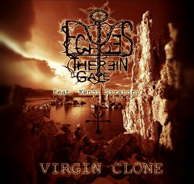

artist: **Echoes Therein Gale** feat. **Kenji Siratori** release: _Virgin Clone_ format: CD year of release: 2008 label: [Self-released](http://www.myspace.com/echoestg) duration: 26:44

_Virgin Clone_ is a collaboration between Greek electronic/ambient project **Echoes Therein Gale** and Japanese writer and noise musician **Kenji Siratori**. It's a six track EP of electronic tracks, overlaid with spoken word in Japanese by Siratori.

Some of the tracks, like the first, feature a steady mid-tempo electro beat and synth melodies, while others, such as the second one, are more ambient in nature. Other touches are added here and there, such as acoustic guitar on "Closure Sun". It's a pity that most people won't be able to follow Siratori's lyrics here, but the delivery of the lines - sometimes calm, sometimes strong and aggressive - supplements the atmosphere of the music. The cyberpunk thematics of Siratori's experimental prose shine through somewhat in the titles.

On the whole, I can't say I'm extremely enthusiastic about the artificial synthy sound of the album, though arguably it fits the industrial side of the cyberpunk genre, which however, also contains enough organic elements, which wouldn't have hurt this album either, had they been included. All the same, _Virgin Clone_ is a very catchy and enjoyable short electronics EP. The title track with its steady beat is the definite highlight. Recommended if you enjoy electronic music with a bit of a futuristic and dystopian atmosphere.

Reviewed by **O.S.**

Tracklist:

1\. Paranoia Womb (6:25) 2. Terminal Gene (5:41) 3. Closure Sun (2:47) 4. Soul Gram (4:01) 5. Uterine Machine (3:27) 6. Virgin Clone (4:23)
