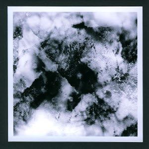

artist: Clouwbeck release: A Moraine format: CD-R year of release: 2007 label: [Sustain-Release](http://www.sustain-release.co.uk/) duration: 27:59

detailed info: [discogs.com](http://www.discogs.com/Clouwbeck-A-Moraine/release/1649491)

**Clouwbeck** is one of the latest musical incarnations of **Richard Skelton** and his Sustain-Release label. _A Moraine_ is a one track EP in three movements, housed in a beautiful packaging: grey card folded sleeve, translucent paper inserts, and custom visual art, with a personalised dedication. Stunning handicraft, as ever.

_A Moraine_ is built up of layered and manipulated string melodies, woven together into an ambient acoustic soundscape. A bit less dense than **A Broken Consort**, but slow-moving, serene, and profound.

The mood is not particularly melancholic, but expresses a more mystical atmosphere, trying to put some of the secrets of life and nature to music. The three movements work with their own distinct note and melody patterns, each running for about a third of the EP's duration. There is some similarity in composition between the pieces, as is parallelled in the morphology of the subtitles: "Andelevesarewe", "Anlauesargh", "Anlewesearche".

Altogether another very fine Sustain-Release album, proving once more that this man's art in unmissable if you love calm acoustic soundscapes with a brilliant presentation. This one's especially recommended if you like Richard's **Landings** project.

**Reviewed by O.S.**

Tracklist:

1\. A Moraine (27:59) -Andelevesarewe -Anlauesargh -Anlewesearche
