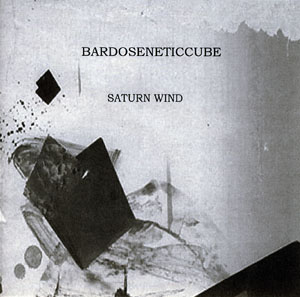

artist: **Antenne** release: _#3_ format: CD year of release: 2008 label: [Helmet Room](http://www.helmetroom.com/) duration: 49:43

detailed info: [discogs.com](http://www.discogs.com/Antenne-3/release/1389659)

_#3_ is the (you guessed it) third album by Danish duo **Antenne**, consisting of Kim G. Hansen and Marie-Louise Munck. Both members have experience in the band **Amstrong**, and Hansen was also part of **Institute for the Criminally Insane**. This album is marketed as trip-hop, but I always have a hard time imagining what to expect from something like that. **Portishead** invariably gets mentioned in such contexts, and the promo sheet for _#3_ is no exception. This kinda thing always bugs me, because I happen to be one of the apparently few people who's _not_ raving mad about **Portishead**, and that has caused me to generally ignore things to do with so-called trip-hop.

Enough whining, though - once more I've told myself that one always just needs to cut the crap and listen to the CD. Well, _#3_ is a fine, relaxing album put together from electronics (though not many prominent beats), acoustic and electric guitars, keyboards, and soft female vocals courtesy of Madam Munck. The first three tracks set a strong, calm mood, utilising the elements mentioned above. Especially "Gloves On" has a captivating, even uplifting character. "Ttreaa#7" is an experimental instrumental track full of static, noise and some great guitar and saxophone work. "Blue Light" has a more melancholic atmosphere, with very a very minimal and sad melody, and some subtle percussion. Two of the last three tracks are instrumental experiments again, though a bit more conventional than "Ttreaa#7". "End" is the last track with vocals, another one with a slightly more melancholic atmosphere.

At some points I feel the album is perhaps a touch too easy. The vocals are consistent, but you could also say they are a bit stale. The album experiments at times, and it does so very well, but the end result still is a bit careful for my tastes. I think **Antenne** would do better to keep the good points steady, but to try to add a bit more of a challenge to the whole. All the same, _#3_ is a very pleasant album that works fine as it is. It's full of that peculiar mood that is at the same time calm, downcast, and comforting.

So, trip-hop or not, I'll leave that to others. What counts is that this is a well-succeeded album with equal parts electronica, ambient, and melancholic folky pop, and if that sounds appealing, do try these Danes out.

Reviewed by **O.S.**

Tracklist:

1\. Long To Kiss (6:37) 2. Gloves On (7:01) 3. Days into Nights (6:42) 4. Ttreaa#7 (5:59) 5. Blue Light (6:23) 6. Ernst (5:49) 7. End (4:55) 8. All of Us (6:17)
