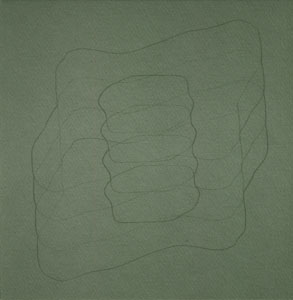

artist: **Mathias Delplanque** release: _Ma Chambre Quand Je N'Y Suis Pas \[Montréal\]_ format: CD year of release: 2006 label: [Mondes Elliptiques](http://www.angle-rec.net/mondes) duration: 45:14

detailed info: [discogs.com](http://www.discogs.com/Mathias-Delplanque-Ma-Chambre-Quand-Je-NY-Suis-Pas-Montr%C3%A9al/release/744632)

_Ma Chambre..._ is a concept album, based on a sound installation **Mathias Delplanque** made for an exhibition. The sounds are created in their entirety from recordings made in the exhibition studio when it was empty and 'quiet'. Using this method, the listeners focus is drawn towards the sounds that still remain when we believe a room to be quiet, which is of course a relative concept. These sounds are amplified and manipulated to a great degree, giving way to a detailed and layered ambient texture.

The 45-minute track resulting from this process is an interesting piece of ambient sound exploration. As will be expected by anyone who has an ear for unusual sounds and attentive listening, a 'quiet' room will show many interesting things to listen to, that normally would be hidden. On this work, the source of the sounds is not recognisable, which lends the whole a rather abstract character. This is enhanced by the geometrical drawing on the cover and the three double-sided insert cards, all by **Dove Allouche**.

There is an interesting mixture of low-frequency sounds (throbs and beats) and higher-frequency static, beeps and noise, which lends the track a rich level of detail. What I did find rather disappointing was that some of the sounds recur almost throughout the entire album, which suppresses any development that might be found in the sounds. There are some subtle differences on a lower level, but not strong enough to really keep this album interesting enough to attentively listen to for its whole duration.

I can sum this up as great concept, great presentation, great sound, but mediocre composition and structure. Certainly a very interesting album if you enjoy sound exploration, but it could have been more interesting musically as well. I always enjoy it when artists are able to combine the two elements in original ways. Nevertheless, this is still pretty interesting for the right people.

**Reviewed by O.S.**

Tracklist:

1\. (45:14)
