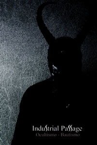

artist: Industrial Passage release: Ocultismo - Bautismo format: 2x CD-R year of release: 2008 label: [The Art of Mystification](http://www.myspace.com/theartofmystificationrecords) duration: 1:37:45

detailed info: [discogs.com](http://www.discogs.com/Industrial-Passage-Ocultismo-Bautismo/release/1462595)

**Industrial Passage** is the drone project of Antillian-Dutch **Ewell Juliana**. He has made several releases on his own before, as well as (live) collaborations with **Machinist** and **Melle Kramer**. _Ocultismo - Bautismo_ is a double album, released on two CD-Rs in slimline DVD case in February 2008.

I haven't heard the other releases yet, so I'm not sure how the sound compares, but the tracks on this release are based around prominent and very heavy guitar drones, along with what sounds like a particularly dark organ, but is probably guitar as well. Other important elements are manipulated voices and whispers, and the occasional percussive elements. "Et Benedictu" is worth mentioning in particular, as it combines the best elements of this album's sound. The drones are heavy, the atmosphere is dark and spiritual. Very nice here is the spoken word part by Dutch radio DJ (on the excellent KinkFM program X-Rated) **Bob Rusche**.

The downside of the album is that it is in my opinion a bit overlong. There is not all that much variation in terms of sound between most of the tracks, and while I enjoy these oppressive dark sounds for about 20-30 minutes at a time, taking _Ocultismo - Bautismo_ in all at once is not something I'd do very quickly. As a consequence, this is more of an album where you pick a track now and again, and listen to it, or even one of the two halves, but seldom all in one go, and that's a pity. With some more variation and ripened ideas, I'm sure some very interesting drones will come from this direction. All in all, I'd recommend the album to drone enthusiasts, also from a metal angle, and especially those people who like to keep their eyes on the Dutch underground.

Reviewed by **O.S.**

Tracklist:

_Ocultismo:_ 1. Et Bendictu (8:02) 2. Nobis Peccatoribus (29:42) 3. Nostrae Mortis (20:30) 4. Oracion (6:27)

_Bautismo:_ 5. Santu (33:04)
