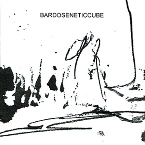

\[caption id="attachment\_939" align="alignright" width="150"\] 'Saturn Wind'\[/caption\]

artist: Bardoseneticcube release: Saturn Wind / Lord of Light format: 2x CD-R year of release: 2006 label: [Deserted Factory](http://www.desertedfactory.com/) duration: 52:58 / 59:07

detailed info: discogs.com \[[Saturn Wind](http://www.discogs.com/Bardoseneticcube-Saturn-Wind/release/981975) / [Lord of Light](http://www.discogs.com/Bardoseneticcube-Lord-Of-Light/release/981976)\]

**Bardoseneticcube** is an a post-industrial duo from St. Petersburg with an extensive discography since the early 2000's. _Saturn Wind_ and _Lord of Light_ are two semi-recent releases, published right after one another on the Japanese Deserted Factory label. Since they could perhaps be considered a double album, and I received both at the same time, I will make this a double review. Both albums were released on CD-R, with sparse black and white artwork.

_Saturn Wind_ is the first half, and in many respects the harsher one. It is mainly a noise album, with abrasive static and howling aural winds featuring prominently in every track. Here and there, this mass of sound is supported by industrial beats, throbs, distorted vocals, and synthy waves.

_Lord of Light_ leans more in the direction of dark ambient, for while the noisy elements are still present, the music and sounds are allowed to breathe a bit more on this half of the set. The result is that we can hear more of the strange samples, effects and voices that lie hidden.

When taken as a double album, it is nice that the two halves each have their own typical style. _Saturn Wind_ is an all-out barrage of sound that leaves room for pause, while _Lord of Light_ is less dense, though it retains a certain agitated atmosphere. Both sides also share a detailed texture of sound. I do feel that the music comes across as a bit sterile and emotionless, or even lacking a concrete conceptual dimension, and that is a pity, as it would have been interesting to see these musical movements coupled to a more overt theme.

In short, these releases are definitely not for everyone, as they are quite inaccessible, there being little to hold on to for newcomers to extreme electronic music. If you're a noise and/or ambient veteran, though, these albums may very well be your cup of tea, for there certainly is quality in here.

Reviewed by **O.S.**

Tracklist:

_Saturn Wind_: 1. (6:47) 2. (5:17) 3. (3:39) 4. (9:44) 5. (10:58) 6. (5:41) 7. (10:52)

_Lord of Light_: 1. (10:54) 2. (11:11) 3. (13:27) 4. (11:51) 5. (11:44)
