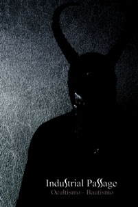

artist: **Cisfinitum** release: _Tactio_ format: CD year of release: 2008 label: [Mechanoise](http://www.mechanoise-labs.com/) duration: 46:40

detailed info: [discogs.com](http://www.discogs.com/Cisfinitum-Tactio/release/1263940)

Russian dark ambient project **Cisfinitum** is a new name for me, as is the Mechanoise label, but this excellent release will surely help me remember them for the future. _Tactio_ was recorded live in the St. Petri Dom cathedral in Bremen, and although being there must have been an even better experience, this live registration captures a great atmosphere.

_Tactio_ is made up one 45-minute set divided into six movements and a closing outro of applause. It starts off with calm melodic waves, probably created with manipulated violin. Added to this are the usual trappings (effects and sounds) of dark ambient. In the later movements, Evgeny Voronovski, the man behind the project, starts utilising church bells to great effect, creating drones, loops, and melodies. The last movement, finally, twists everything into a brilliant hypnotic rhythm.

All through the album, an abstract, mystical or even religious atmosphere is achieved and combined with skilled presentation and misty sound; the result is marvellous.

This one's highly recommended to dark ambient and drone enthusiasts. References to artists like **Troum**, **Raison d'Être**, and **Psychic Space Invasion** are certainly not out of place, and who knows, **Cisfinitum** itself might become a touchstone for the genre in the future.

Reviewed by **O.S.**

Tracklist:

1\. (6:39) 2. (7:58) 3. (5:55) 4. (5:19) 5. (10:19) 6. (9:17) 7. (1:13)
