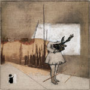

artist: **The Enchanted Wood**  
release: _The Enchanted Wood_  
format: CD  
year of release: 2008  
label: [Doryphore](http://www.doryphore.org/)  
duration: 35:10

**The Enchanted Wood** is a precious little project, hailing from France. The influences seem to be gathered from the neofolk scene, and from artists such as **Nick Cave** and **Leonard Cohen**. I will go pretty straight on here, guiding you through the nine tracks. Follow me!

The first one sounds like a really broken carousel, a pretty ghastly melody actually, and later accompanied by a banjo. Many of the tracks are built around the banjo, but there are also some guitars here, mostly electric, and also some bass, flute and harmonium work. And of course, and above all, Michel’s crystal clear vocals that you’ll acquaint yourself with in the second track, the tale about the "Little Girl in White Lace". It’s a really nice track, reminding me a little about **Death in June** in melody, but with a strummed banjo instead of guitar. Track three is also a good one, but with different qualities. It remains true to the haunting atmosphere, and the lyrics are really worth your attention. The fourth track does not really keep me interested all the way through though, I find it dull and too repetitive, with the easy guitar line over and over again. It has some nice background noises though. Then comes an interlude, pretty unremarkable but nothing that disturbs. I’m glad it’s not too long (which is very common). It boosts the atmosphere up a little before you enter "In your Street", the best track here on this little self titled album. It’s a guitar / bass track, with some nervous tension hanging in the air. Good lyrics are a trademark of this release, and in this track, they’re splendid. Also, the vocals work perfectly here. An unaware ear could probably mistake Michel for a **Matt Howden** from time to time, and that’s a great score if you ask me. "Memories" is the only track I don’t remember after listening to this album. Don’t know why though, since it has some fine moments, and a really suggestive mood. I can listen to "Sleeping Beauty" on repeat for hours, it’s really smooth and I love the romantic sounding singing in this one! Also, the instrumentation is great, just listen to the harmonium, and the transition to the final track... Super. The final track, by the way, is a fine outro where the harmonium just keeps going in circles, making me think a little about **Current 93**’s hypnotic "Sleep Has His House".

**The Enchanted Wood**'s debut album is a must-have if you are into experimental folk and _Twin Peaks_\-moods. It’s original, it’s poetic and arty without ever tending to be pretentious at all. It’s simply a very well crafted album and I do wish to hear more from **The Enchanted Wood**.

Reviewed by **C.M.E.**

Tracklist:

1\. The Lady from Venice (2:09)  
2\. Little Girl in White Lace (3:17)  
3\. A 7 o’clock Poem (3:26)  
4\. We Are Strangers (6:46)  
5\. Interlude (1:38)  
6\. In Your Street (4:16)  
7\. Memories (1:50)  
8\. Sleeping Beauty (5:59)  
9\. The Enchanted Wood (5:52)
