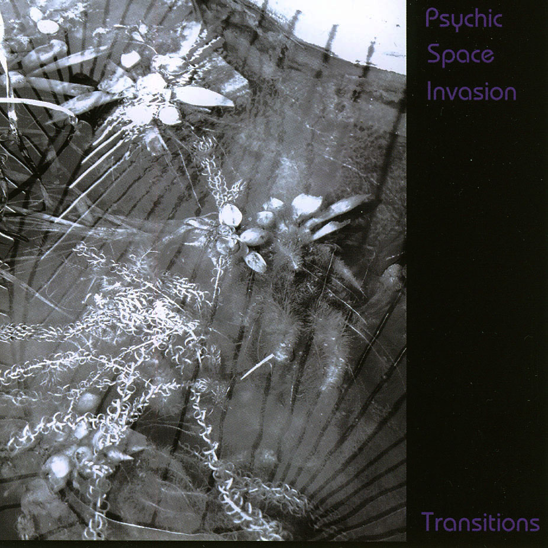

artist: **Psychic Space Invasion**  
release: _Transitions_  
format: CD  
year of release: 2008  
label: [Persepolis](http://www.myspace.com/persepolisrecords)  
duration: 41:10

detailed info: [discogs.com](http://www.discogs.com/Psychic-Space-Invasion-Transitions/release/1289693)

Apparently, _Transitions_ is going to be the last album by **Psychic Space Invasion**. I believe Welsh droner **Ian Holloway** has decided to continue making music under his own name, leaving this project behind. The album under review here, then, marks the transition between two phases, not only symbolically, but also in terms of music.

Combined in this one long track are influences from various stages of Holloway's musical development. It starts out with a powerful, obscure drone consisting of many layers, and embellished with pretty effects sounding like warped chimes and such things. This spacious and fascinating piece develops slowly over the course of the first ten minutes, and gains intensity. At about fifteen minutes, rhythmic distorted voice loops emerge from the depths, transforming the track into something reminding me of the hypnotic _Pendulum_ album. Rhythmic patterns are also formed in the deeper drones itself, building the track up to trancelike levels. More near the end of the track, starting at about 27 minutes, a piano melody starts fading into the still churning loop maelstrom. Slowly the intensity of the track wanes, leaving the piano melody to end the album in a calmer way, which reminds me of Holloway's work on **Itto**. All through the album, additionally, we hear the slightly darker touch that features in much of Holloway's recent music.

_Transitions_ may be the last **PSI** album, but I'm glad Holloway isn't quitting music altogether. He keeps on putting out good drone and ambient works, both solo and collaboratively, so look for his own name from now on. In the meantime, _Transitions_ is recommended to all lovers of quality droneworks.

Reviewed by **O.S.**

Tracklist:

1\. (41:10)
