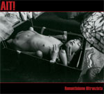

artist: **AIT!** release: _Romanticismo Oltranzista_ format: CD year of release: 2007 label: [Punch Records](http://www.punchrecords.it/) duration: 43:06

detailed info: [discogs.com](http://www.discogs.com/AIT-Romanticismo-Oltranzista/release/924767)

I got to know the Italian one man project **AIT!** on the 2008 edition of the **Summer Darkness** festival. I was curious how this catchy act would sound on CD, so I contacted Tairy Ceron, the man behind the project and behind Punch Records, and he was generous enough to send me the latest album. **AIT!** has released earlier material, but these albums are not available anymore, so it hasn't been possible for me to compare _Romanticismo Oltranzista_ with its predecessors. Nevertheless, there is always the album itself, which I will treat now.

_Romanticismo Oltranzista_ is perhaps best described as a collection of songs with influences from disco, industrial and rock(abilly). The atmosphere is decadent, dark, and conjures up visions of vintage porn, sleazy nightclubs, and the like. The lyrics are in Italian, but luckily also translated into English. After seeing the show, I expected them to be mostly about eroticism, but the subject matter is varied. Some lyrics are quite personal, while others feature social criticism.

The songs themselves also have quite some variation. The album starts with a musica intro with Tairy inviting you to an adult show to forget the drab everyday life and the mediocrity of our age. The next two songs are calm and not very remarkable, but do not distract from the overall atmosphere. The dirty disco track "La Libera e Democratica Società Moderna" is one of the highlights for me. "Dio" is a sparse industrial track with a heavy, dragging beat, various effects and the by now typical reverberating vocals of Tairy. The absolute high point, however, is the up-tempo "Il Mondo è Morto (Trent'anni fà)", a catchy track with well-timed eddects and a driving bassline. The rockabilly track "Una Dedica" is also quite amusing. He played this song during **Summer Darkness**, and it's fun to realise that Tairy was waving happily at the audience during this track, while singing "Vaffanculo, coglione!!" (= "Fuck you, asshole!") at the unsuspecting crowd, who were courteously waving back. The album closes with the angry "Donna", a reworked version of the track the first appeared on the split with **Nový Svet** in 2003.

A little more variation (especially in terms of tempo) wouldn't have hurt this album, but besides that, I think it's very good. In my review of the gig, I wondered whether the music would be enjoyable without a live act, and I can now safely say that this is indeed the case. I'll keep a close eye on **AIT!** from now on, and urge you to do likewise.

Reviewed by **D.M.K.**

Tracklist:

1\. Uno Spettacolo Adulto (2:00) 2. Io Ballo da Solo (6:22) 3. Tempo Morto (5:08) 4. La Libera e Democratica Società Moderna (4:40) 5. Le Tue Labbra Grigio-Blu (3:18) 6. Dio (3:53) 7. Una Fantasia Strumentale (4:52) 8. Il Mondo è Morto (Trent'anni fà) (3:36) 9. Una Dedica (3:03) 10. Donna (6:14)
