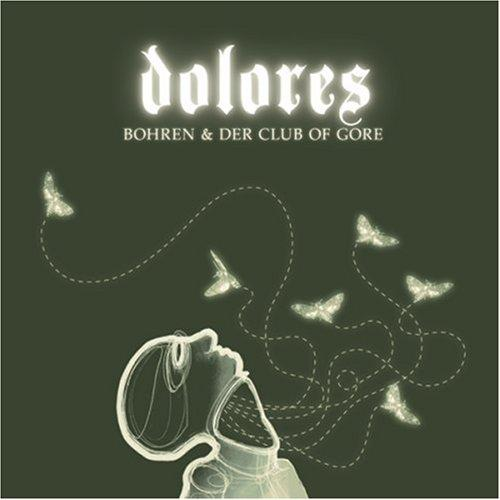

artist: **Bohren & Der Club of Gore**  
release: _Dolores_  
format: CD, 2xLP  
year of release: 2008  
label: [\[PIAS\]](http://www.piasrecordings.com/)  
duration: 58:23

detailed info: [discogs.com](http://www.discogs.com/Bohren-Der-Club-Of-Gore-Dolores/master/60856)

As some readers will recall, I concluded my eclipse review of _Geisterfaust_ - the very first on this website - with the observation that its ending left many avenues open for its followup. Now, three years on, that followup is here, and I was a bit surprised by the results at first.

Instead of continuing along the minimalistic road that _Geisterfaust_ thrived on, _Dolores_ is a step back in the direction of earlier **Bohren** material. Like the canonical _Black Earth_, _Dolores_ is halfway between the dark urban jazz of _Sunset Mission_ and the emptiness of _Geisterfaust_. Now, contrary to popular opinion, I never did consider _Black Earth_ the best album by the band, preferring either the richer or scarcer extremes of the surrounding albums. _Dolores_, however, is something different.

At the album's first listen, I was slightly disappointed, precisely because I feared a return to the _Black Earth_ style. I just couldn't let this album go, though, and it hasn't left my music players since its release. I must have heard it a least a couple dozen times, which is a lot before I generally write a review. The reason, I think, is that this album is far more mature than _Black Earth_ was, with much better songwriting and sound.

A few impressions: The opener "Staub" has an atmosphere to rival that of the sublime "Zeigefinger", featuring an impeccably timed lead melody on Rhodes piano. Another favourite of mine is the sleazy jazz track "Still am Tresen", which, if I understood the band correctly live, has something to do with hanging around in bars. The saxophone is also back from its near absence from the previous album, though in a slightly more modest role than before that time. Near the end of the album we find the great, minimalistic organ & Rhodes piece "von Schnäbeln", a beautiful and dark interlude before the two final tracks, which prove once again that Bohren has a peculiar talent for writing songs that would sound out of place anywhere else than at the end of an album.

And what an album it turned out to be... These four Germans have turned dark jazz into an art, and this, their sixth full-length album, is one of the crowning achievements on a career that was already impressive, both live and on recording. It comes both on CD and as a stylish gatefold double vinyl. Absolutely essential for lovers of dark urban music with an abstract touch.

**Reviewed by O.S.**

Tracklist:

\[vinyl tracklist\]

1\. Staub (7:50)  
2\. Schwarze Biene (Black Maja) (8:12)

3\. Karin (3:36)  
4\. Unkerich (5:29)  
5\. Still am Tresen (3:57)

6\. Welk (6:15)  
7\. Orgelblut (6:12)

8\. von Schnäbeln (3:55)  
9\. Faul (5:55)  
10\. Welten (6:51)
