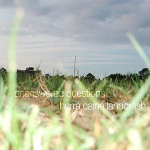

artist: **Hurra Caine Landcrash** release: _Unanswered Questions_ format: CD year of release: 2008 label: [Split Femur](http://www.splitfemurrecordings.com/) duration: 39:52

detailed info: [discogs.com](http://www.discogs.com/Hurra-Caine-Landcrash-Unanswered-Questions/release/1579488)

**Hurra Caine Landcrash** is an English project by Daniel Hopkins that makes relaxed, guitar-based ambient with a quirky and mysterious touch. This is the project's first release on Split Femur Recordings. Hopkins also does a lot of work as a director of videos and short films, both for other artists, projects, and for himself. You can view a selection of them through the [**Hurra Caine Landcrash** website](http://www.landcrash.co.uk/).

The first three tracks on this album are based on delayed, looped and otherwise treated guitar melodies. Also, Hopkins uses unorthodox methods (pebbles, spatula, etc.) to elicit sound from the strings. The result is a selection of strange soundscapes, but with a relaxing aspect as well. "Trip to the Moon" starts out in a more conventional way, with calm ambient waves laying down a sound tapestry. Only at the end of the track do we get some sligtly noisy guitar work. "Autumn Leaves" also continues in a calmer direction, twisting the sounds into a mellow, glitchy whole. "The Ultimate Ever" concludes the album with a flowing ambient piece made up of wavy guitar sounds, soft crackling like the hiss of an old record, and other effects.

The project emphasises different ways to create an ambient atmosphere, with the odd guitar playing often adding a percussive touch to the basic underlying levels of sound. All the while, a constant mood is maintained, one that calls for a more contemplative approach to listening and sensing in general. This is perhaps best expressed in some of Hopkins' audiovisual works, where he combines his two talents. In that respect, this album is slightly less memorable than it could have been, combined with a visual component. All the same, _Unanswered Questions_ is an original and serene ambient album that is worth checking out.

Reviewed by **O.S.**

Tracklist:

1\. Soul (2:37) 2. Blood Letting Go (5:59) 3. Reflex Reaction (5:37) 4. Trip to the Moon (12:22) 5. Autumn Leaves (6:27) 6. The Ultimate Ever (6:50)
