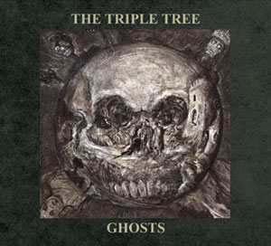

artist: **Marc Almond** with **Michael Cashmore** release: _Gabriel & The Lunatic Lover_ format: CD year of release: 2008 label: [Durtro](http://www.durtro.com/), [Jnana](http://www.jnanarecords.com/) duration: 12:04

detailed info: [discogs.com](http://www.discogs.com/Marc-Almond-With-Michael-Cashmore-Gabriel-The-Lunatic-Lover/release/1340453)

This single by Marc Almond and Michael Cashmore was recently released by Durtro. We know Almond from **Soft Cell**, who had an eighties hit single with "Tainted Love", and from his solo work. Michael Cashmore is one of the most important composers for **Current 93**, **Nature and Organisation** and more solo work. This little record contains two beautiful ballads, for which poems by a certain **Count Stenbock** (1860-1895) were used. A photograph of this good man graces the back of the booklet. On the cover and booklet, we see some stylish painted portraits of Marc Almond, made by **Vania Zouravliov**. In short, the presentation is well taken care of.

And now about the music itself. "The Luncatic Lover" starts a capella with Marc's beautiful and subtle vocals, and is quickly supported by harp and guitar. Different instruments - all played by Michael Cashmore - provide exactly the right accents throughout the song. One shouldn't expect any **Current 93**\-like ballads here. These two compositions are quite different, with more influences from classical music, and a bit more orchestral, which highlights Cashmore's versatility as a composer. The music reminds me the most of _The Snow Abides_, where Antony (of **Antony and the Johnsons**) takes care of the vocals. The second track, "Gabriel", is my personal favourite. I love the poem, and the accents on piano and subtle backing vocals (apart from acoustic guitar and other instruments) make this a breathtaking song. I've listened to this many a time in the late evening hours, or during the rainy days that fill our Dutch summer. In the end, the song closes with a beautiful climax.

Two excellent tracks and beautiful artwork make this an unmissable addition to your collection. I hope the gentlemen found their collaboration equally successful as I did, and that we may expect more beautiful material in the future. I'm looking forward to it!

Reviewed by **D.M.K.**

Tracklist:

1\. The Lunatic Lover (6:10) 
2. Gabriel (5:54)
