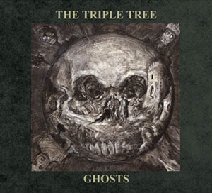

artist: **The Triple Tree** release: _Ghosts_ format: CD year of release: 2008 label: [Cold Spring](http://www.cold-spring.co.uk/) duration: 58:01

detailed info: [discogs.com](http://www.discogs.com/Triple-Tree-Ghosts/release/1482003)

_Ghosts_ is one of those albums I had been waiting for for quite some time. **Tony Wakeford** started this project with the MP3-only album [_The Turning Wheel_](file:///D:/EoL/en/reviews/ttt_ttw.htm) on Woven Wheat Whispers in 2006, but has since been joined by **Andrew King** to take on this project together. Along with an impressive array of guest artists (**Kris Force**, **Reeve Malka**, and **John Murphy**, to name a few), these two men have tackeled the superb and prolific ghost stories of **M.R. James** on this interesting and original album.

Those who think that Wakeford has been stuck in playing straight-forward neofolk with the classic **Sol Invictus** should look again, for the good man has shown a fine taste for musical experiments in the past years. 2007 saw the release of his collaboration with **Nick Grey** and **Kris Force**, the beautiful and subtle _Grey Force Wakeford_ album, and this latest one by **The Triple Tree** is no exception. _Ghosts_ is made up of original compositions that incorporate elements from the neofolk background, surely, but also ambient, neo-classical, Wakeford's own funky bass, and of course traditional song as championed by **Andrew King**. The result as a whole is quite diverse, yet very coherent in its atmosphere.

That is, of course, the aim of a concept album like this. Just as James' stories display different flavours, their overall tone is always one of dread and mystery: a restrained counterpart to the splatter horror of today. Ghosts are of course the real protagonists in these tales of forbidden esoteric magic, tragedy, and horrid crime. So it is with the music on this album, which is at different times epic, subtle, mystic, unnerving, catchy, but always convincing.

This album is quite different from its predecessor, which focused more on dreamy ambient repetition, and is closer to the aforementioned _Grey Force Wakeford_ in style, though with a distinctly more horrid atmosphere, and more folk influences in the music itself. Another link is of course **English Heretic**, who indeed are no strangers to the world of **M.R. James**. Their interpretation of "Oh, Whistle, and I'll Come to You" off [the 2006 album _Wyrd Tales_](file:///D:/EoL/en/reviews/enher_wt.htm) was no less brilliant. Little surprise that **The Triple Tree** make grateful use of **EH** field recordings. Finally, **Andrew King**'s [collaboration with **Les Sentiers Conflictuels**](file:///D:/EoL/en/reviews/lsc_aking_1888.htm) comes to mind, which features a similar combination of spoken word and horror atmosphere.

There's no use trying to describe this album any further. The key elements are sophisticated dark experimental music with a rewarding lyrical and narrative base in the classic ghost stories by James. It's certainly not an accessible whole if you are expecting a certain established musical style, but I can't do otherwise than recommend this album to anyone who feels up to the task of digesting this work of experimental musical horror.

Reviewed by **O.S.**

Tracklist:

1\. Ghosts - Prologue (4:01) 2. Three Crowns (5:36) 3. The Stalls (3:45) 4. The Mezzotint (4:11) 5. Mrs. Mothersole (4:02) 6. The Ash Tree (4:40) 7. The Malice of Inanimate Objects (5:05) 8. There Was a Man Dwelt by a Churchyard (1:48) 9. Lost Hearts (5:25) 10. Oh, Whistle, and I'll Come to You (5:10) 11. Black Crusade (4:54) 12. Casting the Runes (5:34) 13. The Ghosts of England (3:50)
