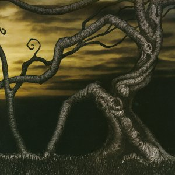

artist: At the Head of the Woods release: Secrets Beyond Time and Space format: CD year of release: 2008 label: [Glass Throat](http://www.glassthroatrecordings.com/) duration: 70:06

detailed info: [discogs.com](http://www.discogs.com/At-The-Head-Of-The-Woods-Secrets-Beyond-Time-And-Space/release/1441981)

A recent offering of the ever prolific Glass Throat Recordings is James Woodhead's solo project **At the Head of the Woods**. We know James from the two excellent **The Elemental Chrysalis** albums, also reviewed on Evening of Light. Comparing these albums, one can tell that James seems to be responsible for some of the more pyschedelic and spacy influences in the music of **The Elemental Chrysalis**, for _Secrets Beyond Time and Space_ dwells on precisely those musical elements, being a suite of four pieces combining ambient and moments of progressive rock.

These four long pieces move through calm parts with subtle ambient synth waves and typical flowing guitar melodies - the likes of which are also quite prominent on **The Elemental Chrysalis**' albums. At times however, as in the middle of the first movement, the music is joined by some sparse drums and chanted vocals. The tracks flow into each other seamlessly, and the second one starts with some thunder, rain and bird sounds, and a new guitar melody overlaid on the calm waves that ended the previous movement. The second track also introduces the lyrics for the album, sung by James in a high-pitched, reverberating voice, drifting over the rest of the music like clouds moving across the night sky. The third movement picks up the pace a bit, with a heavy, straightforward drum rhythm and continued recitation of the lyrics, all this in a somewhat darker atmosphere than the first half of the album. The end of the track is beautified by a string melody supplementing that of the guitar. The final movement consists of two separate parts. The first is a beautiful sorrowful ambient intro that fades into the final part where the final section of the lyrics is sung over a melody of piano and guitar.

In all, _Secrets Beyond Time and Space_ is an impressive and atmospheric album with a very powerful mood. Like many **The Elemental Chrysalis** tracks - and indeed, many other artists from the Glass Throat roster - it relies heavily at times on hypnotic repetition. At times, this puts me off a bit, and I seem to be wavering between moments when I felt the album could have sufficed with half its duration, and other instances where I listened to the album in full, totally entranced in its extensive flow. On the whole, therefore, I found it to be slightly less interesting - since it contains less variation - than the work Woodhead does together with Chet Scott on **The Elemental Chrysalis**. All the same, I think this is an excellent debut release. If you are in the right mood for a spacy, yet dark and profound musical trip, _Secrets Beyond Time and Space_ is a good bet.

Reviewed by **O.S.**

Tracklist:

1\. (17:25) 2. (18:11) 3. (17:06) 4. (17:24)
