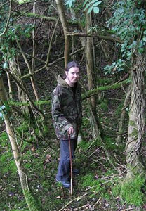

### Interview with David Colohan

January 2nd 2009 - by O.S. & D.M.K.

All images property of Dave Colohan, except where noted.

Irishman Dave Colohan, the man behind **Agitated Radio Pilot** and prominent member of the Deserted Village Collective, was one of the first people we wanted to interview for Evening of Light. Parts of this interview have been lying around since early 2007, but now we've finally been able to mold it into a new whole. Dave was kind enough to answer all our questions before he left on an extensive backpacking trip through South East Asia late 2008.

_O.S. & D.M.K.: How are things in Ireland just before the Winter?_ 

In a few days I leave for South East Asia, where I will be travelling with my friend Bean. We plan to record as we go so that should be exciting. The Summer has been a good one. I spent a month touring in America with **United Bible Studies** & **Sharron Kraus** & we met the most wonderful people, saw some incredible places & made some great music along the way. After that I toured Ireland with my friends in **Resurrection Fern** & **The Driftwood Manor** & I got to play on both of their albums. My own new album _The Rural Arcane_ has come out on Deep Water Sonic Productions, which I am delighted about as those guys are true gentlemen & good people to hang out & play with. I have a lot of new projects started which I hope to finish around Christmas. The coffee is brewing & **Wim Mertens** is on the speakers. It's all good...

_It is clear from your music, and from interviews, that nature plays a big role in your life and music. How do you relate yourself to nature? Does nature have a spiritual or religious dimension for you?_

When I stopped thinking of Nature as something 'other' and accepted it as something I am part of on a daily basis, I found that it became an important part of my life... from what I eat to what I play... and all points in between I suppose! Away from daily living, there is something about a vast landscape, forests, mountains, seas .... that brings you to an emptiness within yourself... brings an end to philosophy & petty concerns. It brings you to a point where you can begin again. This is its spiritual dimension for me... that you can find redemption out in the wild places.

_Do you have different relationships with different landscapes? We can imagine that Ireland must be very different from your experiences in Australia, for example._

Ireland is a small country by any standard but has a wealth of variety in its landscape. Where I am from in the Irish midlands is mainly flat plains & bogs interspersed with forests & lakes. It can be a very haunting landscape & has influenced my music in ways that appear again & again - _In Goldsmith Country_ & _Like Flightless Birds_ are attempts to come to grips with it. The edges are blurred. Maybe it is the ever-present rain! When I lived in Australia I travelled quite a lot, living in a tent mostly. This way I could come & go as I pleased, working on farms & going camping in some truly magnificent places. From the rainforests & crocodile infested rivers of Cape York to the unforgiving expanses of the central deserts... The rolling farmland of New South Wales & the ancient Blue Mountains... The haunting emptiness of the Nullarbor Plain to the heartbreaking vistas of the Ocean Road... It is an astonishingly beautiful country. With the band **Holt** I tried to put some of it into words & when I listen to that album it brings back so many memories. Likewise, _A Drifting Population_ takes me back to days on farms avoiding Brown Snakes & not having a care in the world. Not a day goes by that I don't miss it over there & I know it will influence my music as long as I am alive. Travelling across America has had a similar affect. When you drive from West to East, the country transforms so often that it is impossible not to be moved in some profound way. In musical terms, sometimes I can hear the vast distances unfold... Landscapes & memories are echoed, looped & delayed... That emptiness where you can begin again is somewhere in the swirl & haze of sound.

_How have your different travels (Australia, USA, Iceland, &c) affected you as a person?_

I suppose there are some places where you take things in & some where you let things go.... I have learned something of both everywhere I've passed through or lived in. Travel chips away at the walls you build around yourself & helps you to let go of those things you're afraid to lose. _Your music is often very personal. Do you ever feel uncomfortable opening up your soul in music that much?_

Since I was 18 or so I have been writing & recording under the **Agitated Radio Pilot** name. I recorded many, many tapes - very primitive home recordings - on My Agitated Radio, the tape label I had at the time. Nobody listened to them & so I had a great freedom to develop my approach to music without interference. The Shrimper label - run by the wonderful Dennis Callaci - put out countless cassettes, CDs & vinyl by the likes of **Sentridoh** & **The Mountain Goats**. I would write to him a lot & get incredible albums from distant, exotic America along with letters & drawings. At the same time I was writing to **Daniel Johnston**'s manager & getting all of his cassettes & 7"s. The music was sometimes overwhelmingly honest...& so this leaked into my own songwriting. Riot Grrrl \[[wiki](http://en.wikipedia.org/wiki/Riot_Grrrl)\] was happening at the time & something of punk's spirit of "Anyone can form a band!" was in the air. So, without a musical bone in my body, I began to record all these cassette albums with their Shrimper-influenced artwork (& songs!)... It was only when I saw **Townes Van Zandt** play in Galway that I truly became aware of the power of opening up your soul in music. A man alone on stage with a guitar. That gig haunted me & still does. Years later, seeing **Devendra Banhart** play alone in a small bar, just before he rightly became well known... That was a major epiphany too. For different reasons maybe. But the essence was there in a man with a guitar, vulnerable & laughing & making the hairs on the back of your neck stand up... drawing ghosts up out of yer past & making ye sup on yer pint with a little more urgency. When you're writing a song, I suppose you're not thinking about the fact that (hopefully!) somebody will eventually be listening to it, maybe even the person it might be about. What comes out, comes out. It becomes uncomfortable playing them live. Not all of them of course but some cut a little close to the bone. Maybe sometimes I've thought that I can change a situation through a song. That's a lonely road to go down... Short answer: Someone once asked what I write about when I'm not being so personal. I told them that's when I write instrumentals! _How did the Deserted Village collective form?_

**AMM** were doing a weekend of workshops & performances in Dublin in 2001. My friend Scott McLaughlin & I went along to take part in an improvisation workshop run by **Eddie Prevost**. Funnily enough, the ones who would eventually become the Deserted Village collective's founding members were the ones who turned up with guitars! I'm not sure I impressed anyone with my contribution! After the workshop we did get to play in an ensemble with Eddie, supporting a solo set by **Keith Rowe**. I mean, these were guys who influenced **Syd Barrett**! It was an incredible experience & turned out to be a pivotal moment in my life. I asked Shane \[Cullinane\] & Gavin \[Prior\], the other guitar culprits, if they would like to play together again sometime. I know now that they were a little suspicious! But we started to meet once a week, playing in a room above the gate to Trinity College. Usually we'd go for a pint afterwards & so became friends as well as bandmates. After some time we decided to set up a cdr label in order to release recordings by **Murmansk**, our new free improvisation band. A neighbour came up with the name 'Deserted Village', it referring to the area I am from & the poem by **Oliver Goldsmith**. **United Bible Studies** existed already with just myself & James Rider being members. We invited the lads to join & soon there was a thriving community of us playing, recording & sometimes living together. Many people have passed through the Deserted Village over the years. Some stay & some move on. _What are the main projects of the Collective and of which are you part?_

\[caption id="attachment\_499" align="alignleft" width="300" caption="United Bible Studies playing live"\]\[/caption\]

**United Bible Studies** is the main project. **Murmansk**, the original inspiration for it all, is on hiatus at the moment. **The Magickal Folk Of The Faraway Tree** has reissues & an unheard album to be released...but the members all live in different parts of the world now. **Children Of The Stones** was a once off project which I am very proud of. Gavin has several projects on the go - **Toymonger** being his main one. **The Cosmic Nanou** is on the far side of the world, hopefully still recording on the sly! There are plenty of other projects people are involved in but these are the main Deserted Village-related ones that come to mind. Of other bands... I used to be in **Holt** & currently play in **The Driftwood Manor** & **Resurrection Fern**. _For you personally, what are the different concepts behind these projects?_

**Murmansk** is only concerned with free improvisation. At our last gig I was told off for playing "too New Age!" Heh! **The Magickal Folk Of The Faraway Tree** is concerned with acoustic folk & unaccompanied singing. **Children Of The Stones** was a much more electronic approach to songs & drones. **United Bible Studies** can be virtually anything. On the recent American tour we went from feral noise to quiet folk, free jazz to completely acapella in the space of a few days. It all depends on who is there & where we are. I can't really speak for the other bands. In case I get it all wrong! _Do you have a special aim or goal with the Collective?_

If you asked me this when we started off, I would probably have said our aims were to release lots of music, meet like-minded people & travel. All of those things came to pass & hopefully will continue to for many a long year yet. I've been fortunate enough to play & tour with some of my favourite musicians- **Charalambides** & **Fursaxa**, to name but two...& to travel around America, experiencing such great hospitality along the way, not to mention all of the other incredible bands & places! Wonderful!

_Were you immersed in folk music at a young age, or is this a later love of yours?_

I remember when I was in school there was a programme on Channel 4 called 'Party With The Rovers'. This was an Irish folk group \[**The Irish Rovers**, O.S.\] based in Canada, milking their accents for all they were worth & wearing woolier jumpers than **The Clancy Brothers**. They frequently performed while walking across misty moors or mountainsides. When they weren't at that they were in the pub. This, whether I realised it or not at the time, had a profound influence on me! Some years later I spent time with a friend called Laura Tennant in England... I was 18 or 19 at the time... We were going to the Phoenix festival, specifically to see **Levitation** play. Of course as soon as I had bought a ticket Terry Bickers left the band but I went to England anyway. A plan we had was to visit some ancient sites, inspired in part by a mutual fondness for **Julian Cope** - whose _Jehovahkill_ album was a massive influence on me - but alas we had no wheels in the end so that fell through. Laura's parents had wonderful taste in music, not that I knew it at the time. I was far too cool to be enjoying **Fairport Convention** & **Ashley Hutchings** solo albums! If _Melody Maker_ didn't mention it then I didn't care! But I suppose being in a rustic part of Britain, listening to music that seemed so out of time, well I guess this also had a huge influence on me. When I listen to this music now I am transported back to those quaint English pubs & country roads. _You mentioned that at first you were mainly interested in British folk music, and only later (re)discovered Irish folk. How did this come about?_

In school, just before we went home, we would gather around the Master's desk & learn the tin whistle. Something of its mournfulness struck a chord in me even when I was 11 or 12. We also had to learn Irish Dancing in those pre-Riverdance days though I have no fond memories of that! Irish music to me was all hundred-mile-an-hour jigs & reels & I felt nothing for it. When I was in secondary school my aunt got me a **Nick Drake** compilation -_Heaven In A Wild Flower_\- & through listening to him I got into **John Martyn** & others from that scene. Then years later a friend of my girlfriend at the time handed me a battered video of a film I might like - _The Wicker Man_... Then I joined the ranks of musicians who were completely rewired upon hearing the music & absorbing the imagery within. From here I gained an appreciation of a much older tradition in folk music, both British & Irish. On our side of the water, singers like **Margaret Barry** & **Paddy Tunney**... His singing of "When A Man's In Love He Feels No Cold" is one of my very favourite songs. I feel very fortunate to have met **Johnny Moynihan**, also known as 'The Bard Of Dalymount' & a walking library of song. A founder member of **Sweeney's Men**, he travelled with **Anne Briggs**, spent some time in **Planxty** & has spent almost every waking moment with an instrument in hand... or so I imagine! He played a few gigs with me on a short Irish tour we did some time back & just being around him, hearing the songs & stories... I've been very lucky. He's also the sharpest wit I've ever met! So it was only after getting into British folk-rock that I discovered where they were coming from... & Irish music did seem to play a strong part in that, with some of them at least.

_What about your other musical interests? A quick glance on your MySpace throws up links with metal bands like **Primordial** and **Wolves in the Throne Room**, both projects that are far away from ARP musically, but perhaps share a sort of profoundness with your own music? How do these tastes influence you?_

I loved metal before anything else. I should say I loved the imagery of metal but the music would rarely live up to it...That is until I discovered **Paradise Lost**, **My Dying Bride** & **Anathema**. I loved **Slayer** & **Entombed** & a few others too but the epic melancholia of these bands in particular appealed to me. At the time I was also listening to a lot of **Fields Of The Nephilim** & **The Sisters Of Mercy**, who also seemed to draw on a vast sadness. Travelling in northern Italy with a friend when I was 16 - along with **A-Ha**, these bands were the staple fixture of my walkman. We were hiking in the Alps & I have vivid memories of the music & the scenery melting into one... The natural world dissolving into chiming chords & drones & vice versa... Making snowballs on a mountainside in the middle of July with this music ringing in yer ears & the sound of waterfalls & birds bleeding through that again... It leaves an impression. Along came the explosion of underground American rock, grunge, university & girlfriends & somewhere along the line I stopped listening to metal. A few years back, sitting in my friend Paul Condon's house, he tells me he has something I need to hear. It turns out to be **Burzum**'s _Filosofem_ & so a new raging love of Black Metal is born in me... Just like I had never left it. If my own music shares anything with Black Metal then I think it is philosophically rather than sonically. (Although I seem to share crappy keyboards with a few on that scene!) Nature is not always a benign force, as so much psychedelic folk seems to dwell on. It is haunting & cruel too. Where this seems to be what some Black Metal addresses, I feel my own music falls somewhere between the two. In some newer material I've been working on the Black Metal influence comes across more strongly. I feel that if I continue in this vein then it will be under a different name - **Enclosed & Silent Order**. Seeing **Primordial** live was an incredible experience. They have a seriously dedicated following over here. Again it is this idea of self & landscape dissolving into one that I feel in their music. Same with **Wolves In The Throne Room**, **Striborg** & **Xasthur** (though I'm sure he would hate to pinned down in such a way!)... I am reminded of those feelings I had on the mountain in Italy. Where sound seems to pour through the cracks between where you are & what you are feeling.

_A bit about World Winding Down. How did you manage to gather such an impressive array of guest musicians? Was it difficult to incorporate all their input into your own musical vision?_

\[caption id="attachment\_501" align="alignright" width="300" caption="Dave with violinist Vicky Langan"\]\[/caption\]

Most of the contributors were friends of mine already & as the majority of the album was recorded in Galway, all of my musical friends from there appear on it... Keith Wallace of **Loner Deluxe**, **James Rider**, Annemarie & Aaron of **Mirakil Whip**, Aaron from **Phantom Dog Beneath The Moon**... They knew where I was coming from & helped me to get where I wanted. **Maja Elliott** was living there at the time too & it was wonderful having her on board. **Richard Moult** sent some piano improvisations & I edited these into songs. **Alison O'Donnell**, formerly of **Mellow Candle** surprised me when she contacted me & it was an honour to have her on board. She got in touch through Myspace & I got in touch with others the same way; **Richard Skelton**, **Larissa Pychlau** \[**Cele**, O.S.\]... **Antony Milton** & **Anders Gjerde** supplied some field recordings. We released cdrs on their labels in the past & have much in common. **John Cavanagh** is a gent & did some beautiful work. Brian Conniffe & Vicky Langan of **Female Orphan Asylum** contributed haunting parts. **Autumn Grieve** & **Sharron Kraus** sang beautifully. Shane & Gavin of Deserted Village were invaluable... as was Caroline... who appears on _Your Turn..._ & _World..._ Indeed she inspired everything. An album is not finished until the artwork captures the sounds within & I have **Maeve O'Sullivan** & **Aaron Coyne** to thank for the imagery. I've met **Richard Moult** since & we have toured in America together but I have yet to meet some of those who appear on the album. We'll share a bottle of wine someday, no doubt! It wasn't difficult to incorporate everyone's input into the overall vision, as it was one of sparseness. To me, it flows as it was intended to.

__

\[caption id="attachment\_288" align="alignleft" width="150" caption="'World Winding Down' album cover"\]__\[/caption\]

_You've mentioned that World Winding Down and The Rural Arcane are sort of sister albums. Could you elaborate on that?_

Well I will go one further & say that along with _Your Turn To Go It Alone_, they make up a trilogy. Weirdly enough they're all doubles too...although _Your Turn..._ is a double 3" & roughly single album length...in the vinyl sense! They all contain a mix of shorter songs & more expansive instrumentals, which is true of nearly every recording I've made. Blame years spent listening to **Pink Floyd**!

\[caption id="attachment\_502" align="alignright" width="150" caption="'The Rural Arcane' album cover"\]\[/caption\]

With _The Rural Arcane_ there is a more concerted effort to place the song at the heart of these soundscapes. All three work through a particular period in my life but _Your Turn..._ has a few songs that refer to earlier times...relationships/friendships in America & Australia. I guess the themes are similar though... landscapes without & within - trying to capture moments long since passed. Can we capture them in the haze of reverb, echo & delay? I hope so... The first two parts were recorded while I was living on couches & floors & relying on friends. Wandering between Dublin, Cork, Galway & Ballymahon without any real direction. I guess there's a lot of pain & longing in those albums. _The Rural Arcane_ trades in heartbreak for a sort of redemption in country living I guess. Tellingly, this one was recorded entirely alone at home in Longford on four-track. On the previous recordings I was happy to mainly play guitar & sing. On this one I played every instrument I own & headed further out. Maybe there's an emotional & musical progression from one album to the next. I like to think there is, but maybe I'm not best qualified to say.

\[caption id="attachment\_503" align="alignleft" width="150" caption="'Your Turn To Go it Alone' album cover"\]\[/caption\]

_What are you planning for the near future?_Well for the next few months I will be travelling in South East Asia with my good friend & fellow musician Bean Dolan of **Resurrection Fern**. We plan to do a lot of wandering - writing & recording as we go. A lot of new material has been recorded already, which I hope to get back to when I return.

_Any live plans? Perhaps outside of Ireland?_

**United Bible Studies** & **Murmansk** have been my main touring experiences abroad. The Pilot has mainly wandered around Ireland. This past Summer however, I got to play some songs on a boat in Bar Harbor, Maine. I joined my friend **Audrey Ryan** on Independence Day before the fireworks began & it was a wonderful experience. She played fiddle on songs I'd written that morning under a great tree at her mother's place. Got to do a few songs in Portsmouth, New Hampshire too, which was beautiful. I love that town! Rambling off the point again but as regards playing outside of Ireland in the future - definetely. I'll play anywhere!

_Finally, name one thing that you’d hope to accomplish with your music._

As I mentioned earlier, I hoped that I would make new friends & get to travel. That worked out & will hopefully continue to. I always hoped that maybe someday my music would affect people in much the same way musicians like **Mark Kozelek** & **Neil Young** have affected me. I get the odd mail from people who seem to find something of what they need in the songs. If that continues well then I'll be happy. On a more frivolous note, I long for the day **ARP** gets a double gatefold vinyl! Heh!
