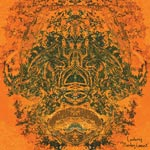

\[caption id="attachment\_566" align="alignright" width="150"\] Gultskra Artikler cover\[/caption\]

\[caption id="attachment\_567" align="alignright" width="150"\] Lanterns cover\[/caption\]

artist: **Gultskra Artikler** / **Lanterns** release: _Berezka_ / _Monkey Lament_ format: LP year of release: 2008 label: [Other Electricities](http://www.other-electricities.com/) duration: 25:23

detailed info: [discogs.com](http://www.discogs.com/Gultskra-Artikler-Lanterns-BerezkaMonkey-Lament/release/1599955)

_Berezka / Monkey Lament_ is a split LP by two acts from the realm where acoustics, electronica, and drones meet. I haven't held the actual LP, so I can't provide any details on its production and presentation, but the music alone is in this case reason enough to look into this release.

Russian, currently Moscow-based, project **Gultskra Artikler** covers side A with three fascinating experimental tracks that combine crackles, samples, drones, and otherworldly melodies. Elements like these are combined in such a way that it reminds me of different musical styles, yet it all remains somewhere in between. This is precisely the strength of these tracks, which are varied but consistent in high quality. Difficult to describe, but "electronics and acoustics in an exciting mix" comes a long way.

**Lanterns** I've heard before, whilst appearing with them on **Larkfall**'s _Reynardine_ compilation, and now these English improvisationists are back with two extensive tracks of folky drone. I understand that **Lanterns** tracks are live jams, and that each depends on a certain magic happening during the recording. Well, this is definitely the case here. "Snake Ice" is based more on a synth drone, while "Dir Tup" has heavy guitar and flute overtones, but both are interesting, albeit not extremely original drone tracks.

It should be clear that this split LP is certainly recommended if you're into freefolk, drones, experimental electronica, or ideally all of the above. Two promising projects have joined forces on an excellent offering here.

Reviewed by **O.S.**

Tracklist:

**Gultskra Artikler:** 1. Pervie Gusli (4:15) 2. Figase (5:08) 1. Berezka Take 2 (3:19)

**Lanterns** 4. Snake Ice (7:57) 5. Dir Tup (4:44)
