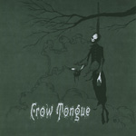
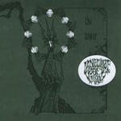

\[caption id="attachment\_557" align="alignright" width="150" caption="Crow Tongue side"\]\[/caption\]

\[caption id="attachment\_558" align="alignright" width="150" caption="Language of Light side"\]\[/caption\]

artist: **Language of Light** / **Crow Tongue** release: _The Tower_ / _Wind Chant_ format: 7" year of release: 2008 label: [AntiClock](http://www.anticlock.net/) duration: 10:33

detailed info: [discogs.com](http://www.discogs.com/Language-Of-Light-Crow-Tongue-The-Tower-Wind-Chant/release/1503772).

This here 7" is a nice little offering from AntiClock records, and it's a split between **Language of Light**, which is a duo consisting of R. Loftiss (**The Gray Field Recordings**) and Frank Suchomel (**Inalonelyplace**) and **Crow Tongue**, which has become Timothy Renner (**Stone Breath**) his new main project, where he is joined by Æ Hoskin on drums. It's pressed into a nice disc of marbled grey vinyl, which along with the grey artwork makes for a very fine layout.

**Language of Light** occupies the A-side, with a track that is very different from their first EP, _Inside The Head Of A Butterfly Dreaming Of Being A Giant Moth Destroying Tokyo_, which was basically a long, spacy drone. "The Tower" is much more a mixture of the styles of either member of the duo, combining experimental folk, drones, spoken word, and samples. The song sounds quite sweet, but also gains in intensity, climaxing in a very nice folk drone with Justin Jones on guest violin. A funny side detail is this: the track incorporates samples of aged vinyl crackle, but the 7" itself is also not of the highest quality - my copy being slightly off-centre - which adds natural surges of crackle to the sound as well. The result of the two overlaid 'defects' is suprisingly nice, however.

The crackling sound is also present on the B-side of course, where it is equally unobtrusive, to be honest. It fits quite nicely into the lo-fi folk ritual that is "Wind Chant". The track is a hypnotic, repetitive one based mainly on vocals, djembe, percussion and a homemade bass gumbri-banjo. It's quite typical of Renner's style, but works very well on this release.

The end result is a good split single by two interesting artists from the American experimental scene. If you enjoy any of the related projects, or fancy a peek at what's happening in the US folk/drone avantgarde, do pick up this slab of grey matter.

Reviewed by **O.S.**

Tracklist:

A. **Language of Light** - The Tower (6:03)

B. **Crow Tongue** - Wind Chant (4:30)
