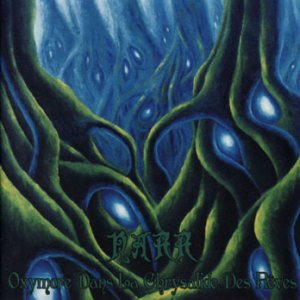

artist: Narr release: Oxymore dans la Chrysalide des Rêves format: CD year of release: 2009 label: [Musea](http://www.musearecords.com/) duration: 51:06

detailed info: [discogs.com](http://www.discogs.com/Narr-Oxymore-Dans-La-Chrysalide-Des-R%C3%AAves/release/1443414)

**Narr** is a French band led by Clément Werner that plays an eerie and dark kind of progressive rock. This isn't our usual fare at Evening of Light, surely, but life isn't any fun without thinking outside the box once in a while. So, when I heard the samples of this release I thought it sounded quite nice and decided to opt for the promo anyway. A good choice, for _Oxymore fans la Chrysalide des Rêves_ is an excellent debut album. First self-released as a promo CDr, the album was released by Musea Records in February 2009.

Like I said, the genre can broadly be defined as progrock, but with a unique sound. The rhythm section, especially the bass, are the most prominent instruments, and a guitar or synth only pops up here and there to embellish the basic lines. The vocals are handled in different ways, from simple clean vocals to more choir-like arrangements. In addition, there is a large role for the flute, which is handled masterfully by Laurent Lefebvre, and it lends a dreamy and mystical touch to the music.

As a whole, the album flows more or less in the same mood, even though there are enough changes in tempo and colour to keep it interesting. The individual tracks basically have the same instrument sound throughout, though. This makes _Oxymore..._ a stylistic whole, also accented by the obscure mythical cover artwork by Dutch painter **Jeroen van Valkenburg**.

Perhaps a bit more variety in the playing style or instrumentarium couldn't have hurt, but I consider this to be a very fine debut album. Original style, great atmosphere, clear production. Nothing to object, quite simply. If you enjoy original and progressive rock music with a dreamy and strange atmosphere, **Narr** is a good bet. I'm looking forward to hearing more from these men!

Reviewed by **O.S.**

Tracklist:

1\. Zepter Des Narren (6:01) 2. Ronces Et Iconoclasme (9:01) 3. La Lyre Cornue Pleure (3:35) 4. La Dune Bleue (7:28) 5. Au Bal Des Larves (7:35) 6. Cephalée Neptunienne (Odravyel) (6:41) 7. Murènes Du Léthé (6:28) 8. Ruisselle (4:17)
