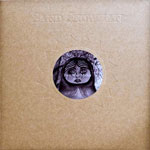

\[caption id="attachment\_578" align="alignright" width="150" caption="CD cover"\]\[/caption\]

\[caption id="attachment\_579" align="alignright" width="150" caption="LP cover"\]\[/caption\]

artist: **Sand Snowman** release: _Two Way Mirror_ format: 2xCD / LP year of release: 2009 label: [tonefloat](http://www.tonefloat.com/) duration: 1:27:10

detailed info: [discogs.com](http://www.discogs.com/Sand-Snowman-Two-Way-Mirror/master/190009).

Things have been going fast for **Sand Snowman** in the past few years. The london-based Irish guitarist and composer has gone from several obscure MP3 and CDr releases to much more, evidenced by the rerelease of the albums _"i'm not here"_ and _The Twilight Game_ on vinyl by tonefloat records. This cooperation proves to be a fruitful one, as this, the new album, is again released by the Dutch label, this time both on double CD and the good old high-quality vinyl. The 2CD is a premiere for tonefloat, which is traditionally a vinyl label, and it includes a bonus album called _The Magpie House_. This is also the edition under review here.

The change from very limited releases to a more professional output coincides with the musical growth of **Sand Snowman**. He was searching for a unique development of his own sound on the earlier works, which contained some imperfections still. _Two Way Mirror_, however, marks the project's maturation. The style is essentially the same: acoustic guitar compositions ranging from the folky and ambient to the experimental and modern classical-influenced. Added to this are subtle synths, flute, piano, percussion, and a varied range of (sometimes polyphonic) vocals. **Moonswift** has been a returning singer on earlier albums, but this time she is joined by the likes of **Jason Ninnis** and **Steven Wilson** on guest vocals. The male vocals add a great amount of new moods to the already quite varied sound of the project.

The main album itself is not too long, fitting easily on one LP, but contains a very nice range of musical styles, wavering between progressive folkrock, experimental ambient, and much more. The bonus disc is also quite worthwhile, expanding on the instrumental compositions by Sand. It is not as catchy or upfront as the main part, perhaps, but its dreamlike ambient quality is very good nonetheless. So good in fact, that it seems a shame that it is only avaiable in CD version. I love vinyl, and tonefloat vinyls are made with love as well, so in a way it's too bad you have to miss out on _The Magpie House_ is you opt for the LP. A consolation is the fact that the CD edition is housed in what is basically a mini-gatefold made out of sturdy cardboard, and with excellent layout by Carl Glover. In that sense, it feels like a tiny double LP.

Regardless, it's safe to say that _Two Way Mirror_ is Sand's best album to date, and a testament to his unique style of playing and composing. The album is a truly original work of modern acoustics, and highly recommended to anyone who is open to a mixture of prog, folk, and ambient.

_Reviewed by O.S._

Tracks:

**Two Way Mirror**: 1.1 The Butcher's Hook (5:49) 1.2 I Spy (3:45) 1.3 Faded Flowers (5:21) 1.4 A Vision On The Green (2:43) 1.5 Matryoshka, Muse Of Misrule (1:51) 1.6 Mirrors (8:23) 1.7 Riverrun (2:48) 1.8 Neurotic Zoo (3:27) 1.9 Kites (4:48)

**The Magpie House**: 2.1 The Tower (9:15) 2.2 Magpie House (3:12) 2.3 The Memory Box (7:10) 2.4 Harlequin (3:51) 2.5 Lammas Meadow (2:31) 2.6 Quarter Circle (5:00) 2.7 Earth Inferno (4:31) 2.8 Untitled (12:45)
