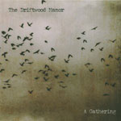

artist: **The Driftwood Manor** release: _A Gathering_ format: CD-R year of release: 2008 label: [Self-released](http://www.myspace.com/thedriftwoodmanor) duration: 29:58

detailed info: [discogs.com](http://www.discogs.com/Driftwood-Manor-A-Gathering/release/1625810)

**The Driftwood Manor** is a new band based in Ballymahon, Ireland that plays a kind of acoustic alternative rock, but with a strong dose of folk thrown in, both free and traditional. Little surprise if you look at the lineup, which apart from main songwriter and vocalist Eddie Keenan includes David Colohan (**Agitated Radio Pilot**, **United Bible Studies**, etc.) and Bean Dolan (**Resurrection Fern**), but also traditional fiddler Neil Fitzgibbon, among others. This short debut album is self-released on pro CDr, and actually of a very high quality.

The album starts off with an instrumental, which has a very dronish buildup and melancholic tinge. This shifts, however, to the second one - "To The Waves" - which is uptempo and combines a longing neofolk track (in the broad sense) with some traditional fiddling. There is much variety, though, as the three middle tracks illustrate. "Pyre" is a calm alternative folk ballad with female second vocals and tracks 5 and 6 show a relaxed, though still melancholic, singer/songwriter style. The final tracks contain a similar mixture of styles, from the uptempo "The Sense Of An Ending" - with more female vocals and also a trumpet - to the serenity of "Trial By Fire". The sound is also quite enjoyable: very crisp, yet organic and idiosyncratic, particularly the drums and fiddle.

While I wouldn't say this is a very innovative album, I've been playing it very often lately, as there is simply a lot of good songwriting in here. Another piece of evidence that Ireland is a nation of true artistry in the realm of popular music. This is a highly recommended and promising debut for any lover of alternative folk.

Reviewed by **O.S.**

Tracklist:

1\. From Here The Town Looks Like Nearby Stars (4:00) 2. To The Waves (3:22) 3. The Pull (2:09) 4. Pyre (4:15) 5. Thank You, Dear Aggressor (3:16) 6. I Will Wait For You (4:17) 7. The Sense Of An Ending (2:43) 8. Trial By Fire (2:57) 9. Voices In The Corridor (2:59)
