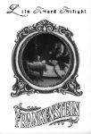

artist: **Life Toward Twilight** release: _Edison's Frankenstein_ format: DVDr + CDr year of release: 2008 label: [Bottle Imp](http://www.bottle-imp.com/) duration: 12:44 + 39:43

detailed info: [discogs.com](http://www.discogs.com/Life-Toward-Twilight-Edisons-Frankenstein/release/1476278).

_Frankenstein_, made in 1910 by Edison studios, is one of the oldest horror movies, though not one of the better known ones. According to [this feature](http://www.filmbuffonline.com/Features/EdisonsFrankenstein1.htm), all but one of the film's copies were lost, and it resurfaced as late as the 1970s. Silent movies are usually supplied with a score from some stock music archive, but Daniel Tuttle, the man behind **Life Toward Twilight**, apparently wasn't content with the versions of this film's score that were out there. So, he set to composing his own. The project took some years too attain final form, but in 2008, the release was there, combining the original film with new score, and including a CD with more extended versions of the soundtrack compositions.

As can be expected, the approach is from the direction of dark ambient and industrial electronics, not a bad choice, even for a movie from a different period. The soundtrack combines simple piano melodies, synthesizer waves, drones and some quite heavy noises and percussive sounds here and there. The combination of film and score works very well, in particular in the part in the first half of the movie where Frankenstein conducts his experiment. The impressive stop-motion animation of the monster's alchemical birth in the cauldron is accompanied by intense industrial ambient, both elements enhancing eachother and forming the highlight of this release. After this climax, the pace of the movie slacks a bit, depicting the haunting of Frankenstein's bridal night and the subsquent 'dissolution' of the monster in a less impressive way than the parts that came before.

All the same, this short film is a pleasure to watch, especially for historic reasons. In addition, the soundtrack adds a lot to the movie's atmosphere, not in the least because the alternative (stock piano music) could be considered particularly gruesome (cf. [\[YouTube\]](http://www.youtube.com/watch?v=3BKs5FknCVI)). If you're interested in old (horror) movies and post-industrial music, _Edison's Frankenstein_ is excellent value for money. And if you're not convinced, and want to try before you buy, the soundtrack can be downloaded for free from the artist's webpage (see below).

[Click here to buy this release, or download the audio part of this album from Bottle Imp](http://www.bottle-imp.com/discography/aimp016-life-toward-twilight-edisons-frankenstein/). [Click here to read the artist's notes on this release](http://toward-twilight.livejournal.com/8993.html).

Reviewed by **O.S.**

Tracklist:

**The Film**: DVD-01. Edison's Frankenstein (12:44)

**Soundtrack**: CD-01. Discovered The Mystery Of Life (3:46) CD-02. The Evil In Frankenstein's Mind Creates A Monster (3:39) CD-03. Appalled At The Sight Of His Creation (1:10) CD-04. The Return Home (1:35) CD-05. The Monster Sees Himself (1:16) CD-06. Bridal Night (2:19) CD-07. Overcome By Love And Disappears (1:09) CD-08. Attack (2:57) CD-09. The Monster (1:24) CD-10. The Mirror (2:08) CD-11. Leaving For College (5:39) CD-12. Edison's Frankenstein (12:40)
