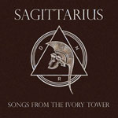

artist: **Sagittarius** release: _Songs from the Ivory Tower_ format: CD year of release: 2008 label: [Cold Spring](http://www.coldspring.co.uk/) duration: 46:44

detailed info: [discogs.com](http://www.discogs.com/Sagittarius-Songs-From-The-Ivory-Tower/release/1341197).

**Sagittarius** is a German project headed by **Cornelius Waldner**, and it's been around for a couple of years, with a few limited releases. This album, however, is their first on a bigger label like Cold Spring. What we get is about three quarters of an hour worth of calm neoclassical and neofolk, with piano as the dominant instrument. Most of the tracks are based on German poems, but with a bit of English and instrumental work thrown in as well.

The poems cover a range of topics, ranging from traditional romanticism, melancholia, and modern cultural criticism. This unites different areas from conceptual spectrum of neofolk, which is nice to see. The album certainly isn't hung up on a single theme. The variation in terms of music isn't very great, being based as said on piano, with the occasional addition of flute, cello, and guitar, sometimes provided by guest artists like **Marcel P.** (**Allerseelen**) and **Damiano Mercuri** (**Rose Rovine E Amanti**). However, in this case I don't think it is a negative point for the album, which has a focused flow, somewhat comparable to that of **Current 93**'s [_Soft Black Stars_](file:///e:/EoL/en/eclipse/c93_sbs.htm). The vocals are also varied, with guest singers like **Troy Southgate** (**HERR**) and **Herr Twiggs** (**Kammer Sieben**). I must say the performance of each of these guest performances varies in quality, but it never detracts from the overall atmosphere of the album.

I can be fairly brief about this one: it's simply a very decent album. Certainly recommended for neofolk lovers, especially if you enjoy a calmer and perhaps distinctly German style, comparable to **Orplid** or **Forseti**. However, if you're not particularly fond of neofolk or neoclassical, this album most likely won't change your mind.

Reviewed by **O.S.**

Tracklist:

1\. Nihil Arisen (3:43) 2. Du Stehst Am Alten Gartentor Und Schweigst (3:48) 3. Der Sommer, Den Die Erntezeit Gekrönt (2:27) 4. Die Nächtlichen Geschicke (1:39) 5. An Des Meeres Strand (4:01) 6. Trunkene Flut (3:14) 7. Das Lied (2:47) 8. Der Gute Kamerad (2:24) 9. Menuet Von Johann Krieger (Für H.E.R.R.) (1:24) 10. Cupio Dissolvi (4:48) 11. Sternwandel V (2:15) 12. Nova Apocalypsis (4:04) 13. Europa Calling (3:51) 14. In Signo Solis (3:33)

15\. The Song (2:46)
