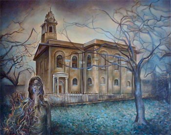

\[caption id="attachment\_294" align="aligncenter" width="300" caption="'I'm Not Here', by Sand"\]\[/caption\]

Interview by **O.S.** & **D.M.K.;** All images property of Sand Snowman.

London-based musician and composer **Sand Snowman** has been releasing his unique material since 2006, also the year in which our website started. We've followed Sand from humble MP3 beginnings to where he is today: beautiful releases on CD and vinyl. Together with other artists from the Dutch tonefloat label, he paid a visit to our country in early february for a concert and some interviews, and he will return at the end of March. We encountered Sand in the KinkFM radio studio, where he performed on the experimental and avantgarde show [X-Rated](http://www.kinkfm.com/programma/X-Rated). Just after that, we had a pleasant chat in the station's lounge with some tea and wine, and the chance to ask Sand about his music, Irish background, art, and much more. Our thanks go out to Charles of tonefloat and Arjen & Bob of X-Rated for hosting this interview.

_O.S. & D.M.K.: What can you tell us about the development of the whole project, because Moth Dream was the first album, back when Woven Wheat Whispers still existed, but it's only been 3 years or less. It's a big step from an MP3 release to these beautiful vinyl things on Tonefloat, so... what happened in between?_ Sand: I really don't know \[laughs\]. I think when you put something out into the world, onto the ether, you've a vague hope- I mean, like for example when I did _Moth Dream_ or _Obsessive Creatures_ in America, I had no guarantee whatsoever that anyone was going to listen to it, let alone that it would actually be picked up by any... you know, find a home anywhere. So, I don't know, I mean, I put it out there and just see what would happen. As it has transpired, I think it's been perfect for me, because it's allowed me some time to develop what I was doing, but without taking too long for this to happen and lose interest. 

\[caption id="attachment\_299" align="alignright" width="150" caption="'Moth Dream'"\]\[/caption\]

_So then you put out some limited CDr's on Reverb Worship and Time Lag. How'd you make the step to that?_ I think I would've had _Moth Dream_ available on Woven Wheat Whispers, and I like **Six Organs of Admittance**, I remember looking something up on them through Time Lag. I just sent the label an email and said, you know, "I'm doing stuff. You're not obliged to listen to it." He sent me an email back and said "Yeah, I'd love to hear some." So I sent him a CD and he said "Yeah, that'd be great, I'd love to do a little run of 'em." I did _"I'm not here"_ and that's one that came again on Woven Wheat Whispers, I guess the end of 2006 for _"I'm not here"_, the end of 2007 for _The Twilight Game_, and Roger from Reverb Worship just contacted me through MySpace and said, "I noticed you have some things available through download, would you like a CDr-run?" -"OK, great," you know? So, it happens kind of in step with what I was doing. _The first release you did was all instrumental, and then suddenly on "I'm not here" there's two ladies singing, so how did that happen?_ I know it's strange, I'm not quite sure myself, but I think with _"I'm not here"_, cause it was the first concentrated album I did and like writers say that the first novel is autobiographical, or that you're working through a lot of your influences, and a lot of the sonic ideas that I had, the purely instrumental ideas I had, on the first album I had a lot of room to explore with that. When I started writing the material for _"I'm not here"_ or when the ideas started coming to me, a lot of them were in song form and I thought it'd be nice to still have a kind of continual music, still a continual instrumental tone experience, but to have some structure just popping up there, every now and then. Moonswift is my long-term partner, so uhm... "honey, do some singing". I just put the microphone in front of her. I met this girl Nix and with her basically, you know, met up, got some ideas. I just gave her some backing tracks I had and "you can do what you want over it," you know. It could open up what I was doing so it wasn't all dependent on me, because I was still I think a bit tentative about writing lyrics and song structures myself.

_You do write all of that yourself?_ Yes.

_Now on the new album, there's some male vocals added and also a bit on The Twilight Game, so who's responsible for all of that?_ Right, on _The Twilight Game_ I got a friend of mine, Jerome, to do some vocals. One night he said "Actually I do some singing, so if you want some male vocals..." I thought yeah, just for balance, because I like the underpinning of the voices. Also on _The Twilight Game_ Jo Lepine who sings with **The Owl Service** did some singing for me as well, so I thought, great, because I like the idea of polyphonic vocal lines. I'm not really a singer myself, and I've been told that by singers that a lot of my lines aren't that easy to sing, because I think of them as melodic lines or just instrumental melodic lines. I think polyphonically, and I like the idea of having lots of harmonies and as many textured layers vocally as are there instrumentally. And you know, it's just been a continuation of that, really. I mean, at the moment, in the songs I'm working on at the moment, I've already used three vocals, and I've got another three or four in mind to work with.

_So, and what about the new album? There's **Jason Ninnis** and **Steven Wilson**, so..._ 

\[caption id="attachment\_300" align="alignright" width="150" caption="'Two Way Mirror', CD version, artwork by Carl Glover"\]\[/caption\]

Jason's a friend of mine, a singer/songwriter from London, and again it was one of these things, one evening he said you know "If you want some vocals sometimes." - "Yeah, great, here we go, that'd be ideal." And Steven - cause I did some playing on his album, he said "If you want some singing done..." - "Excellent, that's great." It was a question as well of thinking of what songs in terms of lyrics and melody suit what voices, and the two that Steven sang, well they're really ideal in my head for his voice, and I'm very very happy with the way they turned out. _So how did you get in touch with Steven?_ Steven got in touch with me, because the chap at Reverb Worship must have sent Steven a CD. There were a limited edition of 50 copies each, and Steven sent me an email, "I'm really really impressed with your work and I think that maybe more than 50 people should hear it." So, it just went on from there, really. Steven passed _"I'm not here"_ and _The Twilight Game_ on to Charles \[from Tonefloat\] and... good fortune, really. \[laughs\]

_Will you rerelease_ Moth Dream _someday?_ Possibly _Obsessive Creatures_, the American version, the reason being because that, as I said earlier, I just can't find two of the masters for the tracks on _Moth Dream_. But, I'm not too bothered, because there's the three tracks "Serpentine", "Moth Dream" and "Light, Space, Shadow" I'm very happy with, and I wrote this other one around the time, which was on the American issue, "Obsessive Creatures and Caricatures". It may be issued in that format, and that would be again be four fairly long instrumental pieces. So, that may be...

_But the entire album is lost, because you lost some of the master tracks?_ Yeah, I don't have three of the tracks. Also, unlike _"I'm not here"_ and _The Twilight Game_ and _Two Way Mirror_, this album didn't present itself as an entity to me, as an entire album. Because to me the structure of an album is as important as the individual tracks on it, the moods and the contrast to each other and stuff. Probably because _Moth Dream_, my first one, is more a question of 'I like these, got them done now, put them together.' When I finished that album, I started work pretty much immediately on _"I'm not here"_, so I was just pretty much taken up with that. So, the masters of a couple of songs just got mislaid. They're somewhere in my flat, but that's The Twilight Zone essentially, so they may at some stage turn up. \[laughs\] _One day... when you move into a new place or something._ \[all laugh\]

\[caption id="attachment\_301" align="alignleft" width="150" caption="'Flicker Fading Spark' EP"\]__\[/caption\]

_And what about this Flicker Fading Spark EP, because that's also disappeared along with Woven Wheat Whispers._ Well, I do have the masters for those, cause that's when I started working on _The Twilight Game_. It's weird because it was actually another project, and that took over. And one of the tracks on the _Flicker Fading Spark_ EP, "Magpie Eye", is from a longer piece that became "I Spy", the second track on _Two Way Mirror_. I had basically done the backing track of this 8-minute piece and I thought 'the first part, I'm gonna get singing on the first part. The rest of it, I'm not sure if singing will work with it, so... no, the first part will be a separate song and this will just be an entity unto itself.' And also because I thought that if I was going to do an EP to predate the album, it would be good to have a couple of tracks that don't appear anywhere else. But I do actually have them... \[laughs\] I was a bit more sensible. \[laughs\]

_OK, so then we've made it to the new album, basically. It's going to be released this month, so what's a bit of the background behind Two Way Mirror in terms of concepts and writing? How'd you compose it?_ Uhm... ooh sorry, there might be a pause... \[laughs\] I'll think about that one in silence... You know, the first 500 CDs have an extra album, _The Magpie House_. It's basically a kind of continuum: _The Twilight Game_, _The Magpie House_ and _Two Way Mirror_. What I started with for _The Twilight Game_ had some of the material that ended up on _The Magpie House_. Then I thought you know, 'I'll use that in the next one.' But then other ideas presented themselves. I wanted a different colour and feel to previous albums. I mean, _"I'm not here"_ to me sounds kind of like summer evening or something like that. It sounds like woodland at nighttime or something. _The Twilight Game_ reminds me of a nighttime sky, a wintry sky, and _Two Way Mirror_ puts me in mind of clouds and sky and kites and things like that.

_Where does The Magpie House fit in in terms of ideas and concepts?_ Well, _The Magpie House_, I had this dream- cause I have a thing about magpies, I paint them and draw them, I really love them and I love the idea of them as well, going around and gathering these things that are shiny and glittery. And, I had this dream of this house with all these magpies in it and all these wooden beams and stuff like that, and I thought 'house, magpies, magpie house!' That's something else, you know. Or you know, me just gathering these fragments of myself from wherever. The album itself, where it would fit in would be that it's the underpinning of say, mainly _The Twilight Game_ and _Two Way Mirror_, it's material that was acutally happening concurrent to that. Not so much outtakes, it just didn't fit in with the idea, the structure and the concept of those ones. But it was in its own way kind of essential, because it's what was going on as well.

_Do you think that dreams have special meanings?_ Yeah, I do, yeah... _Are they also an important inspiration for you? For your songs?_ Certainly the unconscious or the subconscious... _Which speaks to you through dreams, yeah..._ Or just impressions, I mean, it can be- when we left from the city airport, this industrial area, and it was cold, but there was this intense sunlight coming through. I find that these feelings- I see something like that and automatically a piece of music stars presenting itself to me then. So it can be dreams, but just impressions, subconscious impressions, impressions that are outside of time or a kind of material concept of reality. _And then the music comes to you, yeah, and you have to give it shape?_ Yeah, and that's what music is, giving shape to a very vague feeling, an impression, it's giving the form, structure... \[all laugh\] _Speaking of this kind of thing, if one looks at your MySpace, they'll quickly realise that you're also a painter, so how did that start for you, and in what way is it intertwined with your musical expression?_ Yeah, well, my mum's an artist, I was drawing before I could write or any of that. I love it and also it's a great respite from having to think in terms of sound. It really really does cross over for me in terms of music, again it's very hard to explain because it's a feeling, a sensation, you know. But I think they are- I find that there might be an idea or a concept that's presented in an album, and there's kind of an overspill into the paintings I do, you know. Again, I mean the thing with music, I might do a painting or a song that I myself don't really like that much but it feels absolutely right. In a way it's kind of outside my own judgement. And I like to be as much outside of my own judgement as possible. So in a way it's not something that I have that much control over. I quite like that. \[laughs\]

_And apart from MySpace - you've used it for some of the earlier album covers, but do you also do exhibitions or something like that?_ 

\[caption id="attachment\_302" align="alignright" width="250" caption="'Flicker, Falter, Fading Spark', by Sand"\]\[/caption\]

Uhm, the last exhibition I did was... nearly two years ago. \[laughs\] I very very rarely do, to be honest, I rarely put exhibitions on because of just the logistics, sorting it out and having to get people there and stuff. I know it might sound strange, but I don't actually feel a great pressure to sell my stuff, or even have it seen. It happens, it exists. I think it's the world we live in, where we feel that things have to be qualified by being seen and heard. In a way, that's like me being an artistic meanie, keeping it to myself, you know. \[lauhgs\] But it's not deliberate like that, you know. I very very rarely exhibit, and probably the main reason for why I very very rarely exhibit is that the priority is music. That's my main purpose essentially. The painting is more \*for\* me, it's more of an indulgence for myself.

_Is there for you a difference between musical and visual expression?_ Yes, yeah. Definitely, because music to me is entirely abstract from material reality, from what we see and hear and experience. Music, apart from birdsong and natural sound, music is a totally abstract concept. Most of the other art forms, I think, come some way out of our experience, like visual art. I think visual art has always been, through all cultures, representational. European art is in some way kind of an abstraction from real life, but it is based pretty much on the world that you see, you know. And I think it's the same with literature, poetry, because it uses language, by which we communicate. Music then of course is just something else entirely. _Perhaps more direct, sometimes at least. Speaking to your feelings, or at least that's a way to experience it._ Well, that's it, cause it has a main line into your feelings, your subsconscious.

_And what about literature or poetry? Does that influence you in your music in any way? Or your painting..._

Very little, but... **James Joyce** is a big influence on me, more in his approach than anything. The approach of like _Ulysses_ or _Finnegan's Wake_, where you have parallel worlds, parallel takes on things happening at once. Because music was the primary influence for him, with literature, where he was, instead of telling a story, instead of a sentence like saying "he went out of" he'd have these compound words actually, cause he was trying to get polyphony in writing. But it's just the way that makes you look at reality that's had a huge influence on me, really, you know. When I read about _Finnegan's Wake_, which I haven't read - I love _Ulysses_, but I haven't been able to get through _Finnegan's Wake_. _\[laughs\] OK._ But the idea is absolutely mindblowing for me. _Why is it so difficult to get through for you?_ _Finnegan's Wake_? I think it's having a primer first, it's recognising the code, because I mean with Joyce you have a lot of references to Greek mythology, you know. I mean like say for example using kind of musical forms of fugues in literature, so the first time you read it it's... you know. I mean I read about _Ulysses_ quite a lot before I actually read it, so I had a primer in it and I was going to prepare for it. I think because _Finnegan's Wake_ is a dream, it's kind of underwater, and it's so very very- I find it very very hard to penetrate its meaning, you know. I understand it is about a dream reality, and also the thing of a wake\[[1](#1)\]- "Finnegan's Wake" is an Irish song. There's also Fionn again, the coming of Fionn mac Cumhaill \[[wiki](http://en.wikipedia.org/wiki/Finn_Maccool)\], this Irish mythological hero. It's the return of the hero, which is going through all of Joyce's literature. The main character, it's all the hero's voyage. Except in the last, in _Finnegan's Wake_, the voyage is in a dream. It's dream logic, he has strange juxtapositions and you don't know where you are \[laughs\]. His language is beautiful, but I don't know what he's saying \[laughs\]. You know, but I'll go back to it in time. _Maybe then it's a bit more like music._ Yeah, it is. _If you read the words, but you don't know exactly what it means, you have to rely on the feelings he expresses._ Yeah. 

_Uhm, apart from your refereces, you also have an accent, so..._ I'm Irish. _You're Irish, yeah, cause you were living in London, that's what we garnered, but we never heard you were Irish, so how did you end up in London?_ That's a very good question! \[laughs\] A series of strange events... when I was 17 I moved to London, and uhm, never went back. Oh, I've been back, but it's just become home, you know, but it's like I said, I've been there like since I was 17-18 years or so. _It has a special feeling for you, the city?_ London, uhm, I think so, but then I'm not sure if that's because I've been there a long time and I have history there. I think when you have a history somewhere, you have all these references there, so it becomes something to you. I mean, in many ways I don't have to actually be living in London for what I do, but it's right for now.

_And what about Ireland? You ever feel like going back?_ For a holiday, yes, but to live, no. _And why not, if we may ask?_ Exile. I take after **James Joyce**. It's when you're in exile from your homeland. The danger is you romanticise it or you can become cynical about it, that is, you see it out of balance. But, you internalise the experiences. I mean, when I go back, I go back for a week every now and then, and I'm really- I'm not saying the people who live there don't appreciate these- but it's the ordinary things, the smell of coal fires, that's just amazing, and it's an instant effect on me that takes me back to when I was a little boy. Because I'm not living there, because I've been away from there, these associations are powerful, and I don't really want to risk losing them. \[laughs\] You know, and I like that being somewhere else. _So you only realised these little things when you've been away for a while?_ Yeah, definitely. _Or you take them too much for granted._ Yeah, well, you no longer see it. It's if you're taking the same route every day you don't notice the odd nuances of an area or of the people's accents and things like that. It's when you're away, then you really notice it.

\[caption id="attachment\_303" align="alignleft" width="350" caption="'The Tower', by Sand"\]__\[/caption\]

_In your interview just now on the radio, you talked briefly about your musical influences. Your music itself is already pretty eclectic, but does that have a background in your own musical taste?_ Yes, very much so, yeah. I mean, I get excited by things, I don't know if it's apparent in _Two Way Mirror_, but there's a couple of tracks on it... I was really really excited by **Bartók**'s string quartets and **Shostakovich**'s string quartets. With the string quartet you have a dialogue going on, and it's very economical. And, I often get excited about something that I \*can't\* do, but it presents me with this other world to kind of play with and get involved in, so I thought 'well, OK, how d'you get that kinda quality, that dialogue with acoustic guitars?' You know, so rather than staying in the pattern of like, say, what an instrument does, I kinda listen to what it doesn't. What I do often is that I write a piece on the piano and translate it to maybe two or three acoustic guitar parts. Or write a piece on the guitar and then play it on the piano. So I'm thinking of it, or I'm seeing it in a different perspective, in a sense. So, I mean, yeah, but the influences, we're influenced by everything, even the things we don't like, you know, but they are very very eclectic in what I relate and what I love and what I'm excited by, you know. What I'd like to integrate in what I do.

_And what about playing live, is this the first time for you tomorrow?_ I did a couple of very very brief sets in London last year. I did one actually as part of an improv thing with these two other chaps, who were playing like electronics and noises, and I was playing, doing what I do on the acoustic guitar, whatever it is I do on the acoustic guitar. But I did two sets, one in summer and one in October. Just to get myself prepared basically for playing in front of people, because everything I do is very much in my head, an extension of that is to actually do it in a room. I mean, I'm excited about it, because I think rather than recreate or trying to recreate a record - because the record is there and people can listen to that - what I'm interested in doing is taking the live experience, making that something into itself, an event into itself or a piece of music into itself. So there are themes and bits and pieces from the albums that are interwoven with each other.

_OK, and then finally, you're doing a couple of shows now, and you've just got a new album out, double CD, vinyl, and... Is there anything you have planned already for the future?_ Uhm, one album, definitely, that I've pretty much all the backing tracks done for, and I just need to get the vocals done on that. I'm also working on this other thing at the moment, that I'm not sure what it is. It's quite different, it's more uh- I don't know if I'll actually do it as a- I don't know if I'll acutally finish it. Or, I don't know if I'll do it as a **Sand Snowman** project. It's quite rhythmic, there's a lot of drums and things like that in it, and it's very sort of disjointed, but it's very much in its early stages. I hope to have the new **Sand Snowman** one finished by the end of summer. _By the way, those drums, do you also play those on the album?_ I play some, and I program some. I mix them up, basically, yeah. _But most of the instruments is just you?_ I play, yeah. On the new one I've just got a friend of mine, she's done some flute, and I've written some cello parts for another friend of mine. But still pretty much instrumentally, it's me. _You mean the next album, the one that's coming?_ Yes, yeah. _And are there any more surprises you can unveil? Is it going to be very different from_ Two Way Mirror_? What's your feeling about it?_ I think it's going to be as different from _Two Way Mirror_ as _Two Way Mirror_ is from _"I'm not here"_. That is, there are similarities. In fact I think actually you can hear traces of all of them, even the first one. There are parts on that, that are the feelings and ideas that occur on the later albums as well. Basically, there's kind of a cross-pollination thing going on with them.

\[1\] The "wake" in the traditional "Finnegan's Wake" is a reference both to the wake at his funeral, and his awakening during the funeral, when it becomes apparent that he isn't dead, but suffering from a severe whiskey delirium. An alternative interpretation would be that he was dead, but resurrected by the water of life (whiskey). See: [http://en.wikisource.org/wiki/Finnegan%27s\_Wake](http://en.wikisource.org/wiki/Finnegan%27s_Wake).

Links:

- [Sand Snowman (MySpace)](http://www.myspace.com/sandsnowman)
- [tonefloat records (Official Website)](http://www.tonefloat.com/)
