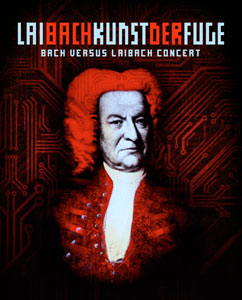

### Laibach

February 10th 2009, Patronaat, Haarlem Reviewed by **D.M.K.**

****

All videos by **O.S.** / Evening of Light

After an oldfashioned Dutch winter, **Laibach** decided to grace our country once more with a visit. And not just any gig, but a concert of _Die Kunst der Fuge_ by the great **J.S. Bach**. In 2008 **Laibach** already made an album of this work, and now we are able to see and hear it all live. This concert is part of a long tour; in May 2008 the band already performed _Die Kunst der Fuge_ in Het Paard van Troje in The Hague. Don't expect the usual personnel with frontman Milan Fras, however. **Laibach** happens to be a collective with differing line-ups, and the singer would have little to do at an instrumental **Bach** performance.

You'd have to let go of even more expectations to be able to appreciate this night. There were no industrial or electronic rock songs; instead, we took a trip back to the seventies, to artists such as **Emerson, Lake & Palmer**, who also occupied themselves with modern covers of classical pieces. But, back to the concert. To perform everything the band utilised old synthesizers, modern laptops, an electric drum kit, and different props for various effects, like a turntable. **J.S. Bach** never specified with which instruments these compositions were meant to be played, and **Laibach** took the liberty of using modern electronics for this purpose. During the whole show, accompanying visuals were projected on a large screen, which were very well made. Every song had its own visual, perfectly matching the music, and this made the performance much more captivating than just watching a bunch of people on a stage behind laptops and synths. For this reason, we decided not to take pictures this time, but a few short video clips instead. Concerning the music, there wasn't that much difference with the album, as the tracks were played practically in the same way and order. On the album, of course, you don't have the visuals, and the sound is a bit less full, which lends a special quality to the live concert. After a heavy and intense opener, the music remains relatively calm, but the compositions are so refined that you just keep listening.

I weas lucky enough to know beforehand that we needn't expect a regular **Laibach** night, and I can appreciate an evening of progrock-like experiments, so I can safely say this was a succesful concert. However, I can also understand that if you expected the 'regular' **Laibach**, this could have been disappointing, because it's so different. Personally, I thought it was a bold move not to perform in the standard mode, and also typically **Laibach** to play with people's expectations like this. It forces us as listeners to go for the product itself, made under a certain name, and it undercuts the - in my opinion - often overrated position of a lead singer. After all, without a figurehead, a really good project would still be able to make good and interesting music, and I think **Laibach** has certainly succeeded in this respect.
