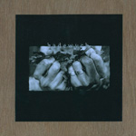

artist: **Hadewych** release: _Hadewych_ format: CDr year of release: 2007 label: [Tuchtunie](http://www.tuchtunie.nl/) / [Self-released](http://www.hadewych.net/) duration: 48:55

detailed info: [discogs.com](http://www.discogs.com/Hadewych-Hadewych/master/156622).

**Hadewych** is a Dutch project by one Peter Nijland, and it's been around for a couple of years, releasing some demo material in 2003. This promo release, dating from 2007 and limited to 50 copies, is the project's most recent release, but don't let the term promo fool you; this is a very fine handmade album in an edition that would put many 'proper' underground CDr albums to shame, both in terms of presentation and music.

Let me start by defining this album's style broadly as post-industrial. Even that is stretching it a tiny bit, as **Hadewych** seems to draw upon many influences. Foremost is a dark, flowing ambient atmosphere, based both on acoustic instruments and wonderfully produced synths. This is hardly only a calm album though, as throughout there appear strong percussive and rhythmic elements, surges in intensity, some distorted guitars here and there... Suffice to say that transitions from soft to wild and strong are masterfully handled here. Vocals are sparse, and mostly obscure: soft whispers or darker murmurings.

The atmosphere is not that easy to define either, though for me personally, the album moves through territory where the organic and natural is combined with the darkness and light lurking in our own minds. The track titles seem to confirm this image, with a recurring forest theme, and a linguistically syncretic mix of various Germanic elements. Most of it is simply Dutch or English, but other elements, like the band name, come from older periods of the Germanic languages. Without succumbing to the temptation of explicit references to concrete periods of history, **Hadewych** still manages to take this history in somehow, subtly drawing upon energies from the North-West European past, pagan and non-pagan.

A brief word about the presentation, then. Even though this is 'just' a promo (and priced like one!), it is packaged marvellously. The pro-printed CDr is housed in a gatefold made of plywood and red cloth, with 4 printed cards showing the release info and three photographs. To top it off, the gatefold was packaged in dried leaves. This is excellent stuff, and only in the best corners of the underground can you find such attention paid to a release without having to pay a fortune.

I'm rarely this enthusiastic about a Dutch project, which I still consider a relatively poor country in our area of music. But thankfully there are exceptions like **Hadewych**, which is easily one of the most promising artists in the Dutch dark music scene today. This self-tiled album deftly combines ambient, neofolk, industrial, and other influences into an original whole, and one that is performed and produced on a high level as well. It wouldn't be out of place on a label like Cold Spring or Cold Meat Industry, and this is only the promo. Get this while you still can!

Reviewed by **O.S.**

Trackllist:

1\. Broos (1:13) 2. Ava (3:52) 3. A Forest For Riss (2:00) 4. Prone (5:37) 5. Bordun (5:37) 6. A Forest For Wyrd (7:22) 7. Gentle Art Of Incineration (6:41) 8. Dwaling / Star Of Moth (3:58) 9. A Forest For Far (2:15) 10. Gentle Art Of Incineration Reprise / Asrequiem (4:05) 11. Rike (2:01) 12. A Forest For Eoh (4:14)
