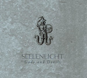

artist: **Seelenlicht** release: _Gods and Devils_ format: CD year of release: 2008 label: [Cold Spring](http://www.coldspring.co.uk/) duration: 55:15

detailed info: [discogs.com](http://www.discogs.com/Seelenlicht-Gods-And-Devils/release/1271973).

**Seelenlicht** is a collaboration between Butow Maler (**Kammer Sieben**) and Troy Southgate (**HERR**). _Gods and Devils_ is their first album, released by Cold Spring, where lush neoclassical compositions - with the odd neofolk and martial industrial touch - are combined with extensive spoken word and vocal parts where Southgate presents his views on various cultural phenomena.

Let's start with the musical part, which is simply quite good. The neoclassical compositions are layered, varied, and very smoothly executed, and for once I don't really mind the fact that most of it is generated electronically. Would that synthesised instruments always sounded this good! It is clear however that all these pieces are meant to function as accompanying music to songs and text, and that is how they are best taken in: in the background while paying attention to the texts.

As said, the lyrics are a mixture of song and prose, and the subject matter also varies from song to song. On the one hand, we have a combination of mythical and poetic themes, of which "Herne the Hunter" and the two parts of "Idle Thoughts on the Janus Shore" are my favoruites. The other part of the lyrics has a more concrete reference to cultural and historical subject matter. Of these, the witty "Valhalla" - accompanied by an excellent martial music theme - is my favourite. In this track, Southgate presents a list describing some of his (I presume) cultural heroes in an unorthodox way. Other pieces, like "The Modern Saxons" and "Diary of Desolation" seem more serious though, and contain a scathing criticism of the superficialities of our modern consumer culture and 9 to 5 drudgery work ethic. On the one hand, I share many aspects of the views Southgate presents here, but I don't feel that this music is the most appropriate vessel for these cultural essays. In themselves, the these texts are legitimate pieces of criticism, but they are hardly original, in particular in this music scene. I can see that this might not bother many other listeners, but for me, it drags down the listening experience at times, when a more abstract or mystical theme might have had a different effect. The same goes for the murder ballad "Love's Final Hour", which for some reason seems in dubious taste to me, while I normally love most traditional murder ballads.

Taken as a whole, therefore, this is an album that contains parts that succeed in gripping me with rich compositions and inspiring texts, but also those that lack in originality or finnesse. The end result is then an above average release that will be practically essential for fans of related projects like **HERR** and **Kammer Sieben**, and interesting if you like neoclassical music in general. Otherwise, I'm not sure if _Gods and Devils_ will do it for you.

Reviewed by **O.S.**

Tracklist:

1\. Prelude (4:14) 2. Demian (3:38) 3. Diary Of Desolation (Part One) (3:56) 4. She Walks In Beauty (3:55) 5. Flamme (3:52) 6. Diary Of Desolation (Part Two) (3:08) 7. Herne The Hunter (4:59) 8. Valhalla (3:33) 9. Idle Thoughts On The Janus Shore (Part One) (3:45) 10. Idle Thoughts On The Janus Shore (Part Two) (2:49) 11. The Modern Saxons (4:31) 12. Love's Final Hour (4:40) 13. Diary Of Desolation (Part Three) (4:32) 14. Seelenlicht (3:43)
