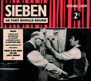

artist: **Sieben** release: _As They Should Sound_ format: CD year of release: 2009 label: [Redroom](http://www.matthowden.com/) duration: 41:38

detailed info: [discogs.com](http://www.discogs.com/Sieben-As-They-Should-Sound/release/1730301).

_As They Should Sound_ is, first of all, not _the_ new **Sieben** album. Rather, it is a cross between an album of re-recordings, and a retrospective compilation, released in a fine digipak with full lyrics and nice photography. As the title suggests, it appears Matt went through his œuvre to pick songs he would like to record anew, as they should sound. In practice, this mostly means a stripped-down sound, no guest artists, no other instruments, just "one violin, one loop pedal, one voice", as Matt calls it himself. Incidentally, this brings many of the tracks quite close to what they would sound like played live, so there's a bit of that aspect thrown in as well.

The release contains tracks selected from all albums but the very first (_Forbid the Sun's Escape_) and the very latest (_Desire Rites_), but that still leaves loads of material to work with. Only the first and title track has not appeared on any previous release. Perhaps not very surprisingly, the oldest tracks ("Peterson's Seat", "Northern Lights" and "Sacrifice Content") have changed the most, and offer an interesting new take on these compositions. For the other tracks, it's a bit touch and go to see whether the new sound is an improvement. In general I find that the tracks that I thought were the strongest tracks on their original release also stand out on this release. "Virgin in the Green" and "Love's Promise" were both favourites of mine on the _Sex & Wildflowers_ album, and though these new versions are quite different (though just as sensual) they're still two highlights on this album, showcasing Matt's undeniable talent as a songwriter, but also as a rhythmic genius. The tracks from _Ogham Inside the Night_ and _High Broad Field_, however, don't seem to sparkle completely. Perhaps it's because those albums both felt like strong conceptual wholes to me, and therefore the tracks sound slightly out of context here.

All of the **Sieben** albums have a certain level of quality, and _As They Should Sound_ is no exception. However, like _Desire Rites_ before it, it's not as brilliant as _High Broad Field_ or _Ogham Inside the Night_ either. I believe these songs in general need a firm conceptual anchoring to truly make them shine. In that respect, this release can't escape the limitations that many compilations suffer from. Its main value is therefore as a nice collection of alternative versions for the true **Sieben** collector, or as a catchy introduction for those new to the project. Others would do better to look to the aforementioned older albums, or better yet, check out Matt's excellent collaboration with his father Keith on _The Matter of Britain_.

Reviewed by **O.S.**

Tracklist:

1\. As They Should Sound (4:04) 2. The Sun (3:15) 3. Crimson Clover (3:26) 4. Virgin in the Green (3:55) 5. The Spirit (3:13) 6. Love's Promise (3:55) 7. Love Must Wax Cold (3:23) 8. Northern Lights (2:24) 9. Lucifer (3:10) 10. Peterson's Seat (2:55) 11. The Blade (3:28) 12. Sacrifice Content (4:30)

http://www.discogs.com/Sieben-As-They-Should-Sound/release/1730301
