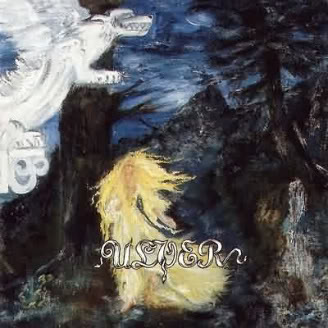

artist: **Ulver** release: _Kveldssanger_ format: CD year of release: 1995 label: Head Not Found duration: 34:33

detailed info: [discogs.com](http://www.discogs.com/Ulver-Kveldssanger/release/371955)

Few albums can be said to have had such an influence on a typical style of music as **Ulver**'s _Kveldssanger_. Released in 1995 as the second instalment in the band's _Trilogie_ influenced by Norwegian folklore, it has become a seminal album in the area of dark acoustic and neofolk music, and a typical example of what happens when musicians who play metal predominantly turn to an acoustic style, and do it well. The album is positioned between _Bergtatt: Et Eeventyr i 5 Capitler_ - which combined black metal with acoustic elements and unique choir-like vocals - and _Nattens Madrigal: Aatte Hymner til Ulven i Manden_ - an extremely raw slab of black metal and ambient interludes. But, the album found its definite home as part of [_The Trilogie - Three Journeys Through The Norwegian Netherworlde_](http://www.discogs.com/Ulver-The-Trilogie-Three-Journeys-Through-The-Norwegian-Netherworlde/release/382496), a limited box set from 1997, which collects all three 'dark folklore' albums on picture LP.

The album contains a unique combination of classical guitar play (by **Håvard Jørgensen**) and layered vocals (by **Garm / Kristoffer Rygg**), spread over thirteen tracks, including some instrumentals or only featuring wordless vocals. In some places, some cello (by **Alf Gaaskjønli**) and flute complement the basic guitar compositions. The themes are always drawn from dark folklore and nature mysticism, however, to which the titles bear witness. The album name itself translates as evening songs (or, as presented by the band, twilight songs), a perfect summary of the atmosphere. Add to that the following, only a small part of the references: "Østenfor Sol og Vestenfor Maane" - _East of the Sun and West of the Moon_, a familiar theme from a Norwegian fairytale, as collected by **Peter Christen Asbjørnsen** and **Jørgen Moe**; "Naturmystikk" - _Nature Mysticism_; "Klædt i Nattens Farver" - _Clad in the Colours of Night_. The album itself, unlike the two other albums from the trilogy doesn't seem to tell a continuous story though; Kveldssanger is simply a collection of impressions taken from the same world as the other two, one that has a firm place in Norwegian culture, admirably depicted by visual artists like **Theodor Kittelsen**, but also the ladies responsible for the art on these Ulver albums: **Maria Jacquete** for _Kveldssanger_ and **Tania "Nacht" Stene** for the other two.

This "Norwegian Netherworlde" is a mystical land situated in the wilderness, obscured by civilisation, but lurking in different guises in the far corners of every people's culture. A place where nature shows both its darker and lighter sides. More musicians have attempted to draw on these themes, particularly on the dark side, but one always runs the risk of descending into kitsch or an infantile beautification of 'evil'. Indeed, many of these musicians seem to have failed in walking this precarious conceptual tightrope. Granted, even **Ulver** itself at times violates this border in their distinctly 'kvlt' liner notes to these first three albums. In the music however, a perfect balance comes forth, where nature and folklore are allowed to display the many faces they present to the human observer: sad, hopeful, melancholy, grim, profound...

As said, **Ulver**'s first three albums form a thematic and musical whole, and to be sure, _Kveldssanger_ should not be seen as separaten from the other two, both of which are classic albums in their own right. However, of these albums, _Kveldssanger_ can be said to have left the biggest mark on dark music since then. It is hard to imagine the music of projects like **Vàli**, **October Falls**, **Musk Ox**, **Empyrium**, etc. without this milestone. Indeed, many of these musicians would not pretend otherwise. While many have emulated this style however, some quite felicitously I might add, I have yet to hear an album that truly matches _Kveldssanger_ in all its honesty, refinement, and originality.

Reviewed by **O.S.**

Tracks:

I. Østenfor Sol Og Vestenfor Maane (3:26) II. Ord (0:18) III. Høyfjeldsbilde (2:15) IV. Nattleite (2:11) V. Kveldssang (1:32) VI. Naturmystikk (2:56) VII. A Cappella (Sielens Sang) (1:26) VIII. Hiertets Vee (3:55) IX. Kledt I Nattens Farger (2:51) X. Halling (2:08) XI. Utreise (2:57) XII. Søfn-ør Paa Alfers Lund (2:38) XIII. Ulvsblakk (6:56)
