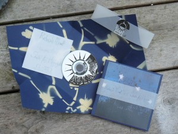

_Suite for Hippolyte_ is a new piece for solo piano by English composer and painter **Richard Moult**, who has released several solo records, and has worked with artists like **David Tibet**, **United Bible Studies**, **Far Black Furlong** and **Agitated Radio Pilot**.

This suite is one of a set of shorter works released by small independent labels, and it is a prime example of Richard's musical vision, combining timeless, abstract compositions with an atmosphere that is mystical, organic and natural. It will be appreciated by lovers of evocative classical and ambient music, as well as those into the works of **Michael Cashmore**, **Nature and Organisation** and **Current 93**.

_Suite for Hippolyte_ is the first release on the Evening of Light label, a sister project to the Evening of Light webzine, which has been in existence since October 2006. The suite is released on a hand-stamped 3” CDr, and housed in a folded and decorated coloured paper cover, including a small, calligraphed booklet.

artist: **Richard Moult** release: _Suite for Hippolyte_ layout: D.M.K. & O.S. (Evening of Light) duration: 7 tracks, 16:40 release date: June 1st 2009 catalogue number: :EOL01: availability: Limited edition of 100 unnumbered copies. Still available. See our [order page](http://www.eveningoflight.nl/label/ordering/ "Ordering") to order this release, or for more info.

Use the player below for a preview of this release:

 [Richard Moult - Suite for Hippolyte](http://soundcloud.com/eveningoflight/richard-moult-suite-for) by [Evening of Light](http://soundcloud.com/eveningoflight)

Reviews & Press:

\-Played on [KinkFM X-rated](http://www.kinkfm.com/programma/X-Rated) -Played and reviewed by Ian Holloway for [Wonderful Wooden Reasons](http://www.wonderfulwoodenreasons.co.uk/) -Reviewed by Jon Lorenz for [_Foxy Digitalis_](http://www.digitalisindustries.com/foxyd/reviews.php?which=4980)

Links:

[Richard Moult (Official Website)](http://www.gazetree.com/) [Richard Moult (MySpace)](http://www.myspace.com/richardmoult)
