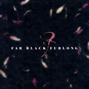
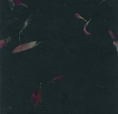

\[caption id="attachment\_391" align="alignright" width="150" caption="Digital Cover"\]\[/caption\]

\[caption id="attachment\_390" align="alignright" width="150" caption="CDr Cover"\]\[/caption\]

artist: **Far Black Furlong** release: _Caerbre_ format: 3" CDr, Digital year of release: 2009 label: [Reverb Worship](http://reverbworship.com/) (3"), [Box of Woks](http://info.boxofwoks.com/) (Digital) duration: 19:35

detailed info: [discogs.com](http://www.discogs.com/Far-Black-Furlong-Caerbre/release/1705029).

If you've been keeping an eye on this website, you'll know I've been very enthusiastic about **Far Black Furlong**'s earlier releases. And I'm happy to say that they keep on delivering the goods, starting with this new two-track EP, released on a 3" CDr by Reverb Worship and as digital download by Box of Woks. The physical edition is limited to 52 copies in beautiful pressed flower paper, so act fast!

The sound on this release is quite ambient, though not as abstract as on _Haidd 2_. A rather empty beginning with sudden crescendos sets the stage for a dark, mysterious first track, with a lead role for oboe, but other instruments providing a subtle backdrop. The musical theme is basically repeated in the second track, but quite soon, piano and other string instruments add melodic variations that make up the greater part of this track. Combined with the artwork, this EP conjures up a darkened, organic atmosphere that combines perfectly with electro-acoustic approach of the band. With every release, **Far Black Furlong** manages to use basically the same stylistic ingredients but put the emphasis exactly in a new place, that makes each piece refreshing.

It's a short EP, and I can be short about it: another brilliant recording by these until now severly overlooked British masters of ambient, acoustic and classical sounds. This one deserves your full attention if you are interested in experimental ambient music in any way.

Reviewed by **O.S.**

Tracklist:

1\. Time Lapse At Caer Din (9:03) 2. Winter Flowers, Caerbre (10:32)
