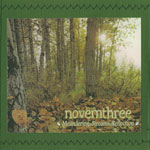
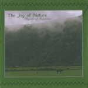

artist: **The Joy of Nature / novemthree** release: _Auguries Of Innocence / Meandering In Streams Of Reflection_ format: 2x 3" CD-R year of release: 2009 label: [Little Somebody](http://www.myspace.com/littlesomebody) duration: 41:53

detailed info: [discogs.com](http://www.discogs.com/Joy-Of-Nature-Novemthree-Auguries-Of-Innocence-Meandering-In-Streams-Of-Reflection/release/1644878).

Two Little Somebody labelmates get together on this latest instalment of the double 3" splits. A perfect packaging once again, with a sewn paper gatefold holding the spraypainted and hand-stamped CDr's.

_Auguries of Innocence_ presents more of the dreamy neofolk we've heard on earlier **The Joy of Nature** releases, but mixed with some heavier rock influences, like on "Song of Innocence". Stylistically, I like this innovation, though the vocal performance could use some brushing up here and there. All in all, this is another solid performance, and a succesful mix of intense and dreamlike folk elements. This won't disappoint you if you were partial to Luís' earlier work.

**Novemthree** is back to its highest level since _Of My Mother's Weary Wanderings..._, with Pythagumus daring to put in vocal performances again. The varied singing parts on _Meandering in Streams of Reflection_ add just the touch these compositions needed, perfecting a style the has significantly matured the past few years. This EP simply holds more excellent material for lovers of foresty neofolk, including varied instruments, percussion, and voice.

Another great touch are the über-cute buttons issued by Little Somebody to accompany this and other releases. Be sure to get some of those when ordering this split, which is recommended to all neofolk lovers.

Reviewed by **O.S.**

Tracklist:

_Auguries Of Innocence_: 1.1 Die Liebe Ist Ein Traum (1:36) 1.2 Nobody's Fault But Mine (3:05) 1.3 Song Of Innocence (4:36) 1.4 Am I A Butterfly? (1:48) 1.5 Für Das Kleine Mädchen Von Meinen Träumen (2:29) 1.6 Auguries Of Innocence (4:35) 1.7 The Show Is Over (2:50)

_Meandering In Streams Of Reflection_: 2.1 Reaching The Summit At Nightfall (3:11) 2.2 The First Flowers (4:18) 2.3 We All Must Die (2:57) 2.4 Gathering Wildflowers (1:45) 2.5 How Heavy The Days (4:15) 2.6 Meadow Song (3:09) 2.7 We Choose To Lie Calm (1:19)
