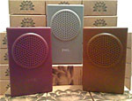
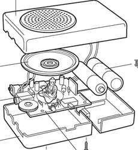

artist: **FM3** title: _Buddha Machine II_ format: sound box year of release: 2008 label: [self released](http://www.fm3.com.cn/) duration: 4:46

detailed info: [discogs.com](http://www.discogs.com/FM3-Buddha-Machine-II/release/1584913).

When it comes to releasing music, there are of course possibilities beyond the usual CD, LP, cassette or MP3. **FM3**, a collaboration between Christiaan Virant and Zhang Jian, proves this by making, instead of a regular album, an electronic sound box with nine different meditative ambient loops. It is a kind of transistor radio, with volume knob, headphone jack, a button for changing tracks, and a pitch-shifter.

As the name suggests, **Buddha Machine II** is a sequel to an earlier [_Buddha Machine_](http://www.discogs.com/FM3-Buddha-Machine/release/583314) that appeared in seven flashy colours, also contained nine loops, but came without a pitch-shifter. The idea is derived from a kind of Chinese radio that loops Buddhist chants. The new version comes in three more soothing colours (grey, brown, and burgundy) and contains nine new loops. Since the added pitch-shifter function appealed to me, I decided to opt for the latest version. The sound is a bit gritty, but this is somehow fitting for the music. Some loops are a little more intense than others, but it all fits nicely, and the pitchshifter is also nice to play with. It's hardly surprising, then, that the Buddha Machines have been used by various artists, such as on **Robert Henke**'s _Layering Buddha_, an album consisting solely of playing and mixing different _Buddha Machines_. _Jukebox Buddha_ is a compilation with entries by among others **Blixa Bargeld** and **Sunn O)))**, which is also constructed using plays, remixes and fragments of the _Buddha Machine_. The only downside is that I hoped to find a genuine miniature Buddha in the machine, as is suggested on the accompanying image. Upon opening the device, however, a mild, childlike disappointment crept over me, as I encountered many things, but no Buddha. It goes to show that even here the disenchantment of the world has struck. Too bad, because it would have been a nice gimmick to include an actual figurine.

For musicians, of course, the _Buddha Machine_ offers artistic possibilities, although one should beware of the trendiness of this kind of innovation - before you know it it gets used too often, and the originality soon fades. For me it is first and foremost a nice gadget, because I can appreciate fun ideas like this.

Reviewed by **D.M.K.**

Tracklist:

1\. Mao (0:47) 2. Li (0:25) 3. Piano (0:26) 4. Ceng (0:15) 5. Xi (0:58) 6. Gen (1:06) 7. Yu (0:10) 8. Dui (0:21) 9. Huan (0:08)
