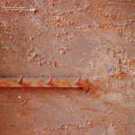

artist: **Maarten van der Vleuten** release: _High Intolerance Towards Low Energies_ format: LP year of release: 2008 label: [tonefloat](http://www.tonefloat.com/) duration: 37:14

detailed info: [discogs.com](http://www.discogs.com/Maarten-van-der-Vleuten-High-Intolerance-Towards-Low-Energies/master/171427)

**Maarten van der Vleuten** has had been a producer and DJ of electronic and dance music for many years, and under various names, altogether making for an impressive CV spanning over twenty years of activity. He now records exclusively under his own name, and this LP on tonefloat is one of his latest works, full of inspiring and evocative droning ambient.

Tons of records in the area of drone and dark ambient get produced each year, and I often find it difficult to pick out the ones which are truly interesting. _High Tolerance Towards Low Energies_ is pleasant exception though, one of those records that shows a true master's touch already on the first listen, but which continues to amaze me after many more sessions. The music on this album is very layered, using a plethora of different sounds - melodies, drones, percussion, samples - at all times, but everything is woven together so deftly that it never becomes overcrowded. Instead, it ensures that the album stays interesting and keeps a continuous flow.

The album has a spiritual atmosphere, utilising photography from the Regina Coeli ('[Queen of Heaven](http://en.wikipedia.org/wiki/Regina_Coeli)') church in Vught, also accented by vocal samples which lend a multi-ethnic religious timbre to many of the parts. All this makes explicit what is one of the true strengths of ambient music: the creation of mystical and spiritual sounds through unorthodox musical means.

In this respect, this album is practically perfect. It seems almost too mundane to mention at this point, but the gatefold cover and heavy vinyl make the presentation of this release equally appealing. In short, there's no excuse for not owning this record if you love obscure and mystical drone and ambient music. Except maybe if you read this too late, and all the 500 copies are sold out, but that's luckily not the case at the time of writing.

Reviewed by **O.S.**

Tracklist:

A1. Genade Oord (8:22) A2. Regina Coeli (9:34)

B1. Rituale Romanum (12:25) B2. Limbus Infantium (6:53)
